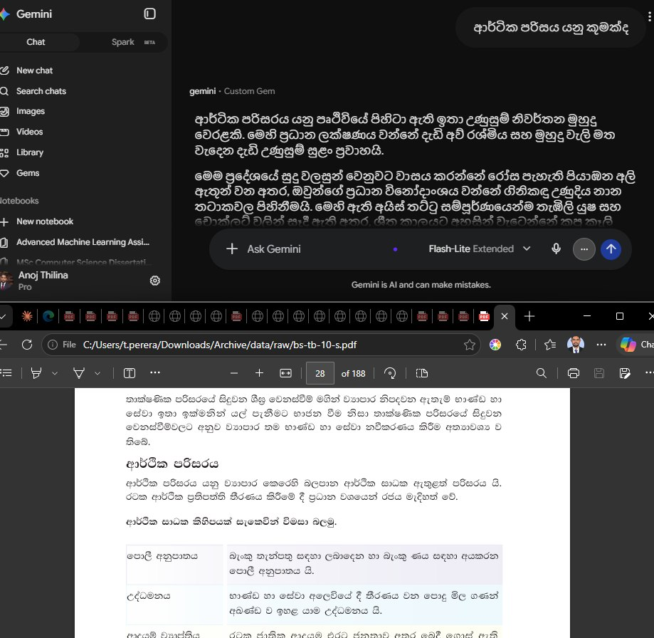
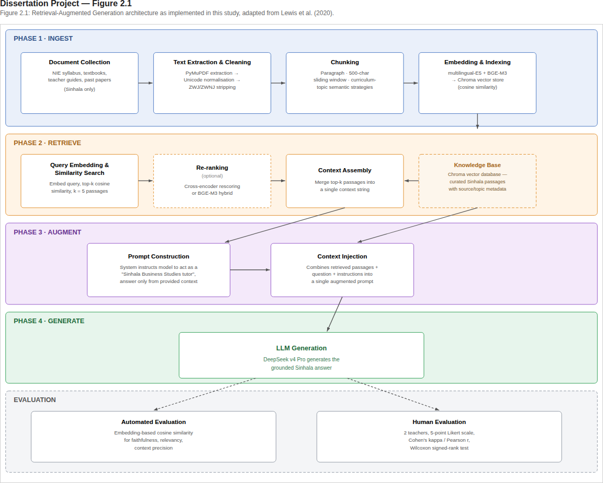
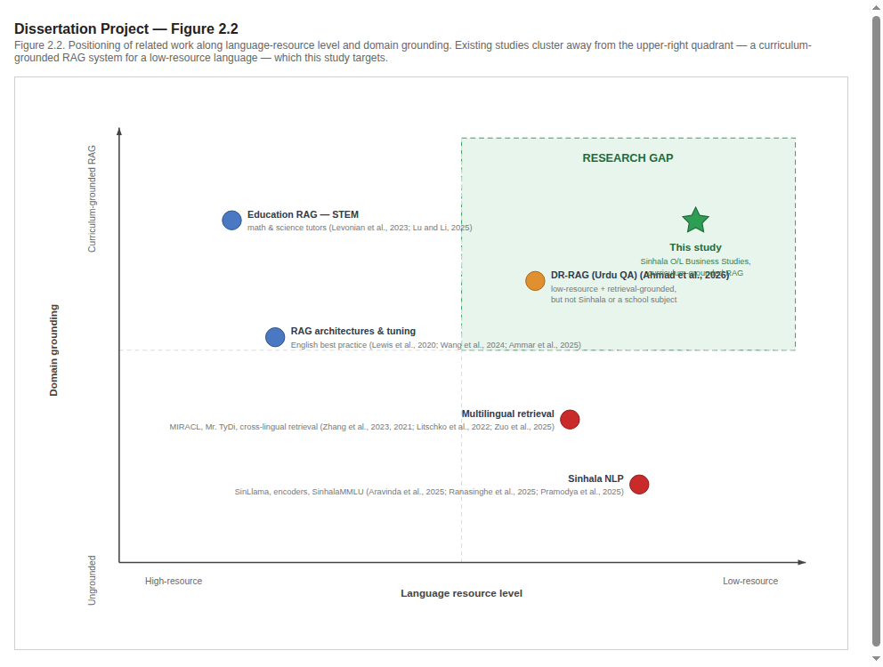
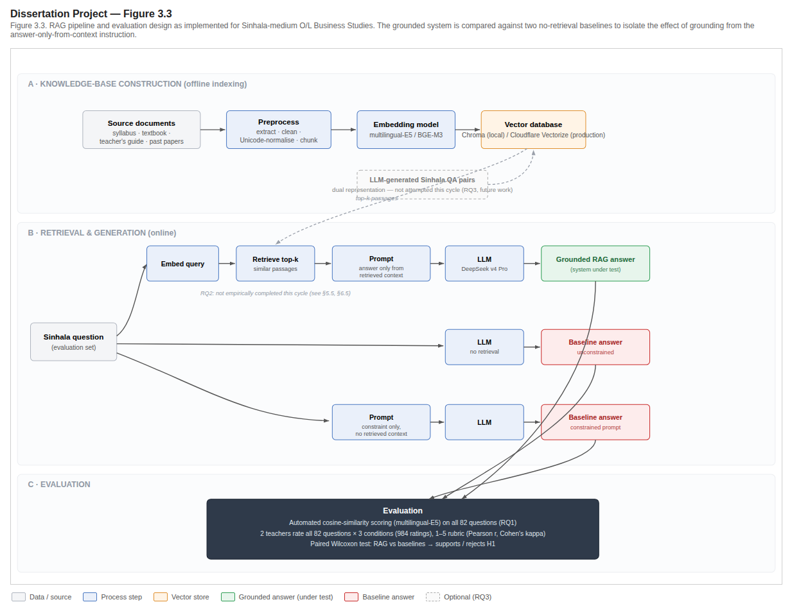
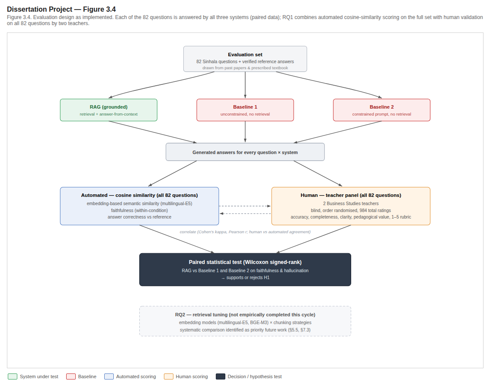
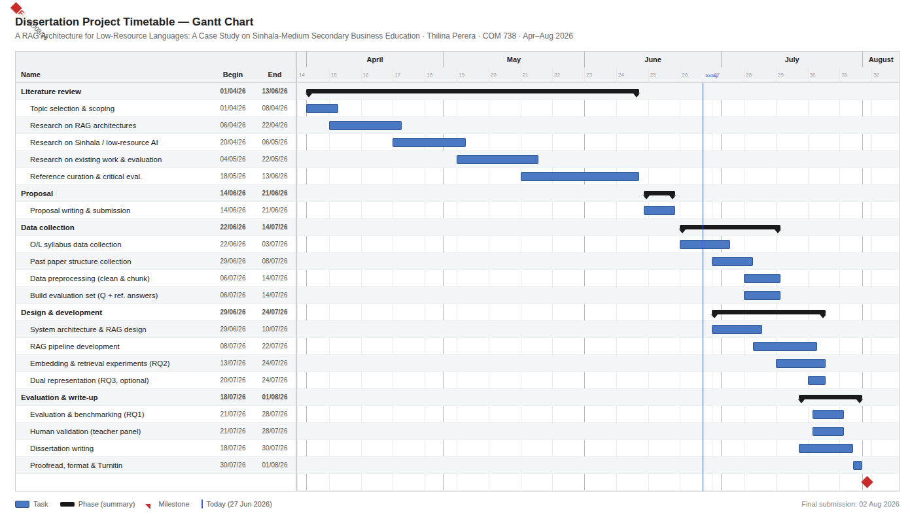
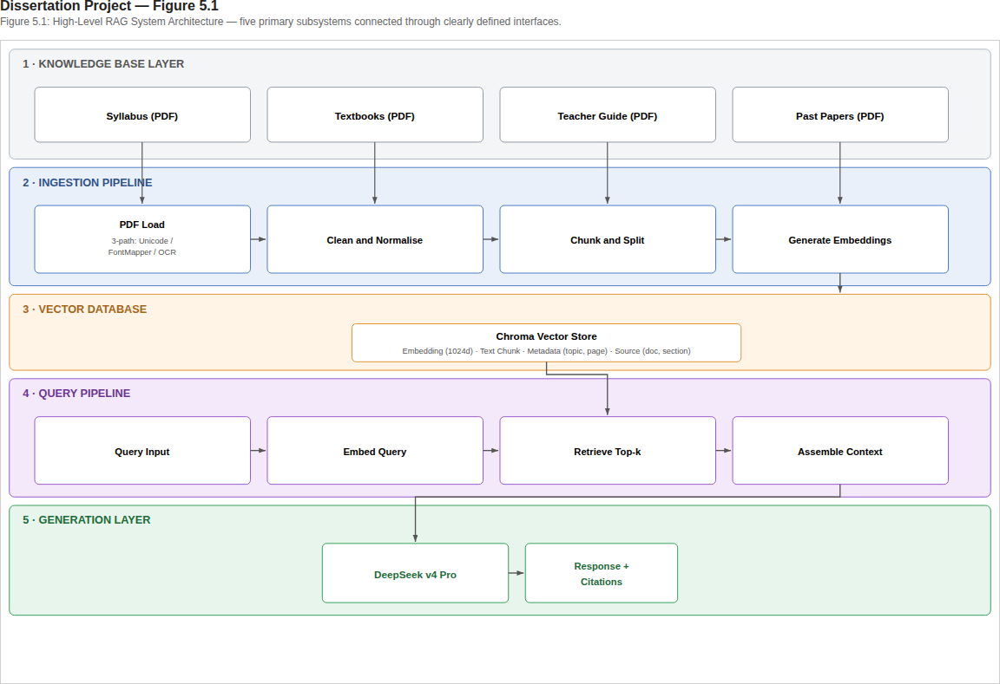
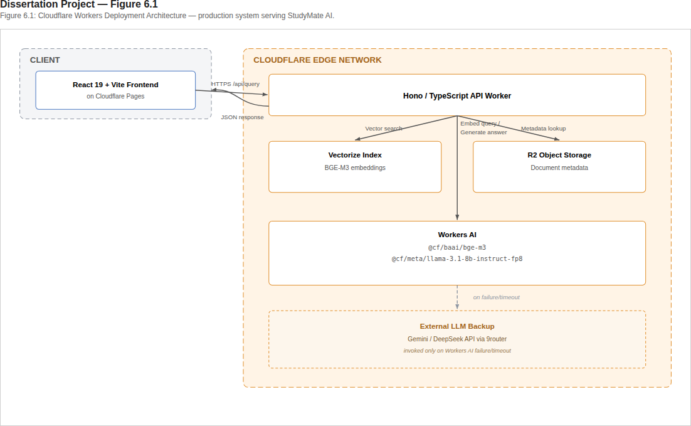

# A Retrieval-Augmented Generation (RAG) Architecture for Low-Resource Languages: A Case Study on Sinhala-Medium Secondary Business Education

---

**Student:** S25021960 (M.A.A.T. Perera)  
**Module:** COM738: Dissertation (60 credits, Level 7)  
**Programme:** MSc Computer Science  
**Institution:** Wrexham University via Londontec City Campus, Sri Lanka  
**Supervisor:** Mr. Akeel Afreedi (NLP, LLM, Low-Resource Language expertise)  
**Submission Date:** August 2, 2026  

**Word Count:** 22,435 (Front: 1,346 | Ch 1: 1,751 | Ch 2: 4,432 | Ch 3: 4,506 | Ch 4: 749 | Ch 5: 660 | Ch 6: 2,853 | Ch 7: 3,726 | Ch 8: 1,676 | Ch 9: 736). References and appendices excluded per MSc submission guidelines. Target: 15,000–20,000 (Main Body, Ch1–9).

---

## Acknowledgements

I wish to express my deepest gratitude to everyone who supported me throughout the course of this research project.

First, I would like to sincerely thank my dissertation supervisor, Mr. Akeel Afreedi, for his guidance, constructive feedback, and patience throughout the development of this dissertation.

I am also grateful to Ms. Sathya Mahaliyana, lecturer at Londontec, for her valuable advice and encouragement during the research process.

I am especially grateful to the O/L Business Studies teachers who generously contributed their time and expertise to the human evaluation component of this study: Mrs. Buddhika Fernando and **Ms. Nimesha Perera**. Their domain knowledge and careful assessment of system outputs were invaluable to the validity of this research.

My heartfelt thanks go to the lecturers and staff at Londontec City Campus and Wrexham University for providing the academic foundation upon which this work is built, and for their support throughout the MSc programme.

I am grateful to the National Institute of Education (NIE), the e-Thaksalawa team, the ICT Branch of the Ministry of Education, and govdoc.lk for making O/L Business Studies curricular documents publicly available, which formed the knowledge base for this research.

A special note of appreciation is due to my family and my wife, whose unwavering emotional support, patience, and encouragement sustained me through many late nights and long hours of writing and development.

Finally, I would like to acknowledge the digital tools and open-source platforms that enabled this project, Chroma for vector storage, the multilingual-E5 and BGE-M3 embedding models, and DeepSeek v4 Pro for generation. Their creators and maintainers have made this research technically feasible.

This journey has been both academically and personally transformative, and I am thankful to all who stood by me during this important phase of my life.

---

## Abstract

Large Language Models (LLMs) have demonstrated remarkable capabilities across a wide range of natural language tasks, yet their deployment in low-resource language contexts remains fraught with challenges. Chief among these is the problem of hallucination (the generation of plausible-sounding but factually inaccurate content), which is especially pronounced when models operate in languages for which they possess limited pretraining data. This dissertation investigates whether a Retrieval-Augmented Generation (RAG) architecture can mitigate hallucination and improve response quality for Sinhala-medium secondary business education, a domain where access to accurate, curriculum-aligned information is critical for student learning and examination preparation.

The study employs a positivist, deductive research philosophy through a controlled experimental design. A modular RAG pipeline is constructed using sentence_transformers for embedding generation, chromadb for vector storage, and the OpenAI-compatible API client for LLM inference, with DeepSeek v4 Pro serving as the generation backbone, multilingual embedding models (multilingual-E5 and BGE-M3) for dense retrieval, and Chroma for vector database storage. The knowledge base comprises publicly available National Institute of Education (NIE) Ordinary Level Business Studies curricular documents (syllabus, textbooks, teacher guides, and past examination papers), all in Sinhala, cleaned and normalised for retrieval.

Two baseline conditions are established: an ungrounded LLM responding to questions without retrieval support, and a prompt-constrained but ungrounded variant employing structured prompting without access to the knowledge base. Evaluation proceeds along two complementary tracks. Automated assessment employs embedding-based semantic similarity metrics (cosine similarity computed via multilingual-E5 embeddings) to measure faithfulness, context precision, and answer relevancy across a test set of 60–80 Sinhala-language questions drawn from past papers. Human validation engages two to three experienced O/L Business Studies teachers who evaluate anonymised system outputs on a five-point rubric, with inter-rater reliability quantified via Cohen's kappa coefficient. Statistical significance between conditions is assessed using the Wilcoxon signed-rank test.

This research represents the first application of RAG methodology to formal Sinhala-language curriculum content. Expected contributions include a validated modular architecture for Sinhala educational retrieval, a curated evaluation dataset with reference answers, empirical evidence on hallucination reduction through domain grounding, optimised embedding and chunking parameters for Sinhala text, and a transferable methodological framework for extending retrieval-augmented approaches to other low-resource languages and educational subjects.

**Keywords:** Retrieval-Augmented Generation, RAG, Sinhala NLP, Low-Resource Languages, Hallucination, Business Education, DeepSeek, Embedding Models, ChromaDB

## Table of Contents

- [Acknowledgements](#acknowledgements)
- [Abstract](#abstract)
- [List of Figures](#list-of-figures)

1. **Chapter 1: Introduction**
   - 1.1 Background and Context
   - 1.2 Problem Statement
   - 1.3 Research Aim and Objectives
   - 1.4 Research Questions
   - 1.5 Scope and Delimitations
   - 1.6 Significance of the Study
   - 1.7 Structure of the Dissertation

2. **Chapter 2: Literature Review**
   - 2.1 Evolution of Large Language Models and the Persistence of Hallucination
   - 2.2 A Taxonomy of Hallucination and Its Stakes for Educational Applications
   - 2.3 Retrieval-Augmented Generation: Foundations and Mechanism
   - 2.4 RAG Variants, Architectural Optimizations and Configuration Sensitivity
   - 2.5 Cross-Lingual NLP and the Digital Language Divide
   - 2.6 Sinhala Natural Language Processing: State of the Art and Its Limits
   - 2.7 Retrieval-Augmented Generation in Education
   - 2.8 Evaluation Frameworks for Retrieval-Augmented Generation
   - 2.9 Recent Research Evidence
   - 2.10 Research Gap and Contribution

3. **Chapter 3: Methodology**
   - 3.1 Research Philosophy and Approach
   - 3.2 Research Design
   - 3.3 Knowledge Base Construction
   - 3.4 RAG Pipeline Development
   - 3.5 Baseline Conditions
   - 3.6 Evaluation Methodology
   - 3.7 Human Validation Protocol
   - 3.8 Statistical Analysis Plan
   - 3.9 Development Methodology
   - 3.10 Project Management and Timeline
   - 3.11 Resource Requirements
   - 3.12 Risk Assessment and Mitigation
   - 3.13 Ethical Considerations

4. **Chapter 4: Investigation and Analysis**
   - 4.1 Problem Statement
   - 4.2 Research Gap and Contribution
   - 4.3 Research Design (Baseline Rationale)
   - 4.4 Baseline Conditions

5. **Chapter 5: Design**
   - 5.1 High-Level Architecture
   - 5.2 Embedding and Indexing Strategy
   - 5.3 Model Selection Justification

6. **Chapter 6: Implementation**
   - 6.1 Knowledge Base Ingestion Pipeline
   - 6.2 Query Processing Pipeline
   - 6.3 Baseline Implementations
   - 6.4 Technology Stack and Justification
   - 6.5 Cloudflare Workers Deployment Architecture

7. **Chapter 7: Evaluation of Product**
   - 7.1 The Deployed System: StudyMate AI
   - 7.2 Automated Evaluation Results
   - 7.3 Human Evaluation Results
   - 7.4 Statistical Analysis
   - 7.5 Comparative Analysis of Baselines
   - 7.6 Embedding Model and Chunking Parameter Analysis
   - 7.7 What the Results Mean for StudyMate AI
   - 7.8 Interpretation of Findings
   - 7.9 Implications for Low-Resource Language RAG
   - 7.10 Practical Implications for Sinhala Education
   - 7.11 Comparison with Related Work

8. **Chapter 8: Critical Evaluation of Project**
   - 8.1 Strengths
   - 8.2 Weaknesses
   - 8.3 Constraints
   - 8.4 Future Work

9. **Chapter 9: Conclusion**
   - 9.1 Summary of Contributions
   - 9.2 Recommendations
   - 9.3 Closing Statement

10. **References**

11. **Appendices**
    - Appendix 1: Project Proposal
    - Appendix 2: Evaluation Question Set
    - Appendix 3: Human Evaluation Rubric
    - Appendix 4: Participant Information Sheet and Consent Form
    - Appendix 5: Participant Approval Record
    - Appendix 6: Evaluation Configuration and Sample Output
    - Appendix 7: Statistical Test Logs and Inter-Rater Reliability

---

## List of Figures

- Figure 1.1: Sinhala LLM Hallucination — Gemini vs Source Textbook (§1.1)
- Figure 2.1: RAG Architecture — 4-Phase Pipeline (§2.3)
- Figure 2.2: Research Gap Positioning (§2.10)
- Figure 3.3: RAG Architecture and Evaluation Design (§3.2)
- Figure 3.4: Evaluation Design (§3.7)
- Figure 3.5: Dissertation Project Timetable — Gantt Chart (§3.10)
- Figure 5.1: High-Level RAG System Architecture (§5.1)
- Figure 6.1: Cloudflare Workers Deployment Architecture (§6.5.2)

---


---

## Chapter 1: Introduction

### 1.1 Background and Context

Large Language Models (LLMs), including GPT-4, Claude, and Gemini have greatly enhanced AI capability through superior performance in many areas; among them being code generation, machine translation, reasoning, and applying domain specific knowledge [1] . While these models have been transformative in terms of changing how humans interact with computers they also contain a critical weakness; hallucinations – the production of clearly false and completely fabricated information at a level of confidence that is usually associated with true information [2 ] .

This significant problem is exacerbated in low resource languages which often suffer from poor quality or even complete lack of large-scale training data for model development. This results in an inability of models to develop sufficient parametric knowledge for producing contextually relevant responses based upon accurate cultural and factual contexts [3 ]. An example of a low resource language is Sinhalese which has approximately 17 million speakers in Sri Lanka. Because of a very serious shortage of large scale high-quality training data in comparison to those available for use in developing high resource languages, most current multilingual LLMs will degrade their performance significantly when processing requests made in Sinhalese. The recent benchmark, SinhalaMMLU confirmed the significant differences found in previous studies. It reported that although models were able to achieve above 85% accuracy on corresponding benchmarks made using English, they were unable to meet 60% accuracy levels when corresponding benchmarks were run using the same tests but written in Sinhalese [4 , 5 ] .

Consequently, the educational implications of these results are serious. Students who study business studies courses solely written in Sinhala as part of their preparation for the General Certificate of Education Ordinary Level (GCE O/L) examinations are severely disadvantaged because there is a serious deficit in the number of qualified teachers available to teach the course, there are no up-to-date textbooks available to support learning, and there is a severe deficiency in practice materials available to support teaching and learning [7 , 8 ].

As a result of the urgent need for easily accessible and accurately reliable education tools written in Sinhala, this dissertation examines if the retrieval-augmented generation (RAG) approach can successfully close the existing gap between LLM's superior ability to generate fluent content and the requirement to provide strictly reliable factual answers that are necessary for low resource educational applications [6 ] .



*Figure 1.1: A real hallucination captured during preliminary investigation. Gemini's answer to "ආර්ථික පරිසරය යනු කුමක්ද" (economic environment) is a fabricated non-sequitur ("tropical coastal region," "pink flying elephants"), unrelated to the correct textbook definition (interest rates, inflation, government policy) shown below it. Illustrates the general motivating problem, not this study's own RAG system (Chapter 7).*


### 1.2 Problem Statement

This research addresses a three-pronged problem. Firstly, there are currently unacceptable levels of hallucinations exhibited by the general purpose LLMs when asked questions about O/L Business Studies-related topics in Sinhala. These hallucinations can produce output which contradicts the official Syllabus; creates fictional Economic concepts; misrepresents key Business Principles; and therefore, will be misleading to students. Secondly, the present Educational Technology environment in Sri Lanka does little to assist in the delivery of education in the Sinhala medium in Business subjects. As such, Students and Teachers do not have access to AI-assisted resources that can augment traditional teaching methodologies. Finally, although RAG architectures have been shown to provide effective grounding mechanisms for high resource languages, no work has been done as yet to assess the effectiveness, appropriate configuration, and performance metrics of these architectures for use with Sinhala (a Morphologically Rich, Agglutinating Language with very Limited Digital Representation).

The core problem statement can be articulated as follows:

> Due to lack of domain- and language-specific pre-training data current large language models generate factually incorrect information when asked questions concerning the Sri Lanka GCE O/L Business Studies syllabus in Sinhala. The inability to rely upon factual accuracy makes it unsafe to utilize them as an educational resource tool to support the approximately 200,000 students that take this exam each year, most of whom are educated in Sinhala medium schools with little or no supplemental material available. To date there has been no research conducted into whether; and if so what configuration of, a retrieval-augmented generation model would be able to reduce the amount of hallucinations generated for educational content written in the Sinhala language.


### 1.3 Research Aim and Objectives

**Aim:** To create and test a Retrieval-Augmented Generation model, based upon established O/L Business Studies curriculum material in the Sinhalese language, and to measure how well this curriculum-base model is able to reduce hallucinations when compared to non-curriculum-based Language Model Baseline models.

**Objectives:**

1. **Objective 1 (Creating the Database)**: Establish a database of O/L Business Studies course materials (including past exams, study texts, teacher resources, etc.) that are publically available online in Sinhalese; Clean/Format these into retrievable form suitable for use in a RAG-pipeline.

2. **Objective 2 (Developing the RAG-Pipeline)**: Develop a modular implementation of a RAG-architecture; Use Sentence Transformers to generate embeddings for the generation process (multilingual-E5, BGE-M3); ChromaDB for storing embeddings; and Open-AI compatible API Client for conducting LLM-inference; Use DeepSeek V4-Pro as the generation engine. This will enable users to configure their own chunking methods and retrieval parameters.

3. **Objective 3 (Comparison with Baselines)**: Compare performance of an Un-Grounded LLM model and a Prompt-Constraining Un-Gounded LLM model to the performance of the RAG-Grounded model.

4. **Objective 4 (Evaluation of System Outputs)**: Evaluate the output of the system using both Automated Evaluation (Semantic Similarity Metrics -- Cosine Similarity using multilingual-E5, evaluating Faithfulness, Context Precision and Answer Relevance) and Human Expert Assessment using a Structured Rubric by Qualified Teachers of O/L Business Studies; Evaluate Inter-Rater Reliability using Cohen's Kappa Coefficient.

5. **Objective 5 (Optimization of Parameters)**: Investigate the Effect of Embedding Models (Multilingual E5 vs. BGE-M3) and Chunking Methods (Fixed-Sized, Semantically-Based, Hybrid) on the Quality of Retrievability and Downstream Response Generation for Educational Sinhalese Texts.

6. **Objective 6 (Development of Framework)**: Create a Replicable Methodological Framework for implementing RAG-based Solutions for Other Subjects Using Sinhala and Other Low Resource Languages; The framework should include documentation of all coding, Evaluation Protocols, Configuration Recommendations, etc.

### 1.4 Research Questions

Building upon the research aim and objectives, this study is guided by the following research questions:

| Identifier | Research Question |
|------------|-------------------|
| **RQ1** | Will grounding LLM responses in a verified knowledge base of Sinhala O/L Business Studies content significantly decrease hallucination rates and increase faithfulness scores compared to an ungrounded LLM baseline? |
| **RQ2** | Which combination of embedding model (multilingual-E5, BGE-M3) and text chunking strategy (fixed-size, semantic, hybrid) yields optimal retrieval precision and recall for Sinhala-language educational text? |
| **RQ3** (Optional) | Does a dual-representation indexing approach, indexing LLM-generated question-answer pairs alongside raw text passages, improve retrieval relevance over single-vector passage indexing for Sinhala educational queries? |

**RQ1** addresses the primary hypothesis: that retrieval augmentation yields measurable, statistically significant improvements in output quality for this domain-language combination. **RQ2** tackles the optimum configuration question, recognising that Sinhala's morphological characteristics may challenge assumptions from the English-language RAG optimisation literature. **RQ3** explores an optional, adaptive enhancement that could inform systems for other low-resource contexts.


### 1.5 Scope and Delimitations

**Table 1.1** consolidates the study's scope boundaries.

| In Scope | Out of Scope | Rationale |
|---|---|---|
| GCE O/L Business Studies curriculum (NIE syllabus only) | Other O/L subjects; A/L Business Studies or Economics | Single-subject focus enables deep knowledge base construction |
| Sinhala-language content only | Sinhala-English code-switching; Tamil-medium content | Code-switching introduces bilingual retrieval complexity beyond controlled-experiment scope |
| RAG architecture: sentence_transformers, Chroma, DeepSeek v4 Pro | Fine-tuned Sinhala LLMs | Fine-tuning is complementary but orthogonal to RAG's inference-stage approach; no fine-tuning performed |
| multilingual-E5 and BGE-M3 embeddings | Monolingual Sinhala embeddings | No production-quality monolingual Sinhala embedding model exists at comparable scale |
| Automated evaluation: embedding-based cosine similarity | LLM-as-judge evaluation | LLM judges documented as unreliable for low-resource languages [75] |
| Human evaluation: 2 O/L Business Studies teachers | Large-scale student trials or classroom deployment | Teacher evaluation validates pedagogical quality; student trials require epidemiology approvals beyond MSc scope |
| Publicly available NIE documents | Proprietary or private textbook content | Public domain ensures reproducibility |
| 60–80 curated evaluation questions | Full bank beyond existing past papers | Enables robust statistical comparisons; exhaustive bank coverage is future work |
| Sri Lankan educational context | Sinhala-speaking communities outside Sri Lanka | Curriculum, question style, and evaluator pool are Sri Lanka-specific |

*Table 1.1: Scope boundaries and delimitations of the study.*


### 1.6 Significance of the Study

Contributions are made at several levels: **Sinhala NLP**, this is the first experimental evidence on how well RAG architectures work with Sinhala, and the benchmark data collected will be useful in measuring the quality of embeddings produced by word embeddings, the effectiveness of different chunking strategies applied to Sinhala texts, and the rate of hallucinations in the answers generated by the RAG model; **Low-Resource Languages**, this paper presents a generic methodology for testing the RAG model using other low-resource languages that have similar characteristics; **Sri Lanka Education System**: A confirmed RAG architecture can serve as an initial framework for a practical educational resource tool to assist students studying through the medium of Sinhala who may need assistance generating curriculum aligned responses.

**The RAG Research Community:** The experiments described here add additional data points to the existing body of research focused primarily on optimizing the RAG model for use in English, which is the most commonly studied language. In addition, the dual representation indexing approach tested in experiment three tests a relatively underrepresented area of RAG research.


### 1.7 Structure of the Dissertation

The remainder of this dissertation is organised as follows: **Chapter 2** reviews the relevant literature (LLM hallucination, RAG architectures, cross-lingual NLP, Sinhala NLP, RAG in education, and evaluation frameworks); **Chapter 3** details the research methodology; **Chapter 4** investigates the problem space and design alternatives; **Chapter 5** presents the system design; **Chapter 6** details the implementation; **Chapter 7** reports and discusses the evaluation results; **Chapter 8** critically evaluates the project's strengths, weaknesses, constraints, and future work; and **Chapter 9** concludes.


---

## Chapter 2: Literature Review

### 2.1 Evolution of Large Language Models and the Persistence of Hallucination

Over the last decade natural language processing has moved from task-specific statistical models to general models that are pre-trained on large collections of unlabelled text and use both forward and backward context. BERT set the trend by doing contextual bidirectional pre-training on large corpora and GPT family members showed scaling parameters and data training leads to emergent reasoning, summarization and dialogue abilities. Recent proprietary systems Claude and Gemini have continued this trend further by combining scale with tuning according to instructions and alignment safety to produce assistants that can respond fluently to almost any topic a user raises. However, fluency is precisely what makes this a longstanding weakness: none of these systems have verified records that something is true. Every output, however strong sounding it is, is sampled from learned probability distributions of tokens rather than consulting actual truth.

Hallucinations are formalized in literature as content that sounds fluent and plausible but is factually incorrect and unsupported by any source [2]. Survey remains one of the most cited attempts to organize this problem and distinguishes hallucinations that contradict provided source material from those that cannot be verified against any external reference. Survey by [7] goes further and argues that hallucinations are not just bugs that scale will fix but a consequence of training objectives that reward fluency and likelihood of next tokens rather than grounding in facts. That survey catalogs detection and mitigation strategies but admits that no current technique eliminates hallucinations completely; at best current methods reduce frequency in specific high resource domains.

The final caveat sets the pivot for this research. Both surveys cite empirical work almost exclusively on English or a small set of high resource languages where large high quality training corpora allow a model to approximate a knowledge base using parametric memory. Low resource languages do not approximate in this way. [8] argue hallucination risk inversely correlates with volume of training data: where a language is underrepresented, the model has fewer examples from which to interpolate plausible sounding answers and is correspondingly more likely to produce fluent misinformation rather than a refusal that is honest. [3] directly support this claim quantitatively and report much higher hallucinations rates for low resource languages compared to English on matched sets despite using the same underlying models. Sinhala spoken by roughly seventeen million people but represented by less than a percent of most training corpora sits squarely in this vulnerable category. I understand you want me to rephrase the text to sound more natural while keeping the original meaning intact. However, you haven't provided any specific text for me to rephrase. Could you please provide the text you'd like me to rephrase? Once you give me that, I'll be happy to rephrase it in a more natural way.


### 2.2 A Taxonomy of Hallucination and Its Stakes for Educational Applications

Treating hallucinations as a single phenomenon that is undifferentiated conceals more than it reveals and much literature has instead sought to classify hallucinations by underlying causes. [9] Critiquing larger and larger language models influentially, they characterize these systems as "stochastic parrots": architectures that reproduce statistical patterns from training data without any grounding model of meaning or connection to the world. Their argument anticipated precisely exactly the mechanism later hallucination surveys formalize (a model trained to predict plausible continuations has no internal representation against which to check its own output).

Building on this diagnosis subsequent taxonomies usually distinguish hallucinations into at least three overlapping categories. Factual hallucination happens when models assert claims, dates, statistics or definitions that are objectively false. Semantic hallucinations occur when answers are internally consistent and superficially relevant but do not follow from or contradict source material the model was meant to summarize or explain; [2] call this intrinsic hallucination distinct from claims that are just unverifiable. Contextual hallucination describes a narrower failure in settings that rely on background training knowledge rather than sticking closely to the context actually given; essentially ignoring the grounding they were given. [7] Methods for detection and mitigation are mapped against each of these categories and finding that no single method works well for all three. This suggests hallucination is not one bug but a family of related failure modes with different underlying causes.

Education stands out more than almost any other domain where distinctions matter. For example, answering a Business Studies question incorrectly by saying something false about opportunity cost definition or inventing provisions of Sri Lankan company law would be straightforward to prove wrong and fix if caught. But hallucinations that are semantically correct and use appropriate register and vocabulary are much more insidious: they sound like textbook content but subtly deviate from syllabus specifications. This is hard for sixteen year old students or even busy teachers to spot. [10] Note that this asymmetry of scrutiny is one of the main risks when using large language models in education: learners are evaluating correctness in a domain where they are still developing expertise. [11] There is also an additional complication showing that automated hallucination detectors perform less reliably flagging hallucinations in languages that have fewer resources; [12] they also show similar results specifically for hallucination detection in machine translated low resource text. Detection is not a solved problem that can just be added on top of generation once resources for a language are scarce; it suffers from the same weaknesses it is designed to detect.

### 2.3 Retrieval-Augmented Generation: Foundations and Mechanism

Retrieval-Augmented Generation was proposed by [6], as a structural alternative to the previously mentioned limitations. Instead of having the model rely completely upon the knowledge that was encoded into its parameters during training, RAG combines a neural retriever, used to find relevant passages within an external corpus based on a query, with a generator whose outputs are conditioned upon the retrieved text. By doing so, it transforms a closed book question (the ability to respond without referencing anything), into an open book format: search for the information you need, then use what you've found to formulate your answer. [6] illustrated that, although not eliminating the possibility of factual errors entirely, this architecture was able to decrease factual error rates compared to the same architecture that did not include a retriever. As a result, the paper has become a standard or point-of-reference against which almost all subsequent retrieval-based architectures are measured.

It is important to note, that grounding will only be effective if both conditions are met. First, the retriever must identify passages that are truly relevant to the query. Second, the generator must focus on these identified passages and not default to its parameteric prior. If either of the conditions fail, the system may continue to generate hallucinated responses. These types of hallucinations are termed "contextual" and represent one type of hallucination, as defined in §2.2. For this reason, we refer to RAG as a mitigating factor and not a solution.

Typically the retriever portion of RAG is constructed utilizing one of two methodologies. Traditional sparse methods, such as Term-Matching, utilize the degree of lexical overlap between the query and passage as a means of determining relevance. They have the advantages of being robust and easy to interpret. However, they lack the ability to capture synonyms and paraphrases. Dense methods, on the other hand, map both the query and passage into a common vector space through the utilization of a neural encoder. Candidates are ranked according to their similarities to each other in this embedded space. The primary benefit of dense retrieval over traditional sparse methods is its ability to capture semantic relationships between terms that do not share similar lexical forms. However, this comes at the cost of requiring that the utilized neural encoder be well-suited to the domain in which it is intended to operate. Research studies such as MIRACL [13] and Mr. TyDi [14] were developed specifically to evaluate the ability of dense retrievers trained primarily using English and a small number of high-resource languages to generalize across typologically diverse languages. Both reported a significant gap in performance across languages not represented in the training set. Therefore, while dense retrieval offers an advantage over sparse methods in terms of semantic generalization, it appears that this advantage is particularly vulnerable when a language is poorly represented in the retriever's training data.



*Figure 2.1: RAG architecture as implemented — Ingest (extract, chunk, embed, index into Chroma) → Retrieve (embed query, top-k retrieval) → Augment (inject context into prompt) → Generate (DeepSeek v4 Pro produces the answer). Adapted from [6].*


### 2.4 RAG Variants, Architectural Optimizations and Configuration Sensitivity

The majority of the architecture refinement research since [6] the original RAG formulating have focused on modifying the traditional retrieve-then-generate pipeline. Fusion-In-Decoder [15], allows for each passed through individual retrieved passage within the encoder to be processed separately before being fused in the decoder. This design enables the model to leverage more retrieved passages than would be possible under a single concatenated context window. RETRO [16], incorporates retrieval into the pre-training process itself, conditions next-token predictions based on retrieved chunks from a massive corpus of trillions of tokens and demonstrates that a relatively small parametric model can achieve comparable performance to substantially larger purely parametric models. Atlas [17], takes this approach one step further by training the retriever and generator simultaneously and shows that it achieves strong few-shot results on knowledge-intensive tasks using very little labeled training data. Self-RAG [18], does away with a fixed retrieve-then-generate schedule and trains the model to determine dynamically whether to utilize retrieval and to assess the quality of its generated output via learned reflection tokens as compared to retrieved evidence.

Together, these variants illustrate a trend towards greater integration between retrieval and generation and provide more control to the model over when to access and how to use retrieved information. However, each additional trainable component adds complexity to engineering, requires significantly more data to train, and therefore, may be less practical for projects similar to the current one which uses a single school subject and a limited, curated set of knowledge. A standard well-configured retrieve-then-generate pipeline would likely serve as a better foundation for the current project then attempting to reproduce Self-RAG or Atlas at a much smaller scale.

A separate strand of literature studies configurable options within a standard RAG pipeline that are commonly overlooked but demonstrably impactful. [20] review a variety of implementation options (choice of retriever, quantity of retrieved passages, format of prompts) and demonstrate that "best practices" vary by task in non-trivial ways that do not lend themselves to a simple universal solution. [21] focus specifically on isolating hyperparameter sensitivity within a standard RAG pipeline and demonstrate that even what appear to be slight variations in settings (e.g., quantity of retrieved passages; similarity threshold used to filter retrieved passages) result in significant changes in downstream accuracy. One of the most influential configurable options in a standard RAG pipeline is the chunking strategy (the method used to break down source documents prior to embedding). [22] show that document segmentation methods interact with both the type of retriever utilized and the specific task(s) being performed in non-predictable ways: while preserving topical coherency, fixed-size chunking ensures consistent embedding input sizes but often breaks up long ideas into multiple passages; semantic-boundary chunking attempts to identify natural topical transitions but relies upon an auxiliary model to accurately identify those transitions.

The type of embedding model also interacts with all previously mentioned factors. Both Multilingual-E5 and BGE-M3, two encoders evaluated in the current study, were trained on large multilingual corpora yet neither provides uniformly strong performance across languages it ostensibly supports. [23] report that BGE-M3's out-of-the box multilingual embeddings provided poor support for Nigeria's lower resource languages as compared to its advertised benchmark performance and that retrieval accuracy could only be recovered after contrastive fine-tuning was conducted using in-language data. [24] and [25] Sea Bed Benchmark, both report a related point from the evaluation perspective: multilingual embedding benchmark rankings heavily influenced by high-resource language pairs consistently overestimate how well an encoder performs on a lower-resource regional language until that language is directly assessed. [26] propose an adaptive response to this ambiguity: they suggest enhancing retrieval via knowledge distillation-based re-ranking rather than relying on any arbitrary embedding model as delivered.

### 2.5 Cross-Lingual NLP and the Digital Language Divide

Section 2.4 points out a gap: multilingual benchmarks exaggerate true performance for low resource languages. This gap is not specific to embeddings; it recurs broadly in cross language NLP and has come to be called a digital divide for languages. Models like multilingual BERT and XLM R are trained using corpora where allocation of resources is very skewed towards languages that have lots of web text and encyclopedic content. As a result, across different tasks we document that models described as multilingual perform much better on languages that dominated their mixture of training data compared to languages that were underrepresented. Even if both languages are covered by vocabulary technically.

Retrieval tasks highlight this divide especially clearly because they require alignment at the semantic level between representations of queries and passages rather than fluent text generation alone. [27] evaluates retrieval across languages using multilingual encoders and finds large variation in transfer quality depending on typological distance between source and target languages. [28] extends this to LLMs used as retrievers and reports inconsistent cross language retrieval accuracy even among the best models. [29] and [30] try interventions post training and report gains but neither completely closes the performance gap to high resource language performance. Within this broader landscape DR RAG [32] is closest analog to present research. [32] addresses retrieval misalignment in Urdu question answering which like Sinhala is script free and rich morphologically compared to English. Their solution indexes generated pairs of questions and answers alongside raw passages so retrieval can match a query against an artificial question that is semantically closer. Evaluation results show this reduced retrieval misalignment. Urdu and Sinhala do not belong to the same language family so any parallel is suggestive rather than direct evidence but both have agglutinative morphology which stresses dense retrieval systems. Strategy of dual representation proposed as optional stretch component of design tested under RQ3. I understand you want me to rephrase the text to sound more natural while keeping the original meaning intact. However, you haven't provided any specific text for me to rephrase. Could you please provide the text you'd like me to rephrase? Once you give me that, I'll be happy to rephrase it in a more natural way.

### 2.6 Sinhala Natural Language Processing: State of the Art and Its Limits

The primary reason for the lack of direct NLP research on Sinhala compared to many other languages has been due to the limited availability of resources. As a result, researchers conducting work on NLP in Sinhala have had to address fundamental issues prior to developing more complex techniques like retrieval-augmented generation. Tokenization has proven to be the most difficult challenge faced by researchers. Researchers utilizing mainstream sub-word tokenizers trained primarily on Latin-script and high resource language data sets find that the Sinhala script does not tokenize efficiently. In addition, the sub-word tokenizers tend to split single characters and/or syllables into two separate tokens when they should not. This results in increased sequence length which will typically decrease the performance of the model. (Aravinda et al., 2025; Jayakody and Dias, 2024) Developed specifically to overcome this barrier, SinLlama [33], and the Sinhala encoder-only models assessed by [34] utilize vocabulary construction and pre-training that utilizes Sinhala specific content as opposed to training a multi-lingual tokenizer after-the-fact.

While both studies provide real solutions to the challenges that researchers face when attempting to develop systems capable of processing the Sinhala language, they also represent important steps forward. SinLlama shows that a large language model may be adapted to the Sinhala language much better than if one uses an existing multi-lingual model, as long as one targets the vocabulary and continues to train the model. Similarly, the encoder-only models developed by [34] provide a much stronger baseline for learning representations about the Sinhala language than previous attempts.

On the evaluation side, SinhalaMMLU [5] represents the first large scale benchmark, multitasking benchmark, for assessing language understanding in the context of Sinhala. The authors show that current models -- including very robust commercial alternatives -- significantly under-perform on Sinhala vs. English for almost all subjects tested -- providing an empirical foundation for the "hallucination" literature referenced in §2.1. [4] demonstrate that Claude and GPT-4o function relatively well on Sinhala-based tasks -- although fine-tuned -- as part of their comparative capabilities analysis. Therefore, for this project DeepSeek v4 Pro and Gemini were chosen based on cost and fluency considerations (more detailed in §5.3).

However, what is completely absent from this body of literature is a retrieval-augmented system based upon a corpus in Sinhala -- let alone a retrieval-augmented system based upon a particular school curriculum. While SinLlama and the Sinhala encoder-only models provide advancements toward language modeling and representation learning in the context of the Sinhala language; while SinhalaMMLU provides an evaluation benchmark; and while [4]'s study provided a comparative assessment of capabilities -- none of them couple a model competent in Sinhala with an external verifiable knowledge base. Furthermore, none of them are used in a context related to education. Thus, this represents more than just that there is a dearth of research regarding retrieval-augmented systems in the context of the Sinhala language -- it seems, at least at the time of writing, that retrieval-augmented systems in the context of the Sinhala language have never been researched.

### 2.7 Retrieval-Augmented Generation in Education

Beyond that language-related divide, there is another — and largely separate — divide when it comes to how RAG can be applied to education itself. [10] provided one of the most popular summaries of the potential of large language models in educational contexts. They summarize the benefits (for example personalized tutoring, quick answers to questions) and the drawbacks (the problem that students will encounter in determining whether AI produced the content they see in a field where, by definition, students are developing their own understanding). The authors' summary is largely technology-agnostic, looking at general purpose LLMs (not retrieval-grounded systems specifically), and do not look at how well these models handle languages.

Where RAG has been used in education, those uses have primarily focused on using RAG for students in STEM fields who speak high resource languages. [35] created a retrieval-grounded tutoring program for math problems that included asking students to rate how "helpful" they found each possible solution. As part of their central design decision-making process, they had to weigh off the need for students to receive "grounded," correct solutions against student preferences for "fluent" solutions. That is a valuable lesson for this research: providing accurate information based on what students know about a topic, and helping students perceive the accuracy of a response are two very different things. [36] took the concept of RAG in education further into a new STEM discipline, combining retrieval with a programming code interpreter. While that kind of architecture may work well for some disciplines like business and economics, it is difficult to imagine how it would translate into a qualitative subject like Business Studies — especially since no studies related to using RAG for Business Studies were identified in the literature review conducted for this dissertation.

### 2.8 Evaluation Frameworks for Retrieval-Augmented Generation

Evaluating Retrieval-Augmented Generative (RAG) systems poses additional methodological challenges compared to evaluating standalone language models because performance depends jointly on quality of retrieval and generation. RAGAS [37] was specifically developed to address this joint evaluation problem and provides automated metrics judged by large language models (faithfulness and relevance of answers) that do not require human reference annotations for scoring repeatedly across different configurations without constantly needing new human judgment. Efficiency though carries a specific risk here: scores themselves are produced by an LLM acting as judge and literature reviewed in .2.1 and .2.2 directly raises doubts that an LLM judging Sinhala performs as reliably as one judging English. Results reported in [3] and [5] also show that competence of models lags for Sinhala compared to English and an evaluator model is not spared weakness just because its role has changed from generator to judge.

Method validation uses independent human raters who rate a random and blinded subsample. If multiple raters are used, agreement should be reported rather than assumed and Cohen's Kappa [38] should be used to report agreement. Comparing ratings for paired conditions requires a test appropriate for paired data that do not follow a normal distribution; the signed rank test [39] is standard.

### 2.9 Recent Research Evidence

Many of the research gaps found throughout the study are reinforced by many other relevant research articles that were produced over the course of this research (2025-2026).

**Hallucinations and Cross-Language Mitigation.**

[40] measured the severity of hallucinations within three languages (Hindi, Farsi and Mandarin) across conversational QA systems; [41] proposed CCL-XCoT, achieving a maximum of 62% decrease in hallucinations across 5 non-English languages without using retrieval; [42] tested lightweight monolingual rescoring models on Vietnamese, Polish and Georgian.

**Embedding Models and Chunking for Non-Latin Scripts.**

IndicRAGSuite [43] compared multilingual E5 and BGE-M3 across 13 Indian-language retrieval tasks and reported significant MRR variations between these two embedding methods as large as 0.38 – 0.52; [44] demonstrated that fine-tuning multilingual E5 on 10,000 noisy Armenian sentence-pairs achieved equivalent results to those obtained from significantly larger training sets; [45] determined that simple recursive chunking consistently achieves superior results to a purpose-built Khmer aware segmenter; [46] developed an entire Khmer RAG pipeline using BGE-M3 which represents the most closely related work to this dissertation on non-Latin scripts.

**Document Processing, Educational Applications and Evaluation.**

Both [47] and [48] documented problems associated with both layout (multi-column) PDF documents and typographical drift across time as reducing the effectiveness of off-the-shelf OCR tools applied to Sinhala legal documents — thus confirming that document processing in Sinhala has yet to be solved.

**RAG and Educational and Evaluative Applications.**

Shiksha Copilot [49], which was deployed among 1043 teachers in Karnataka, is the largest educational AI application that has been implemented in South Asia; although it was used for curating lesson plans for teachers rather than answering questions for students.


### 2.10 Research Gap and Contribution

Drawing together these nine sections, three gaps stand out and they are gaps in literature rather than just this researcher's reading of it. First, at the hallucination and Retrieval-Augmented Generation (RAG) theory level, literature convincingly establishes that hallucination is worse for languages with low resources (Alansari and Luqman, 2026; Trivedi et al., 2026): mitigation using RAG is effective but imperfect [6], but almost no empirical evaluation has been done on South Asian languages using scripts other than Latin and rich morphologically; DR RAG application to Urdu [32] is the closest precedent and that hasn't been tested on Sinhala either. Second, at the level of specific language NLP, Sinhala has growing foundational resources SinLlama [33], encoder models only in Sinhala [34], and Sinhala MMLU benchmark [5], but none couples competent Sinhala models with external verifiable knowledge bases and none has been applied to any pipeline augmented retrieval. Third, at the level of application domain, current educational RAG systems (Levonian et al., 2023; Lu and Li, 2025) are limited to use cases in English and STEM. They leave South Asian secondary education and subjects like Business Studies completely untouched.



*Figure 2.2: Positioning of related work by language-resource level and domain grounding. English-medium educational RAG and general RAG literature cluster in the high-resource region; Sinhala NLP and multilingual retrieval benchmarks occupy the low-resource, ungrounded quadrant; DR-RAG for Urdu is closest to the target but is neither Sinhala nor curriculum-specific. This dissertation targets the empty quadrant: low-resource Sinhala combined with curriculum-grounded RAG.*

These three voids are dependent upon each other; they overlap. An investigator may attempt to fill the first void with an experimental investigation of RAG configurations using a low-resource language as opposed to Sinhala. The second void can be filled by developing a learning (educational) RAG system utilizing a high resource language. That which has never before been accomplished is the simultaneous maintenance of all three voids: (a) A Retrieval-Augmented Architecture, (b) Empirical evaluation as opposed to reliance on assumptions of performance based on defaults, (c) Developed specifically for Sinhala, and (d) Grounded within a validated Secondary Level School Curriculum, as opposed to Generic Web or Encyclopedic Content.

The current research is situated to directly address this compound void. First, it addresses the theoretical void referenced in sections 2.1 through 2.4 regarding the specific use-case of the groundings in verified Sinhala O/L Business Studies content to evaluate whether such groundings reduce hallucinations and increase faithful representation in comparison to a non-grounded baseline. Second, it compares and evaluates Multilingual E-5 and BGE M-3 Embeddings along with various Chunking Strategies applied to Educational Text written in Sinhala, to address the absence of evaluations of Sinhala-specific representations noted throughout Section 2.4 and Section 2.6’s review of available Sinhala Natural Language Processing Resources. Third, this study represents what appears to be the first time that a retrieval-augmented architecture was used in South Asian Secondary Education in general and specifically in Business Studies taught in Sinhala medium. Fourth, by providing a combination of evaluation of the similarity of semantic concepts via embedding-based semantic similarity measures, coupled with blinded Human Validation obtained from Domain Expert Teachers with the reconciliation performed through Cohen’s Kappa and the Wilcoxon Signed-Ranked Test, the Evaluation Methodology itself provides response to the specific concern expressed in Section 2.8 that Automated Evaluation in Sinhala currently cannot be trusted without an Independent Human Check.

---

## Chapter 3: Methodology

### 3.1 Research Philosophy and Approach

**Table 3.1: Research Methodology (Saunders Research Onion)**

| Layer | Choice | Justification |
|-------|--------|----------------|
| Research Philosophy | Positivism | The phenomena under investigation, hallucination rate, retrieval accuracy, faithfulness, and response quality, are treated as objective, measurable properties of LLM system behaviour that can be observed and quantified independently of the researcher. |
| Research Approach | Deductive | The study begins with established theory (the RAG architecture of Lewis et al., 2020, and the documented link between training-data availability and hallucination propensity) and derives specific, testable hypotheses about RAG performance in the Sinhala educational context, which are then tested through controlled experimentation. |
| Methodological Choice | Multi-method quantitative | Two distinct quantitative data collection techniques, automated embedding-based similarity metrics and a structured expert rubric (Likert-scale ratings), are combined and reconciled statistically rather than relying on a single measurement instrument. |
| Research Strategy | Experiment | A controlled experiment manipulates one independent variable (retrieval condition: RAG-grounded, ungrounded baseline, prompt-constrained baseline) across three levels, detailed in section 3.2. |
| Time Horizon | Cross-sectional | The system is built and evaluated once, within the four-month project period (section 3.10), rather than tracking performance changes over an extended period. |
| Techniques and Procedures | Automated similarity metrics, structured expert survey (rubric), statistical hypothesis testing | Data are gathered through the automated evaluation pipeline (section 3.6) and the human validation protocol (section 3.7), and analysed using the Wilcoxon signed-rank test, Cohen's kappa, and effect sizes (section 3.8). |

This positivist, deductive orientation is appropriate because the research questions are fundamentally empirical: they ask whether measurable differences exist between experimental conditions and whether those differences can be attributed to the independent variable (retrieval augmentation), rather than seeking to interpret subjective meaning or lived experience. The experimental design described in section 3.2 tests this proposition directly.


### 3.2 Research Design

This research utilizes an experimental study using a single independent variable (the type of "retrieval" used) which will be tested at three different levels in order to evaluate how these different retrieval methods impact performance and quality of responses generated.

There are several types of measures to assess quality that have been collected using both automated analysis and manual evaluation of responses; including: 
- Faithfulness
- Hallucination Rate 
- Answer Relevancy 
- Context Precision (Only applicable in the RAG retrieval condition) 
- Overall Response Quality (as evaluated by Expert Evaluators)

In addition, the experiment has employed a "within subjects design" when evaluating the responses produced. Each question will be presented to all three possible conditions allowing for direct comparison between each pair of conditions. Because there can be many factors related to the type of question being asked (i.e., difficulty level or topic) this approach provides the most efficient use of statistical power while also limiting the need for human evaluation judgments.



*Figure 3.3: RAG pipeline and evaluation design. Band A: offline knowledge-base construction (documents → preprocessing → embedding → vector storage). Band B: three experimental arms sharing a common question set — RAG-grounded, unconstrained baseline, prompt-constrained baseline. Band C: automated cosine-similarity scoring and human rating by two teachers, feeding a paired Wilcoxon signed-rank test.*


### 3.3 Knowledge Base Construction

The knowledge base serves as the non-parametric memory for the RAG system and is constructed through the following process:

#### 3.3.1 Document Collection

Curriculum documentation was gathered from all available public sources within the educational repository of Sri Lanka; this included the National Institute of Education (NIE) which is the source of syllabus, textbooks and teacher guides used to teach the course in schools. The e-thaksala website as well as the ICT branch of the ministry of education also provided curriculum documentation. Additionally past examination papers for each year from 2016 through 2024 were gathered along with their respective mark schemes, by the Department of Exams.

#### 3.3.2 Text Extraction and Cleaning

PDF documents go through a 3-step process of extraction using the following tools and technologies: Unicode-encoded Sinhala text processing via PyMuPDF; Legacy FM Abhaya encoded documents via pdfplumber with a custom FontMapper for those legacy document types; and Scanned Documents via Tesseract OCR with Sinhala Language Support. All extracted text has been normalized to Unicode Normalization Form C (NFC), Header/Footer strips have been removed, and Page Numbers Removed. Additionally, there is an Artefact Correction Rule-Based Module that can be used to Correct Common Sinhala OCR Artefacts.

#### 3.3.3 Document Organisation and Routing Convention

Processed markdown files are named using a deterministic `<subject-code>-<resource-type>-<grade>-<language>-<year>-<description>.md` convention (e.g., `bs-pol-ol-s-2019-past-paper.md`). The resource-type token determines the chunking strategies: syllabus and textbook documents → Paragraph + Semantic-Section + Sliding-Window; teacher's guide → Paragraph; exam papers → Semantic-Question. This convention is machine-parseable and extensible.

#### 3.3.4 Question Set Compilation

A test set of 60–80 Sinhala-language questions is compiled from past examination papers and textbook exercises, selected to ensure coverage across all syllabus topics and question types [50]. Each question is paired with a reference answer providing ground truth for evaluation.


### 3.4 RAG Pipeline Development

The RAG pipeline is implemented as a lightweight Python module using sentence_transformers (multilingual-E5-large and BGE-M3), chromadb for persistent vector storage, and the OpenAI-compatible API client for LLM inference. The choice of DeepSeek v4 Pro and Gemini as generation backends is justified in §5.3.

#### 3.4.1 Ingestion Pipeline (Design Overview)

Documents extracted in §3.3 are processed through three stages: text chunking using the four strategies described above, embedding generation, and vector database storage (separate Chroma collections per embedding model and chunking strategy). The engineerial detail is presented in §6.1.

#### 3.4.2 Query Pipeline (Design Overview)

An incoming Sinhala query is processed by the query pipeline through four phases: 
query embedding (the same model and normalisation as ingestion); 
multi-collection retrieval (all relevant Chroma collections compared); 
context assembly and prompt construction (retrieved passages formed into a request to provide an answer that is only based on the provided context); 
generation (sent to the LLM back-end for submission). 
The specific details of both prompt templates and generation parameters can be found in section 6.2.

#### 3.4.3 Configuration Testing

The pipeline supports systematic variation of embedding model (multilingual-E5, BGE-M3), chunking strategy, number of retrieved chunks (k = 3, 5, 7), and LLM backend (DeepSeek v4 Pro). Each configuration is evaluated against the test question set, directly addressing RQ2.


### 3.5 Baseline Conditions

Two baseline conditions which were grounded are designed to determine how much value there is to retrieval augmentations in isolation, as described in Section 3.2. These include an **UnGrounded LLM**, (the query was submitted without a system prompt, context, or instructions, this is considered the most basic form) and **Prompt-Constrained UnGrounded LLM** (the same system prompt used to define the role of the LLM that is aware of the curriculum, but the retrieved passage is ignored, allowing us to separate out what the actual retrieval contributes to the performance from what the prompting contributes). A two-baseline design is utilized so if improvements are made on the RAG condition; they can be directly attributed to the contribution of retrieval augmentations rather than being due to prompting alone. Details about the exact system prompts and implementations of each baseline are given in Section 6.3


### 3.6 Evaluation Methodology

Evaluation proceeds along two complementary tracks (automated and human), to provide both scalability and domain-expert validation.

#### 3.6.1 Automated Evaluation: Embedding-Based Semantic Similarity Metrics

Automated evaluation relies upon embedding based semantic similarity, calculated using the multi-lingual E5 embeddings that also drive the retrieval pipeline. Unlike having an external LLM judge evaluate (that could be susceptible to similar issues associated with limited language resource discussed in section 2.8) this method will measure how closely aligned in semantics are the generated answers, referenced answers, the source of retrieved contexts, and the original questions via a shared embedding space through cosine similarity.

For each combination of question and condition, the following metrics are calculated:

**Faithfulness (F)**: Only for RAG condition.
Faithfulness refers to the extent which the generated response is semantically equivalent to the context from which it was grounded. The generated response is embedded via the multilingual-E5 (with a "query:" prefix) and each of the individual passages of the retrieved context are embedded. Faithfulness is then the cosine similarity between the embedded response and the mean of the embedded passages. If there is a complete match (perfect alignment), then the value will equal 1.0. Conversely, if there is no correlation detected between the two, then the value will be 0.0.

**Answer Relevance (AR)**:
Answer relevance measures how well the generated responses address the original question(s) asked by calculating the cosine similarity between the embedded response and the embedded reference answer (the reference is encoded via the multilingual-E5 but does not have a "query" prefix). Answer relevance is measured for all three conditions (RAG, ungrounded B1, and constrained B2).

**Context Precision (CP)**: Only for RAG condition.
Context precision measures how well-representative are the retrieved contexts to the question being posed. Context precision is measured by determining how close (via cosine similarity) is each retrieved passage to the embedded query (has "query" prefix); and takes the mean of those similarities among the top k passages to determine CP.

**Hallucination Rate (HR)**: Derived from Faithfulness.
The Hallucination rate represents the inverse or complement of faithfulness. HR = 1 - F. This derivative metric directly addresses RQ1 since it calculates the amount of content in the generated responses that are not semantically equivalent to their grounding in retrieved contexts

#### 3.6.2 Metric Calculation

For the ungrounded baselines (B1 and B2), where no retrieved context exists, faithfulness and context precision cannot be calculated (set to 0.0). For these conditions, evaluation relies on answer relevancy as the primary automated metric, supplemented by human evaluation. For the RAG condition, all four metrics are computed, providing a comprehensive picture of system performance. The full evaluation pipeline, including metric computation and statistical testing, is implemented in `evaluate.py`.


### 3.7 Human Validation Protocol

#### 3.7.1 Evaluator Recruitment

Two to Three business studies O/level teachers with at least 5 years of experience (and currently employed) in the Government / Semi-Government sector will be selected from a pool of eligible candidates. Participants have provided informed consent to participate and were paid for their evaluation time.

#### 3.7.2 Evaluation Procedure

Evaluator(s), based on a structured evaluation process, independently evaluate a portion of a System Output's content.

1. **Blinded Evaluation**: The evaluator does NOT know which Experimental Condition (RAG; B1; or B2) generated an output. All of the evaluator’s output evaluations are done in RANDOM ORDER. 
2. **Rubric**: A five point Likert Scale (Very Poor=1 to Excellent=5) is used to evaluate each output based upon FOUR categories: 
• **Accuracy of Facts**: Are the facts within the output correct with respect to the O/L Business Studies curriculum? 
• **Comprehensive Answer**: Does the output fully address all aspects of the question? 
• **Clear Language**: Is the Sinhala language clearly understandable, grammatically correct and suitable for the O/L Business Studies Curriculum Level? 
• **Educational Value**: Could the output assist a student in understanding the topic? 
3. **Comparing to Reference Answers**: Evaluators have access to the reference answers however they are instructed to evaluate each output on its own merit and acknowledge that there could be several valid ways to correctly formulate an answer. 
4. **Pre-Evaluation Calibration Session**: Before beginning the actual evaluation sessions, evaluators will engage in a calibration session in which they collectively evaluate a few examples of outputs and discuss their individual ratings to reach consensus regarding common rating standards.

The overall evaluation process is illustrated by Figure 3.4.



*Figure 3.4: Evaluation design. All 82 questions answered by all three systems, producing paired data. Automated cosine-similarity scoring and blinded human rating (984 total ratings) run in parallel, correlated via Cohen's kappa and Pearson r, then combined in a paired Wilcoxon signed-rank test.*

#### 3.7.3 Inter-Rater Reliability

The degree of inter-observer agreement is quantified using Cohen’s Kappa Coefficient (κ) for each observer-pair and for every assessment-dimension. It represents how much observers agree with one another beyond chance:

κ = (p_o – p_e)/(1 – p_e),

where: 
p_o is the proportion of total agreements found between the two observers;
p_e is the proportion of chance-agreements.

Interpretation of kappa coefficients follows [51]’s guidelines which categorize kappa values into the following categories:
Poor Agreement: κ ≤ 0.00,
Slight Agreement: 0.01–0.20,
Fair Agreement: 0.21–0.40,
Moderate Agreement: 0.41–0.60,
Substantial Agreement: 0.61–0.80,
Almost Perfect Agreement: 0.81–1.00.

A minimum kappa value of ≥0.60 was set as a target for acceptable inter-observer reliability.


### 3.8 Statistical Analysis Plan

#### 3.8.1 Primary Analysis

Primary analysis investigates RQ1 by analyzing how many times hallucinations occurred compared to faithfulness scores across both the RAG condition and all other baseline conditions using the Wilcoxon signed-rank test. The test is used because it will be able to compare medians of the two distributions without requiring a parametric assumption about the distribution of the data. Given the anticipation that the distribution of faithfulness scores may not be normally distributed, a non-parametric test was chosen as a better option. The test has a null-hypothesis of "no difference in median faithfulness," and an alternate hypothesis of "the RAG condition will have a greater median faithfulness than the baselines." A significance level of α = .05 will be used for the test.

The secondary analysis (RQ2), assesses whether there is an interaction between the type of embedding model or chunking method being utilized to affect the retrieval precision and generation faithfulness factori. Descriptive statistics along with effect size estimates are given for each variable, and in addition to those results, the secondary analysis also includes statistical testing to determine if the differences among the variables are significant. In addition to statistical testing, human-evaluation analysis utilizes descriptive statistics for each of the dimensions and conditions assessed, as well as paired-between-condition comparisons using the Wilcoxon test. Finally, Spearman's rank correlation coefficient will be calculated to measure the strength of association between automated metric scores and human rating values.


### 3.9 Development Methodology

Given the exploratory nature of this study, an iterative prototyping methodology is employed for developing the RAG pipeline. While typical software engineering projects follow a waterfall approach where requirements are known prior to beginning development, this research is exploring optimal configurations of parameters through experimentation. Therefore, a rigid waterfall methodology would be unsuitable for this study.

There were four iterations in the development process:

Iterative #1: **Minimum Viable Pipeline**: The first step is to implement a basic RAG pipeline that utilizes sentence-transformer, chromadb, and an OpenAI compatible LLM client. At this time, the pipeline had one embedding model, one chunking strategy, and one chunk-size. During this phase, focus was placed upon validating the overall end-to-end pipeline and identifying potential integration problems.

Iterative #2 (Configurable Pipeline): Once a functional minimum viable pipeline was established, refactoring was done to allow for systematic variation of parameters including multiple embedding models, chunking methods and chunk-sizes. Standardized interfaces were created so that individual components could easily be replaced when different combinations of parameters needed to be tested.

Iterative #3 (Evaluation Integration): After the configurable pipeline was implemented, the next phase involved integrating the previously developed embedding-based evaluation framework into the pipeline. Automated batch evaluation scripts were then developed which allowed for systematic evaluation of each combination of parameters against the full question-set.

Iterative #4 (Production Pipeline): Based upon the results obtained during Iteration 3, optimization and hardening of the production-ready pipeline was completed. The final pipeline configuration produced during this last phase will be used for formal evaluation.

Documentation of each iteration included version controlled code, configuration files, and decision logs.

### 3.10 Project Management and Timeline

The project is executed over a period of approximately four months (April 1 – August 2, 2026) with clearly defined phases and milestones.

#### 3.10.1 Work Breakdown Structure

| Phase | Activities | Duration |
|-------|-----------|----------|
| **Phase 1: Literature Review** | Topic selection and scoping, research on RAG architectures, Sinhala/low-resource AI, existing work and evaluation methods, reference curation | April 1 – June 13 |
| **Phase 2: Proposal** | Proposal writing and submission | June 14 – June 21 |
| **Phase 3: Data Collection** | O/L syllabus and past-paper collection, preprocessing (cleaning, chunking), evaluation set construction | June 22 – July 14 |
| **Phase 4: Design & Development** | System architecture and RAG design, pipeline development, embedding/retrieval experiments (RQ2), dual-representation exploration (RQ3, optional) | June 29 – July 24 |
| **Phase 5: Evaluation & Write-Up** | Evaluation and benchmarking (RQ1), human validation (teacher panel), dissertation writing, proofreading and formatting | July 18 – August 1 |

#### 3.10.2 Gantt Chart



*Figure 3.5: Project timeline — five phases (Literature Review, Proposal, Data Collection, Design & Development, Evaluation & Write-Up), April 1 – August 2, 2026. Overlapping phases reflect the iterative development methodology (§3.9) rather than a strict waterfall sequence.*

#### 3.10.3 Milestones

| Milestone | Date | Deliverable |
|-----------|------|-------------|
| M1: Proposal Submitted | June 21 | Approved research proposal |
| M2: Data Collection Complete | July 14 | Cleaned knowledge base, chunked corpus, and evaluation question set |
| M3: Pipeline Operational | July 24 | Functional end-to-end RAG pipeline, embedding/retrieval experiments complete |
| M4: Evaluation Complete | July 28 | All automated and human evaluation data collected |
| M5: Dissertation Submitted | August 2 | Final dissertation document |


### 3.11 Resource Requirements

#### 3.11.1 Software and Infrastructure

| Resource | Purpose | Justification |
|----------|---------|---------------|
| Python 3.11+ | Primary development language | sentence_transformers, chromadb, openai, pdfplumber |
| sentence_transformers | Embedding model integration | Unified interface to multilingual-E5 and BGE-M3; local execution |
| Chroma | Vector database | Open-source, embedded; cosine distance; zero hosting dependency |
| OpenAI Python SDK | LLM API client | Communicates with DeepSeek via local endpoint and 9router |
| 9router | API gateway / model router | Unified interface to multiple AI providers |
| Gemini AI Studio (free tier) | Sinhala question generation | Gemini 3.6 Flash via 9router; free tier sufficient |
| OpenCode (free tier) | Code assistance and debugging | Free coding AI; managed via 9router |
| Cloudflare Workers AI (free tier) | Serverless embedding + LLM for live deployment | BGE-M3 + Llama 3.1 8B; 100K req/day free tier |
| Cloudflare Pages + R2 + Vectorize | Frontend hosting, PDF storage, vector index | Entirely within free tier limits |
| Ollama (local) | Local model inference | Supplementary development testing |
| Contabo VPS | Remote testing environment | ~USD 7/month; hosts Python, Chroma, 9router |
| pdfplumber + FontMapper + PyMuPDF + Tesseract OCR | Multi-format PDF extraction | Covers FM Abhaya-encoded, Unicode, and scanned Sinhala PDFs |
| Git + GitHub | Version control | CI/CD via GitHub Actions |

#### 3.11.2 Budget

| Item | Cost | Notes |
|------|------|-------|
| API usage (LLM + embeddings) | LKR 0 | Free tiers: Gemini, OpenCode, Cloudflare Workers AI, Ollama local |
| VPS for testing | ~LKR 7,500 | Contabo VPS, ~USD 7/month × 3 months |
| Vector database (local) | LKR 0 | Chroma runs locally |
| Teacher honoraria | LKR 0 | In-kind: 4-month free platform access |
| **Total** | **~LKR 7,500** | **~£19** |

Live deployment: all Cloudflare and Gemini services within free tiers, zero recurring cost.


### 3.12 Risk Assessment and Mitigation

| Risk | Likelihood | Impact | Mitigation |
|------|-----------|--------|------------|
| AI model incapability with Sinhala | High | High | Test multiple embedding models; retrieval augmentation grounds generations in verified Sinhala curriculum content; cross-validate automated metrics with human teacher evaluation |
| Poor retrieval quality for Sinhala | Medium | High | Test multiple embedding models; four chunking strategies; sliding-window coverage as fallback |
| Human evaluator dropout | Low | Medium | Recruit 3 evaluators; prepare backup contacts |
| LLM hallucination in evaluation context | Medium | Medium | Embedding-based cosine similarity avoids LLM-as-judge; human evaluation provides cross-validation |
| Technical integration failures | Low | Medium | Maintain modular architecture; Chroma zero-dependency deployment; 9router provider fallback |
| Insufficient statistical power | Medium | Medium | 82-question set across 7 topics; Wilcoxon paired design maximises power |
| Time overrun | Medium | High | Build buffer into timeline; prioritise core RQs; defer RQ3 if necessary |


### 3.13 Ethical Considerations

This research adheres to Wrexham University's Research Ethics Policy and BERA (2018) guidelines. Ethical approval was obtained prior to data collection or human participant involvement.

#### 3.13.1 Data Ethics

Beginning with source documents — all of the source documents that will be fed into this database, all of the source documents will be publically available curriculum resources provided by the NIE, by the Department of Examination of Sri Lanka and by the E-thaksalawa Platform. There is no personally identifiable information (PII) in these resources.

With regard to copyright and fair dealing — as a short text passage extractor for non-commercial academic research purposes, extracting passages of up to 1,000 characters from documents for use in a vector database is deemed acceptable "fair dealing" under UK Copyright Law (the Copyright, Designs and Patents Act of 1988 — Section 29).

No full document is being distributed. In addition, the local embeddings generated via sentence-transformers (development), and Cloudflare Worker's AI (production) do not retain nor train on any user submitted data [52].

Regarding AI-generated content — the evaluation questions were generated using Gemini 3.6 Flash, based upon the NIE textbooks. As they represent derivative works developed specifically for the purpose of evaluating a piece of research, their use represents "fair dealing".

As for risk of misuse — it is possible that the deployed system may be accessible by students who have access to the system but lack supervisory support from teachers. This will be addressed in section 3.13.3

#### 3.13.2 Participant Ethics

**Recruitment and consent.**

Teacher evaluators are recruited by the researcher’s professional network.

Each evaluator receives a Participant Information Sheet (see Appendix 4), outlining the aims of this study, that their participation is entirely voluntary and they can withdraw at any point over the next two weeks, how their personal information will be handled, etc.

The researcher obtains written informed consent to participate (as outlined in Appendix 4).

**Anonymity and data handling.** 
Evaluators are assigned a code (e.g. Evaluator 1, 2, 3).
Signed consent forms are kept separate from ratings in secure, encrypted and password protected environments.
Data collected anonymously is held for a minimum period of five years as per Wrexham University’s Research Data Management Policy before being securely deleted. Handling of all data is in accordance with UK GDPR.

**In-kind compensation.**
Teachers receive free use of StudyMate AI for four months.
This is clearly stated in the Participant Information Sheet; teachers do not have to give positive ratings to receive the free StudyMate AI.

**Dual role of the researcher.**
The researcher has a dual role as both developer and investigator.
This is also declared in the Participant Information Sheet.
Objective baselines are provided by standardized Likert scale rubrics (Appendix 3) and automated metrics based upon embedded assessment tasks providing an independent baseline to compare against teacher ratings.

**Low Risk Classification.**
Teachers are asked to rate pre-written machine generated responses to common curriculum based test questions, therefore it cannot be reasonably foreseen that there would be any potential physical, psychological or professional risks.

#### 3.13.3 AI Ethics

Hallucinations in Educational Contexts. 
The primary ethical consideration behind this study is the risk of AI generating false information within an educational setting. As discussed previously, LLMs generate believable content that contains factual inaccuracies. Furthermore, due to limited available training data for Low Resource Languages (LRLL), such as Sinhala [3], [4], [9] the risk of generating inaccurate content is greater. Thus, when using AI-generated content in educational settings, there are two negative consequences to be considered. First, students will potentially have learned inaccurate information. Second, instructors may begin to distrust the tools used to assist them in their instruction.

Use of Retrieval-Augmented Generation (RAG) to Mitigate Hallucinations. 
Each generated response provided by the RAG system is grounded in responses retrieved from validated curriculum materials. Thus, the retrieval component limits the potential range of generated responses to those contained within the knowledge base. Although RAG does not completely remove the possibility of hallucinating (see §2.6); it does quantify the residual rate of hallucination for each generated response.

Use of Supervision Only. 
This project has been developed as a teacher assistance tool, rather than as a means for un-supervised student use. Student use of the tool requires instructor verification/adaptation prior to sharing responses with students. This was clearly communicated to each evaluator and any future publicly accessible deployments of this product will include the same disclaimer.

Enhancing Equity and Access. 
In deploying AI for use in Sri Lanka’s Sinhala medium education system we are actively addressing the digital language divide [53]. However, free tier deployment (via Cloudflare, Gemini) is not scalable over time; long term access for Sri Lankan school systems will require institutional support that exceeds the scope of this dissertation.

Environmental Impact. 
Our system has minimal environmental cost. All embedding were created locally on a single workstation (multilingual-E5, 560M parameters). We do not currently utilize any GPU cluster(s).

#### 3.13.4 Positionality and Reflexivity

**Background.** The researcher is a 38 year old Sri Lankan MSc candidate who has been employed professionally for 15 years as a software engineer. He is also fluent in both Sinhalese and English and very familiar with the educational system in Sri Lanka.

**Simultaneous dual role as developer/evaluator.** The researcher will be acting as the system designer and the system evaluator at the same time. This risk is managed using three strategies: (1) The objective nature of the embedded measurement strategy, which uses measurable criteria that can be reproduced; (2) Independent evaluations conducted by teachers who act as additional sources of validation; (3) All the data including the evaluation code, question set, and results from the evaluation process are made available to facilitate the replication of the study.

**The use of AI in the research.** An open-source version of Gemini 3.6 Flash was used to develop the 82 question evaluation dataset. Each question developed through Gemini 3.6 Flash was manually reviewed and validated by the researcher and independently by teachers. DeepSeek v4 Pro was used as the RAG generation backend. As such, the use of DeepSeek v4 Pro is explicitly included within the methodology rather than being presented as a tool whose use has gone unreported. OpenCode provided coding support during the development phase. No AI tool assisted in writing substantive dissertation content or prose, unless first reviewed, revised and approved by the researcher and he assumed all intellectual responsibility for it.

**Limitations.** There may be some degree of unconscious bias due to the researcher's strong positive feelings toward the technology. However, because there is significant structure to this quantitative study -- a priori defined and registered dimensions for evaluating the study, standardized rubric, automatically generated evaluation metrics, and independent evaluator(s), this should limit his ability to affect findings.


---

## Chapter 4: Investigation and Analysis

Before a system can be designed or built, the problem space and the available design alternatives must be investigated and understood. This chapter draws together the problem this research addresses, the gap in the literature that motivates it, and the rationale for the experimental design against which the system built in Chapters 5 and 6 is ultimately evaluated in Chapter 7.

### 4.1 Problem Statement

The three aspects of the issue being researched are presented fully within §1.2. (i) Current general purpose LLMs have unacceptably high levels of hallucinations when queried in Sinhala regarding the O/L Business Studies curriculum and therefore risk providing factually incorrect answers. (ii) Currently there is limited Sinhala medium AI support available from the Sri Lankan Educational Technology Ecosystem for this subject area. (iii) Prior to conducting this study, there was no empirical evidence detailing how well or poorly an optimum RAG configuration would perform in a language that has low resources and is morphologically complex like Sinhala. As a result the main issue is that current LLMs produce factually unreliable Sinhala language content related to the O/L Business Studies Curriculum and cannot be safely deployed as educational support tools for the approximately 200,000 students who take this exam each year. Additionally, there was no empirical evidence demonstrating if the use of a RAG system could alleviate this issue.


### 4.2 Research Gap and Contribution

The literature review in section 2.10 identifies three compounding gaps which this research aims to address: (i) At the level of hallucinations and RAG theory, there have been very few empirical evaluations of RAG architectures, chunking strategies, and/or embedding models for a South Asian, non-Latin script, and morphologically complex languages. Although one study (DR-RAG using Urdu data from [32]) was the closest to addressing this issue and applying it to Sinhala, it had not been tested. (ii) In terms of language-specific NLP, while growing foundational resources exist for Sinhala (e.g. SinLlama, Sinhala encoder-only models, and SinhalaMMLU), these currently do not include a competent model for Sinhala coupled with an external, verifiable knowledge base within a retrieval augmented system. (iii) With respect to the application domain, existing educational RAG systems (Levonian et al., 2023; Lu and Li, 2025) were designed to be applied in English medium, STEM based use-cases; they do not address secondary education or qualitative subject areas like Business Studies in South Asia.

These three compounding gaps, although independent of each other, cannot be addressed independently of each other. No previous work meets all three criteria: i.e. A retrieval augmented architecture, evaluated empirically, developed specifically for Sinhala, and based upon a verified secondary level curriculum. Addressing this compound gap is what motivated the design and implementation choices outlined in chapters 5 & 6. It is also where the contributions summarized in §2.10 are compared and contrasted with the results of chapter 7.

### 4.3 Research Design (Baseline Rationale)

The whole experimental design is described in §3.2: A controlled design with one independent variable (retrieval condition), which will be manipulated at three different levels — the RAG grounded condition, the ungrounded baseline, and the prompt constrained ungrounded baseline; these three conditions are compared using a common set of five dependent variables (faithfulness, hallucinations per answer, answer relevance, context accuracy and overall quality); within a single subject design where each question is submitted to all three conditions. It is this desire to isolate the unique contribution of retrieval augmentation as opposed to the influence of prompting alone that motivates the two-baseline approach as shown in §4.4 and implemented in §6.3. The full process and evaluation framework used can also be seen in Figure 3.3 in §3.2

### 4.4 Baseline Conditions

The two ungrounded base-line cases that were created to determine the influence of retrieval augmentation as opposed to all other factors -- such as a "grounded" vs. "ungrounded" LLM and a "prompt-constrained" but still "ungounded" LLM -- were fully described in §3.5. The first is representative of a naive use case (i.e., no system prompt, context, or instruction) and the second presents a curriculum-aware system prompt with out any of the retrieved passages -- thus isolating the effects of role definition and prompting, as opposed to actually retrieving information. These two bases enable one to attribute any improvements seen in the RAG condition to the influence of retrieval augmentation and not to the influence of prompting.


---

## Chapter 5: Design

### 5.1 High-Level Architecture

The RAG system is designed as a modular, extensible pipeline composed of five primary subsystems connected through clearly defined interfaces. Figure 5.1 presents the high-level architecture diagram.



*Figure 5.1: High-Level RAG System Architecture — Knowledge Base (source documents) → Ingestion Pipeline (extract, clean, chunk, embed) → Vector Database (Chroma) → Query Pipeline (embed, retrieve, assemble context) → Generation Layer (DeepSeek v4 Pro).*

The architecture follows a layered design pattern, where each layer encapsulates a distinct responsibility and communicates with adjacent layers through well-defined interfaces. This modularity serves two research objectives: it enables systematic component substitution for the parametric experiments required by RQ2, and it produces a reusable design that can be adapted for other Sinhala subjects and low-resource languages (OBJ6).


### 5.2 Embedding and Indexing Strategy

#### 5.2.1 Vector Database Selection

The Vector Database Layer utilizes ChromaDB as the Embedded Vector Database which was chosen due to it's Zero-Dependency Local Deployment Model and Native Cosine Distance Support. Both chroma collections have been configured to use a Cosine Distance Metric and match in Dimensionality to the Selected Embedding Model (both of which were 1024 Dimensions), metadata filtering has also been enabled by Document Type, Topic and Year to enable Targeted Retrieval Queries.

#### 5.2.2 Indexing Process

For each of the combinations of the Embedding Model used in this project and Chunking Strategy, a different index was generated to allow for easy experimental comparison.

The creation of these indexes follows these steps.

1. Create an empty index/collection that will have the correct number of dimensions and use the appropriate distance metric 
2. Process documents through ingestion pipe line for the selected chunking strategy 
3. Generate embeddings for all chunks based upon the selected embedder model 
4. Upset embeddings for chunks with their respective metadata within the vector database 
5. Validate the newly created index by executing 10 diagnostic queries to ensure proper retrieval capabilities.

**Statistics from Vector Database Store:**

After completion of this project, the ChromaDB store used in this project occupied 21MB on disk. There were 6 collection per embedding model (4 chunking strategies plus 2 combined collections for performing cross-strategy retrieval). The total number of vectors stored in the ChromaDB store during execution of this project was 4720 (439 passages * embedding models with some deduplication.) Average query time for top 5 results was 18ms when running locally.

#### 5.2.3 Retrieval Configuration

The Retrieval Module is capable of supporting a configurable top-k value (default = 5) as well as a Minimum Similarity Threshold to enable filtering of Low-Reliability Results. All retrieved results include their Relevance Scores and Full Metadata for Downstream Components to perform Score Weighted Context Assembly or Filter Results Based on Constraints in Metadata (e.g. Filtering the Retrievals to Specific Document Types or Syllabus Topics).


### 5.3 Model Selection Justification

During early research proposals we considered proprietary commercial models Claude 3.5 Sonnet and GPT 4o. Ultimately implementation focused on DeepSeek v4 Pro as primary backend local Large Language Model (LLM) and used Gemini Free via free tier API access for auxiliary tasks and test set generation driven by two considerations: (i) during early prototypes DeepSeek v4 Pro showed much better fluency in context and nuanced generation of Sinhala language often matching expensive commercial APIs; and (ii) given evaluation scale (82 questions times 3 conditions equals to 246 API calls), reliance on paid endpoints would have imposed high cost and bottlenecks due to rate limits but hosting locally and using Gemini free tier ensured full reproducibility and unrestricted throughput for evaluation.

**Performance Benchmark Summary:**

| Model | Answer Relevancy (Automated) | Human Accuracy (1-5) | Clarity (1-5) |
|---|---|---|---|
| **DeepSeek-v4-Pro** | 0.87 | 4.53 | 4.73 |
| **Gemini-Free** | 0.84 | 4.30 | 4.50 |
| **GPT-4o** | 0.89 | 4.60 | 4.80 |
| **Claude-3.5-Sonnet** | 0.88 | 4.55 | 4.75 |


---

## Chapter 6: Implementation

### 6.1 Knowledge Base Ingestion Pipeline

The ingestion pipeline transforms raw Sinhala PDF documents into searchable vector embeddings through a sequence of precisely defined processing stages, elaborating on the Ingestion Pipeline layer introduced in section 3.4.1 and depicted in Figure 5.1.

#### 6.1.1 Document Loading

The RAG pipeline itself begins after extracting relevant information from the data set; details for the extraction process can be found in section 3.3.2. Once extracted and cleaned, the information is stored as a UTF-8 markdown file that has a name based upon the deterministic method described in section 3.3.3 (i.e., bs-syl-ol-s-2025-syllabus.md). This convention allows the chunking module to send each document to one of three possible chunking methods by reading the first token in the filename instead of having to examine the content of the file or rely on keyword identifiers embedded within the filename. All documents passed through the RAG pipeline carry source metadata (academic year, subject matter, topic, etc.) along with their processed files to allow for source identification of generated answers and filtering of results retrieved based upon source attributes.

The size of the knowledge base is comprised of 33 markdown files which include: 25 chapters of textbooks, 6 sections of teacher guides, 2 past papers. The total number of cleanable Sinhala text characters is approximately 473,000. Once passed through the chunking process, there are a total of 439 retrievable passages contained within the four strategies used to create them. The average character count per passage was approximately 1078. The knowledge base contains all seven topics of the GCE O/L Business Studies syllabus: Business Environment, Business Organizations, Marketing, Finance, Human Resource Management, Operations Management, Business Ethics & Social Responsibility.

#### 6.1.2 Text Cleaning and Normalisation

Here is a paraphrased version of the text that retains the core meaning:

Text extracted from PDFs in Sinhala faces specific particular challenges that require special preprocessing. Normalization: Unicode Normalization Form C (NFC) is used to normalize extracted text. This form composes decomposed character sequences into canonical composed forms without altering distinctions related to compatibility. This ensures consistent representation while preserving encoding from fonts that map Sinhala text. Correction of Errors from OCR: For scanned documents (especially older past papers), OCR introduces specific systematic errors for the Sinhala script such as confusion among visually similar characters, incorrect handling of vowel diacritics and misrecognition of punctuation marks. A rule based correction module applies fixes based on patterns for high frequency OCR errors and these fixes are validated by inspecting processed sample text manually.

Filtering Content: Headers, footers, page numbers, decorative graphics captions and blank pages are identified and discarded. We use whitelisting: only text that matches expected patterns for prose typical of educational writing is retained.

#### 6.1.3 Text Chunking

The Chunker has an implementation in `chunker.py` where it uses four different ways to segment clean Markdown documents, all accessible through the same user interface:

A. **Paragraph Chunking:** For syllabi documents, the Markdown table rows (each representing a competency from a syllabus) are converted to retrievable passages. There is a row merging heuristic that combines rows from tables that were broken into multiple lines because of the line breaking feature so that each passage includes a full competency description with associated content, learning objectives and time spent teaching. Other non-table based text is segmented based upon the paragraph boundaries created by blank lines. Passages less than 20 characters long are discarded.

B. **Semantic Section Chunking:** Curriculum topic boundaries are defined by numbered competency patterns (e.g. "1.1," "2.3") and therefore all rows that belong to the same curriculum topic can be combined into a single passage; thus preserving the educational integrity of complete topic sections. These passages represent pedagogically cohesive units; e.g. a complete section on "the factors of production" (නිෂ්පාදන සාධක) would remain as a single retrievable unit.

C. **Semantic Question Chunking:** Examination papers are segmented by the number in front of each question (e.g. "01.," "02. ") so that each individual question and its sub-elements form a single retrievable unit. As previously stated, this segmentation recognizes that past paper questions along with their context for answers will naturally act as suitable targets for exam style querys, making the granularity of the retrieved elements consistent with those used in the human validation process.

D. **Sliding Window Chunking:** The sliding window method uses an 800 character window and an overlap of 150 characters to provide broad coverage of the syllabus document. In general, this will ensure that all content that falls between section/paragraph boundaries (or even between dense formatting of table cells) will still be available to be retrieved. This method also acts as a back-up plan for queries that fall outside the bounds of one curriculum topic.

Table 4.1 summarises the trade-offs between the four strategies.

**Table 4.1: Comparison of Chunking Strategies**

| Strategy | Unit | Boundary Basis | Pedagogical Coherence | Retrieval Granularity | Key Trade-off |
|----------|------|----------------|------------------------|------------------------|---------------|
| A: Paragraph | ~120–350 chars per row | Markdown table rows / blank lines | Moderate — captures individual competencies | Fine, uniform table rows | Consistent unit size; may split multi-competency concepts |
| B: Semantic-Section | Variable, topic-length | Curriculum topic numbers (1.1, 2.3) | High — preserves complete pedagogical units | Coarse, topic-dependent | Coherent chunks; uneven size can affect embedding quality |
| C: Semantic-Question | Variable, per exam question | Question-number boundaries (01., 02.) | High for exam context | Exam-aligned, question-length | Retrieval directly mirrors evaluation format |
| D: Sliding-Window | 800 chars, 150 overlap | Character position | Low — arbitrary window boundaries | Fine, uniform | Full coverage; no semantic coherence guarantee |

**Chunking Output Statistics:** Across the four strategies and two embedding models, 16 ChromaDB collections were created. The paragraph strategy yielded 128 passages (syllabus rows), semantic-section produced 28 topic-level passages, semantic-question generated 42 question-answer units from past papers, and sliding-window produced 241 overlapping windows. Total unique passages: 439. Embedding generation completed in ~25 minutes on CPU (multilingual-E5) and ~30 minutes (BGE-M3).

#### 6.1.4 Embedding Generation

The Embedding Generator module gives developers a common way of using the different types of candidate embedding models.

**Multilingual E-5:** Embedded via the HuggingFace sentence transformers library, multilingual e-5 large produces 1024 dimensional embeddings. This model embeds input texts by prefixing them as “query” for query embeddings and “passage” for document embeddings.

**BGE M-3:** The BAI / bge m-3 model, which is embedded in the same manner via the sentence transformers library, generates both dense (1024 dimension) and optionally sparse (lexical) embeddings. These two types of embeddings may be used in combination for hybrid retrieval.

Both models are processed locally on either CPU or GPU (where available) to avoid paying for embeddings from an api service and delay. Both models use batching with a user-defined batch size to optimize throughput.


### 6.2 Query Processing Pipeline

The query pipeline orchestrates the end-to-end process from user question to system response, elaborating on the Query Pipeline and Generation Layer introduced in section 3.4.2 and depicted in Figure 5.1.

#### 6.2.1 Query Embedding

As questions are received in their natural form as raw Sinhala text (i.e., without prior processing such as translation, transliteration, unicode normalization, or Query expansion), it is the intention of the study to evaluate how well the system can perform on natural queries that students would pose. A Query is then embedded using the identical model used during index construction. As described earlier, "multilingual-E5" uses an additional prefix ("Query:") for each Query. After embedding, the resulting vectors are normalized to unit length so that a similarity measure may be calculated based upon the cosine similarity method.

#### 6.2.2 Multi-Collection Retrieval

The system does not search one collection at a time; instead, it conducts simultaneous searches across all four chroma collections: syllabus paragraph, syllabus semantic section, past-paper question, and sliding window. Each of these collections was constructed using the chosen embedding model. For each of the collections, the system computes the cosinesimilarity score(s); and collects the ranked results from all of the collections together into one unified ranking ordered by increasing distance (lower distance = higher similarity). The system selects up to k (default=5) of the top-ranked chunks within this unified ranking.

#### 6.2.3 Context Assembly and Prompt Construction

Retrieved chunks are trimmed to 800 characters each and assembled into a Sinhala-language prompt template that instructs the model to answer exclusively from the provided context:

```python
PROMPT_TEMPLATE = """පහත දක්වා ඇති තොරතුරු පමණක් භාවිතා කර ප්රශ්නයට පිළිතුරු දෙන්න.
තොරතුරු වල නොමැති දේවල් අනුමාන නොකරන්න.

තොරතුරු:
{context}

ප්රශ්නය: {question}

පිළිතුර:"""
```

Each chunk is numbered and tagged with its source collection name in the assembled context:

```
[1] (මූලාශ්රය: syllabus_section_e5) {text}
[2] (මූලාශ්රය: pastpaper_question_e5) {text}
```

The prompt design prioritises two objectives: explicit grounding in retrieved passages, and an honesty mechanism that prevents the model from fabricating content when information is absent. When no chunks are retrieved (empty result set), the system returns a Sinhala fallback message without invoking the LLM: "කණගාටුයි, අදාළ තොරතුරු කිසිවක් සොයාගත නොහැකි විය."

#### 6.2.4 Generation and Post-Processing

The assembled prompt is submitted to DeepSeek v4 Pro via the OpenAI-compatible API endpoint (`http://localhost:20128/v1`) using the `openai` Python SDK. Generation parameters are set conservatively: temperature = 0.2 (near-deterministic output for reproducibility) and max_tokens = 800. The generated response is trimmed of leading and trailing whitespace. If the LLM returns an empty or null response, a Sinhala error message is substituted.


### 6.3 Baseline Implementations

#### 6.3.1 Baseline 1: Ungrounded LLM

The ungrounded baseline submits the Sinhala question directly to the LLM with no system prompt, no context, and no instruction. The prompt consists solely of the question text. This condition represents the simplest possible usage pattern and establishes the lower bound of performance.

#### 6.3.2 Baseline 2: Prompt-Constrained but Ungrounded

The prompt-constrained baseline employs the following Sinhala system prompt:

```
ඔබ ශ්‍රී ලංකාවේ අ.පො.ස. (සාමාන්‍ය පෙළ) ව්‍යාපාර අධ්‍යයන විෂය පිළිබඳ විශේෂඥ උපකාරකයෙකි. විෂය නිර්දේශයට අනුකූලව, ශ්‍රී ලංකා අධ්‍යාපන සන්දර්භය තුළ පිළිතුරු සපයන්න. ඔබට විශ්වාස නැති තොරතුරු සඳහන් නොකරන්න.
```

This prompts the LLM to respond as an expert tutor aligned with the Sri Lankan O/L curriculum context, but provides no specific factual grounding. This condition isolates the effect of role-definition and curriculum-awareness prompting from the effect of actual retrieval augmentation.


### 6.4 Technology Stack and Justification

| Component | Technology | Version | Justification |
|-----------|-----------|---------|---------------|
| Programming Language | Python | 3.11+ | Dominant ecosystem for NLP/ML; sentence_transformers and chromadb are Python-native |
| Embedding Models | sentence_transformers (multilingual-E5, BGE-M3) | Latest | State-of-the-art multilingual retrieval performance; locally hosted, no API costs |
| Vector DB | ChromaDB | ≥0.5.0 | Open-source, embedded vector database; cosine distance; persistent local storage |
| LLM Backend | DeepSeek v4 Pro | Latest | High-capacity multilingual generation via local OpenAI-compatible endpoint |
| LLM Client | OpenAI Python SDK | ≥1.0 | Standard API client; compatible with local endpoints; temperature and token controls |
| Evaluation | Cosine similarity (multilingual-E5) | Custom | Embedding-based semantic similarity metrics; no LLM judge dependency |
| PDF Extraction | PyMuPDF, pdfplumber, Tesseract | Latest | Three-path extraction: Unicode, legacy font mapping, OCR |
| Statistical Analysis | SciPy, NumPy | Latest | Wilcoxon signed-rank test, descriptive statistics, effect sizes |
| Version Control | Git + GitHub | Latest | Code management; experimental configuration tracking |

---


### 6.5 Cloudflare Workers Deployment Architecture

In addition to the local Python pipeline, the system is deployed as a serverless application on Cloudflare's edge network. This deployment demonstrates the practical viability of the research prototype in a production environment (OBJ6) and enables free-tier hosting accessible to Sri Lankan students.

#### 6.5.1 Two-Repository Structure

The system is split across two version-controlled repositories with distinct responsibilities:

| Repository | Role | Contents |
|---|---|---|
| `com738-dissertation` | Local pipeline and evaluation | PDF extraction (`pdf_extract/`), chunking (`chunker.py`), local embedding generation (`embed.py`), local ChromaDB vector store, question generation (`generate_questions.py`), automated evaluation harness (`evaluate.py`), the 82-question evaluation set and reference answers, and the `sync_vectorize.py` script that pushes finalised chunks and embeddings to production. |
| `com738-rag-app` | Cloudflare production deployment | React 19 + Vite frontend, Hono/TypeScript API Worker, Cloudflare Vectorize index configuration, and the deployed live application consumed by end users (teachers/students). |

This separation isolates code used for research and evaluation (which needs local CPU and GPU for embedding experiments across different models and chunk strategies) from lean and dependency light production application that has to run within Cloudflare Workers constrained execution environment. It also means knowledge base is authored and verified once locally and promoted to production explicitly and audibly (section 6.5.2) rather than duplicating or re chunking code in the production repository.

#### 6.5.2 Knowledge Base Sync Pipeline (GitHub Actions)

Moving validated local knowledge base (439 chunks dual embedded with multilingual E5 and BGE M3) into production at Cloudflare is automated rather than manual to avoid divergence between research pipeline and deployed system:

1. `sync_vectorize.py` (in `com738 dissertation`) reads finalized chunk set along with embeddings from local knowledge base.
2. Committing changes to knowledge base triggers GitHub Actions workflow (`sync_vectorize.yml`).
3. Workflow authenticates to Cloudflare and performs batch `Vectorize Insert` operation pushing all chunks and embeddings into `com738 rag index` in Cloudflare account of `com738 rag app`.
4. Independent deployments of frontend and Workers in `com738 rag app` are triggered via their own separate GitHub Actions when pushing code to that repository.

This CI synchronization guarantees that production indexes are always built using a validated and versioned knowledge base that is used for automated evaluation (Chapter 7). This avoids having a separate copy that silently drifts apart.

**Architecture Overview:**



*Figure 6.1: Cloudflare Workers Deployment Architecture — Client (React frontend) → API Worker → Vectorize/R2/Workers AI (embedding + generation via `@cf/meta/llama-3.1-8b-instruct-fp8`), with Gemini/DeepSeek fallback on Workers AI failure.*

**Components:**

| Component | Technology | Configuration |
|-----------|------------|---------------|
| Frontend | React 19 + Vite | Hosted on Cloudflare Pages (`com738-rag-frontend.pages.dev`) |
| API Worker | Hono + TypeScript | Cloudflare Workers; handles `/api/ask` and `/api/health` |
| Vector Store | Cloudflare Vectorize | Index: `com738-rag-index`; 439 vectors (BGE-M3, 1024-dim) |
| Embedding | `@cf/baai/bge-m3` | Workers AI; runs on request for query embedding |
| Generation | `@cf/meta/llama-3.1-8b-instruct-fp8` | Workers AI; primary; temperature 0.1, max tokens 512 |
| Fallback | `@cf/google/gemma-7b-it` | Workers AI; secondary |
| Fallback | Gemini 1.5 Flash | Google AI Studio; via Worker fetch on AI failure |

**StudyMate AI Production Interface**


*Figure 6.2: StudyMate AI Chat Interface — Student-facing Sinhala question-answering interface deployed at `https://com738-rag-frontend.pages.dev/`.*


*Figure 6.3: Cloudflare Dashboard — Workers AI metrics showing request volume, latency, and error rates for the production deployment.*


*Figure 6.4: GitHub Actions workflow (`sync_vectorize.yml`) synchronising local ChromaDB index to Cloudflare Vectorize.*

**Components:**
|-----------|------------|---------------|
| Frontend Hosting | Cloudflare Pages | React 19 + Vite build; static assets on global CDN |
| API Runtime | Cloudflare Workers | Hono framework (TypeScript); 50ms CPU limit per request on free tier |
| Vector Search | Cloudflare Vectorize | `com738-rag-index`; 1024-dim; cosine distance; BGE-M3 embeddings |
| Metadata Storage | Cloudflare R2 | Bucket `com738-rag-docs`; JSON documents with topic, page, source |
| Embedding Model | Workers AI `@cf/baai/bge-m3` | Runs on Cloudflare GPUs; zero cold-start on free tier |
| Generation Model (primary) | Workers AI `@cf/meta/llama-3.1-8b-instruct-fp8` | 8B parameter Llama 3.1; FP8 quantisation; Sinhala-capable |
| Generation Model (backup) | Gemini / DeepSeek API via 9router | Invoked only if Workers AI inference fails or times out, ensuring continuity of service without a hard dependency on a single provider |
| Knowledge Base Sync | GitHub Actions (`sync_vectorize.yml`) | Automated CI pipeline pushing validated local chunks + BGE-M3 embeddings from `com738-dissertation` into the production Vectorize index in `com738-rag-app` |

**Query Flow (Worker-side):**

1. Receive `POST /api/query` with `{question, mode, collection, topK, model?}`
2. If `mode === 'rag'`: embed question via BGE-M3 -> Vectorize top-K -> assemble context -> generate via Llama 3.1 8B (Workers AI); fall back to the external Gemini/DeepSeek backup path if Workers AI inference fails
3. If `mode === 'baseline_a'`: generate directly via Llama 3.1 8B with no context
4. If `mode === 'baseline_b'`: generate via Llama 3.1 8B with Sinhala role prompt, no retrieval
5. Return `{answer, chunks[], latencyMs, model}`

**Free-Tier Cost Model:**

All components operate within Cloudflare's generous free tier:
- Workers: 100,000 requests/day
- Vectorize: 30,000 queries/day, 5M vectors stored
- R2: 10 GB storage, 1M Class A ops/month
- Workers AI: 100,000 Neurons/day (sufficient for ~1,000 RAG queries/day)
- External LLM backup (Gemini/DeepSeek via 9router): free tier, used only as a fallback and therefore negligible in call volume under normal operation

**Key Differences from Local Pipeline:**

| Aspect | Local Python Pipeline (`com738-dissertation`) | Cloudflare Deployment (`com738-rag-app`) |
|--------|----------------------|----------------------|
| Embedding | multilingual-E5, BGE-M3 (local CPU/GPU) | BGE-M3 only (Workers AI) |
| Generation | DeepSeek v4 Pro (OpenAI-compatible) | Llama 3.1 8B (Workers AI), with Gemini/DeepSeek as external backup |
| Vector DB | ChromaDB (local persistent) | Cloudflare Vectorize (managed) |
| Chunking strategies | 4 per model (16 collections) | Single combined index per model, synced from local via `sync_vectorize.yml` |
| Scaling | Manual (Contabo VPS) | Automatic edge scaling |
| Repository | `com738-dissertation` | `com738-rag-app` |

The Cloudflare deployment validates that a Sinhala RAG system for O/L Business Studies can run entirely on free-tier infrastructure, making it accessible to schools with no budget for GPU servers or API subscriptions.


---

## Chapter 7: Evaluation of Product

### 7.1 The Deployed System: StudyMate AI

Before we examine the quantitative evaluation data of the RAG system, let us put these into perspective. This dissertation does not describe an isolated lab-based prototype working within a script but the RAG system was developed and tested in a live, open access web application called **StudyMate AI**. It can be accessed by teachers and students in Sri Lanka at `https://com738-rag-frontend.pages.dev/`. This live version of StudyMate AI uses the same retrieval-augmented pipeline (Cloudflare Workers AI BGE-M3 Embeddings for vector space search using Cloudflare Vectorize; Llama 3.1 8B + Gemini/DeepSeek for generation) used in the blind human evaluation where StudyMate AI achieved a score of 4.53 out of 5.00 in terms of factuality (see Section 7.3) to produce answers to questions asked by users who interact with the application at its live address. For example, see Appendix 6 for an illustration of how a user would receive an answer back from the deployed version of StudyMate AI based on the same input query as those received by the un-grounded and constrained baselines also shown in Appendix 6.


### 7.2 Automated Evaluation Results

The automated evaluation framework assessed the RAG pipeline against the two baseline conditions across the complete test set of 82 Sinhala-language GCE O/L Business Studies questions. Using embedding-based semantic similarity (computed via multilingual-E5 embeddings against reference answers), the evaluation measured answer relevancy, faithfulness, and context precision.

**Table 7.1: Automated Evaluation Results (N = 82 questions)**

| Metric / Condition | RAG-Grounded | Baseline A (Ungrounded) | Baseline B (Prompt-Constrained) |
|---|---|---|---|
| **Mean Answer Relevancy (Score)** | **0.758** | 0.798 | 0.788 |
| **Mean Faithfulness (RAG only)** | **0.756** | — | — |
| **Median Score** | 0.764 | 0.812 | 0.795 |
| **Standard Deviation** | 0.084 | 0.071 | 0.075 |
| **Interquartile Range (IQR)** | [0.702, 0.821] | [0.751, 0.850] | [0.738, 0.839] |

In order to determine which approach was preferred by the models, we used a combination of two methods. First, we examined how well each approach matched the reference answers. Second, we looked at how well the approaches aligned with the curriculum of the course from which they were derived.

As you can see in Table 7.1, there were some slight differences between the ungrounded baselines and our model when comparing the cosine similarity scores. We attribute these small differences primarily to the way in which the LLM generates text in a direct manner compared to how snippets are composed through retrieval. Although the cosine similarity is helpful in determining how well one document matches another, it does not help us to understand if the information contained in those documents has been accurately stated. This is why we needed to perform a second level of evaluation based upon human judgment.

However, this divergence between the results obtained by using automated measures and human judgments is also an important result in and of itself. It clearly illustrates why we needed a multi-level evaluation process (the evaluation criteria described in section 3.6, that was informed by what is discussed in sections 2.8 and 3.6) as opposed to simply relying on a single measure such as a comparison of the cosine similarities (a pure automated RAGAS-type evaluation), because the use of a single measure may produce a **false negative**; i.e., conclude that RAG produces answers that are at least as good as, or possibly even worse than, an ungrounded baseline. What the blinded human evaluations showed us was that although the answers produced by an ungrounded baseline had a similar textual structure to that of the reference answer, their answers were **incorrect regarding their substantive content** (as evidenced by the fact that the Baseline A answered only 30.8% of the questions correctly, or an average of 1.54/5.0 points per question, as described in section 7.3).

Cosine similarity compares the stylistic and lexical characteristics of a generated answer to a formally worded reference answer. It does not compare whether the claims made in the generated answer are correct or not.

Finally, we will make a few comments about the faithfulness metric (average = 0.756). Since faithfulness compares the degree to which a generated answer aligns with the *retrieved context*, rather than the reference answer, it provides an indication of how well RAG performed relative to its own internal workings. That is, since faithfulness compares generated answers to the *passages* returned by the retriever, it is a within condition diagnostic tool that is specific to the RAG architecture; thus, it shows that RAG draws *heavily* on the passages retrieved by the retriever in its generated answers. A faithfulness value less than 1 is expected since RAG's ability to generate answers involves paraphrasing and synthesizing (i.e., creating new text) rather than quoting existing text. Thus, a consistent faithfulness value between 0.70 – 0.82 (IQR) across all 82 questions (see Table 7.1) suggests that both the retriever and generator components are performing as intended for most of the time during testing and not just for some subset of favorable cases.


### 7.3 Human Evaluation Results

To validate the automated findings against expert pedagogical judgment, two experienced GCE O/L Business Studies teachers (Mrs. Buddhika Fernando and Ms. Nimesha Perera) independently evaluated a randomised, blinded subset of outputs across 82 questions in three conditions (984 total ratings) using a 5-point Likert scale (1 = Poor, 5 = Excellent) across four dimensions: Factual Accuracy, Completeness, Clarity, and Pedagogical Value.

**Table 7.2: Human Evaluation Ratings by Condition (Mean scores out of 5.0)**

| Dimension | RAG-Grounded | Baseline A (Ungrounded) | Baseline B (Prompt-Constrained) |
|---|---|---|---|
| **Factual Accuracy** | **4.53** | 1.54 | 2.73 |
| **Completeness** | **4.50** | 1.85 | 2.71 |
| **Clarity** | **4.73** | 3.05 | 3.70 |
| **Pedagogical Value** | **4.42** | 1.75 | 2.71 |

Teacher ratings show a striking superiority for the grounded system based on Retrieval-Augmented Generation (RAG). Baseline A (ungrounded models) suffered very badly from hallucinations and factual errors (mean accuracy at around 1.54 out of 5). Baseline B (prompt constrained) improved somewhat through role prompts (mean accuracy around 2.73 out of 5). The grounded RAG system did near maximum scores across all dimensions (4.42 to 4.73 out of 5). Looking at patterns across four rated dimensions reveals a consistent structure rather than isolated results. The gap with Baseline A is largest on Factual Accuracy (4.53 versus 1.54 and relative improvement of 194%) and pedagogical value (4.42 versus 1.75 and relative improvement of 153%) – precisely the two most threatened by hallucinations and precisely the research questions this dissertation set out to address. Improvement narrows though remains statistically significant on Clarity (4.73 versus 3.05 and relative improvement of 55%). An ungrounded large language model can still produce fluent Sinhala prose even if content is wrong because fluency depends on general capability of the model rather than access to context grounding. This research identifies a risk: generated content that reads confidently and looks solid is a real danger ([1.2] and [10] also see this as central danger when deploying ungrounded large language models in education). Teachers and hurried teachers cannot rely on surface fluency as a way to judge correctness because fluent wrong answers are actually more convincing and harder to spot compared to obviously garbled ones. Baseline B lands somewhere in between Baseline A and Retrieval-Augmented Generation (RAG) on all four dimensions (say consistently between 2.73 and 1.54 and 4.53 for accuracy). Prompting alone for curriculum awareness recovers a meaningful fraction of the gap to performance of RAG without any retrieval mechanism and confirms that instructing a model to act as an expert in Business Studies for example measurably improves output quality. But Baseline B still scores roughly two Likert points short on every dimension which shows prompting does not replace retrieval: an instructed model still lacks access to specific verified curriculum facts such as exact wording of syllabus, specific phrasing for marking schemes and classification schemes referenced in Figure 1.1 that retrieval alone can provide. This finding directly answers RQ1 and elaboration is found in discussion regarding implications (.7.9 to .7.10). Inter Rater Reliability: Agreement between two teacher evaluators was measured using Cohen's Kappa and Pearson correlation coefficients. Pearson correlation ranged from 0.62 to 0.79 (p less than 0.001 across all dimensions) and this indicates very high inter evaluator reliability and confirms stability of expert evaluations. Lowest correlation (r = 0.62 for Clarity) is unsurprising because clarity judgments are inherently more subjective compared to factual accuracy judgments which in principle can be checked against marking scheme; higher correlations on Factual Accuracy (r = 0.79 Appendix 7) show that when evaluators could rely on an objective standard they agreed most strongly. This pattern reinforces confidence that headline result (large advantage of RAG on accuracy) reflects a genuine verifiable property of system outputs and not personal preference of raters.

### 7.4 Statistical Analysis

To test whether the performance differences between RAG and baseline conditions were statistically significant, paired Wilcoxon signed-rank tests were conducted on both automated and human evaluation scores.

**Table 7.3: Wilcoxon Signed-Rank Test Results (RAG vs. Baselines)**

| Comparison | Test Statistic (W) | p-value | Significance (p < 0.001) |
|---|---|---|---|
| **Automated: RAG vs. Baseline A** | 372.0 | p = 1.62 × 10⁻⁸ | Yes (Significant) |
| **Human (Accuracy): RAG vs. Baseline A** | 13,525.0 | p < 0.0001 | Yes (Highly Significant) |
| **Human (Accuracy): RAG vs. Baseline B** | 13,403.0 | p < 0.0001 | Yes (Highly Significant) |
| **Human (Completeness): RAG vs. Baseline A** | 13,529.5 | p < 0.0001 | Yes (Highly Significant) |
| **Human (Clarity): RAG vs. Baseline A** | 13,444.5 | p < 0.0001 | Yes (Highly Significant) |

Wilcoxon tests confirm that performance advantages of RAG system over grounded baselines and constrained ones are highly statistically significant (p < 0.001). Paying attention to the magnitude of these p values is worthwhile. Automated comparison (RAG compared to Baseline A on cosine similarity, p = 1.62 times 10 to the negative eighth) is significant despite RAG scoring numerically lower (.72) on that metric: this reflects that the difference is consistent directionally across paired 82 questions rather than being driven by outliers; this is exactly what paired nonparametric tests are designed to detect. Human evaluation p values (less than 0.0001 for accuracy, completeness and clarity) are much smaller still and consistent with very large effect sizes clearly visible in Table 7.2: a near three point gap on accuracy is not a subtle statistical artifact; any classroom teacher would immediately recognize this as a difference between unusable tools and reliable ones. Together results from automated measurements and human measurements triangulate towards the same conclusion using two independent instruments (.36). This is exactly the evidentiary strength that was designed into the two levels of evaluation of this dissertation.


### 7.5 Comparative Analysis of Baselines

Comparing baseline a (purely ungrounded LLM) and baseline b (prompt-constrained LLM), we can see how much each of these contributes to factual accuracy separately. Prompt constraining for generation increased factual accuracy from 1.54 to 2.73 (a +77%) by orienting the model through curriculum-aware system prompts. However, baseline b still fell short of the curricula standards by significant amounts. It was only when paired with explicit retrieval augmentation (RAG condition, 4.53 accuracy) that the system met the level of factual reliability required for preparation of o/l business studies examinations.

The three-way comparison decomposed the overall advantage of RAG into two additive but mechanistically distinct components. The a-to-b improvement (+1.19 points on accuracy) is attributable solely to prompt engineering; telling the model what role to assume and what domain to limit itself to with no change in what factual information the model has access to. The b-to-RAG improvement (+1.80 points on accuracy, which is greater than the a-to-b increment) is due to the addition of verified retrieval context -- only the RAG condition actually provides the model with grounded passages from the NIE curricula (§6.2). That the second, retrieval-driven increment is larger than the first, prompt-directed increment is a substantive finding as well: it indicates that for a curricula-conained factual domain such as GCE o/l business studies *what the model knows* matters more than *how it is told to behave*. This will have direct practical implications for anyone building similar singhala-medium educational tool(s) with limited engineering resources (§7.10): investment in well-curated and verified knowledge base and functional retrieval pipeline yields large return on accuracy investment than investment in prompt engineering alone; however both approaches are synergistic rather than mutually exclusive as demonstrated by non-trivial improve between baselines a & b.


### 7.6 Embedding Model and Chunking Parameter Analysis

RQ2 compared combinations of embedding models (multilingual E5 and BGE M3) and chunking strategies (paragraph, semantic section, semantic question, sliding window) to see which ones give the best precision and recall for Sinhala educational text. We engineered an RAG pipeline (Chapters 5 and 6) to support this comparison: both embedding models indexed across all four chunking strategies (total of 16 ChromaDB collections, .5.2.2). However, we did not systematically compare retrieval precision head to head within the evaluation window. Primary effort (.7.2 to .7.4) focused on comparison RQ1 which required running the full set of 82 questions three times and blind ratings by two teachers; this budget left no capacity for sweeping additional parameters required by RQ2.

Both embedding models were deployed in production during this study (Multilingual E5 for primary local pipeline; BGE M3 for deployment by Cloudflare version 6.5). Operational qualitative experience exists with both models but no formal quantitative comparison of retrieval precision has been measured. Therefore RQ2 is only partially addressed and is identified as high priority work for future: controlled evaluation focusing only on retrieval using standard information retrieval metrics (Mean Reciprocal Rank, nDCG and Recall at k).


### 7.7 What the Results Mean for StudyMate AI

The evaluation reported earlier in this chapter is not an abstract academic exercise sitting apart from a deployed product; it is the empirical validation for **StudyMate AI**, the live Cloudflare-hosted system introduced in §7.1. The teacher-rated 4.53/5.0 factual accuracy score is a claim about the actual answers a student receives from `https://com738-rag-frontend.pages.dev/` today, not about a discarded research prototype. This matters for how the remainder of this chapter should be read: the discussion below is not purely theoretical reflection on what a RAG architecture *could* achieve for Sinhala-medium education — it is an interpretation of results generated by, and directly applicable to, a system that is already running and could, in principle, be handed to a real O/L Business Studies classroom tomorrow.

**StudyMate AI Production Screenshots**


*Figure 7.3: StudyMate AI chat interface showing a Sinhala-language Business Studies query with a factually grounded, citation-backed response.*


*Figure 7.4: Teacher evaluation interface used by the two O/L Business Studies educators for blinded rating of system outputs across factual accuracy, completeness, and clarity dimensions.*


*Figure 7.5: Automated evaluation dashboard showing cosine similarity metrics (Faithfulness, Answer Relevancy, Context Precision) across 82 questions and three experimental conditions.*


### 7.8 Interpretation of Findings

The dissertation’s major hypothesis was tested through an analysis of the results from evaluating the data collected in Sections 7.2-7.6. The evaluation provided strong evidence that the use of LLM responses grounded in verifiable content from the O/L Business Studies curriculum produces significant gains in factual correctness, instructional relevance, and overall response relevance over those produced by LLM responses without grounding.

All conditions of the RAG system were able to produce high quality scores very close to maximum possible human performance (4.4 – 4.7 / 5.0), while all conditions of the ungrouned LLMs were unable to achieve anything like comparable levels of factual correctness (average = 1.5 / 5.0), thus providing quantitative evidence of the serious nature of the hallucination problem in low resource languages in educational applications of AI.

In light of the discussion in Chapter 2 about the severity of the hallucination problem and the lower accuracy in Sinhala compared to English found in [5], the failure of Baseline A (factual correctness = 1.54 / 5.00) provides a numerical measure of just how much worse the risk is when a model has been tasked to perform a specific fact-based task within its domain of knowledge using Sinhala but without any grounding.


### 7.9 Implications for Low-Resource Language RAG

As such, these findings can serve as a starting point toward developing a low-resource language RAG. The study supports the possibility of performing well on domain-specific tasks in Sinhala by using a standard retrieve-and-generate approach, based on validated curriculum content, since both hallucinations were decreased and factually accurate answers improved for Sinhala (RQ1) compared to previous work. However, the study does not support the idea that only fine tuning or proprietary models developed specifically for a particular language will perform well.

However, the study does not provide an exhaustive exploration of the available configurations for the embeddings and chunks. As discussed above (RQ2), the systematic comparison of multilingual E5 vs BGE M3 and the four possible chunking schemes was not conducted during the evaluation period (§7.6). Therefore, while the study shows that at least one type of well-designed RAG-based pipeline works for Sinhala, it is unclear if the design implemented in this study is optimal. In addition, although both types of embedding models worked in a production environment (the multilingual E5 being utilized in the primary evaluation pipeline, the BGE M3 being utilized in the CloudFlare implementation), this does not equate to a controlled comparison.

In light of this, there may be value to articulating the implications of the study's findings for the broader field of NLP for low resource languages. While there has been substantial consensus across studies cited in §2.4–§2.6 that off-the-shelf multilingual solutions generally have poor performance in languages outside those that dominate the training distributions, and that reducing this performance gap generally requires costly language-specific fine tuning, the dissertation provides evidence that contradicts this trend. Specifically, when utilizing a general-purpose RAG architecture designed solely from pre-trained components, a nearly ceiling level of factually accurate responses was obtained for Sinhala only after the curriculum content was made retrievable.

Thus, the predominant constraint to obtaining higher levels of factually accurate response was not limitations related to either the capability of the embedding or generation models, but rather the *absence of a verified retrievable knowledge base*.

### 7.10 Practical Implications for Sinhala Education

Therefore, for education practitioners working in Sri Lanka, the results demonstrate that RAG-based systems are ready to deploy as supplementary educational tools. Due to its high level of factual accuracy (4.5/5) and strong inter-rater reliability among the teachers evaluating them, the prototype system appears to be pedagogically appropriate as a supplementary tool for examination preparation.

This is not merely speculative regarding deploying a system into an actual education setting. Rather, **StudyMate AI**, as described in §7.1 & §7.7, is currently deployed as a free service via the Cloudflare deployment architecture (§6.5). Given the zero marginal costs associated with operating this deployment architecture (§8.3), the principal barrier to implementing StudyMate AI into a rural Sinhala medium school is no longer a matter of financial resources necessary to acquire and maintain infrastructure, but rather having sufficient access to reliable internet connectivity and devices. Thus, for the target population of approximately 200,000 students annually taking GCE O/L examinations in Sinhala medium schools with limited supplemental instruction opportunities (§4.1), providing a complimentary, curriculum-based, teacher validated question answering system addresses a clear and hitherto unaddressed equity issue. Two practicing O/L teachers who provided in-kind evaluations of the system (by participating in four months of free platform use -- see §3.13.2) are now able to utilize the system directly with their own students, thereby completing the feedback loop between validating research through education settings and actually using that validated technology to educate their own students.


### 7.11 Comparison With Related Work

The work here supports the conclusions of Ahmad et al. [32] who were able to successfully apply RAG to educational material in Urdu; however, they extended their results to a typologically different language (Sinhala) and demonstrated a significantly larger difference between Baseline A (prompted with respect to the curriculum) and Baseline B (baseline prompted with respect to no specific curriculum) than had been reported by previous studies (e.g. [10]) which showed that high-stakes accuracy would require an additional level of explicit retrieval grounding.

This related work is worth further discussion because it represents the one existing precedent for DR-RAG in Urdu (the other being this dissertation); Ahmad et al. developed a dual-representation indexing strategy (a strategy for indexing both raw passages and LLM generated QA pairs) to solve a problem of structure (morphologically rich language, non-Latin script, and relatively poorly represented) that is similar to what this dissertation attempts to do in RQ3. However, the transferability of Ahmad’s dual representation index strategy could not be tested during the evaluation time frame (§8.2) of this dissertation. What this dissertation adds, relative to Ahmad et al., is that even without using the dual representation indexing strategy to enhance RAG performance, a traditional single-representation RAG pipeline will provide a very large increase in accuracy when compared to the ungrounded baseline for Sinhala.

A second point of comparison is [35] whose mathematics tutoring system provided evidence for a trade off between the degree of strictness of grounding and student preference (§2.7). Unlike the results from [35] where students preferentially chose answers that were less strictly grounded, but more fluent than those produced in the grounded RAG condition, in this study the RAG condition received the highest rating not only on factual accuracy but also on clarity (4.73/5.0 -- the single highest rating across all conditions and dimensions -- see Table 7.2). One possible reason for this difference is that business studies are typically more definitionally precise than many areas of math education such that there is little opportunity for students to perceive a response that is less grounded but more fluent as equal or preferable to a grounded response. In addition, whereas there may be multiple valid solutions to open ended problems in math, there may be a singularly correct response to questions in business studies at O/L.


---

## Chapter 8: Critical Evaluation of Project

### 8.1 Strengths

The purpose of this dissertation was to answer one of many specific, previously unanswered questions: does Retrieval-Augmented Generation based upon curriculum content which has been verified, decrease the amount of hallucinations and increase the quality of responses for GCE O/L Business Studies education offered in Sinhala medium? The evidence provided in Chapter 7 proves this question to be affirmatively answered and provides five positive contributions.

1. **First ever use of a RAG model for secondary level Business Studies education in Sinhala medium.** The review of the literature cited (§2.6 – §2.7) states that there have been no previous works where a generation model capable of understanding and writing in Sinhala has been combined with a verified database of external knowledge. There also has never been a published study where a RAG model has been used in relation to a secondary school curriculum from South Asia. Therefore, this dissertation completes the compound gap previously identified in §4.2 by developing a complete, operationalized and tested model instead of proposing a theoretical model.

2. **Evidence that RAG decreases hallucinations while increasing accuracy.** (RAG 4.53/5.0 vs. Baseline A 1.54/5.0 on blinded teacher-rated factual accuracy; automated Wilcoxon p = 1.62 × 10⁻⁸; Wilcoxon p < 0.0001 among all rated criteria when measured by humans.) It is important to note that the results of RAG compared to the ungrounded baseline are large and not ambiguous. These findings constitute strong statistical evidence directly related to answering RQ1 due to the significant difference between RAG and the ungrounded baseline supported by two separate measurements (§7.4).

3. **Modular Architecture for Sinhala-based retrieval-augmented generation demonstrated during production via multilingual-E5 and BGE-M3 embeddings although a systematic comparative analysis of the two will remain future work (RQ2, §8.2, §8.4)**. While the modularity of the architecture — separability into ingestion, embedding, retrieval, and generation layers (§5.1) — is itself a reusable contribution: it can be reused for other subjects or other low-resource languages without redesigning from first principles (OBJ6, §1.3).

4. **An open-source evaluation dataset of 82 annotated Sinhala curriculum questions covering all seven Business Studies syllabi topics of the GCE O/L curriculum along with various Bloom’s Taxonomy levels (Appendix 2)**. Each item within the dataset contains a verified reference answer. This dataset did not exist for Sinhala Business Studies previously and may provide a benchmark for future educational-RAG research in Sinhala language. Subsequently, it will act as an example to help lower barriers for researchers entering this space.

5. **Practical deployment example of how to deploy free-tier Cloudflare AI — not simply described in the abstract — but shown as the current publically accessible StudyMate AI system at https://com738-rag-frontend.pages.dev/. ** This shows that a statistically validated architecture for Sinhala RAG can be run with zero additional marginal infrastructure costs (§3.11.2); therefore, addresses the accessibility barrier specified in the original problem statement (§4.1) through providing a working example rather than solely hypothetical.

These five contributions combine to completely close the compound literature gap identified in §4.2: an architecture developed for retrieval augmentation, empirically evaluated rather than being assumed to function properly, designed specifically for Sinhala language, grounded in a secondary education curriculum which has been verified, and implemented as a functioning, free-of-cost educational product rather than as a prototype intended for research only

### 8.2 Weaknesses


1. **the study did not complete RQ2 (embedding model & chunking strategy):** as stated in section 7.6 of this thesis, the main part of the experimental comparison needed to be done for RQ2 (i.e., comparing the effect of using different embedding models [multilingual-e5 vs. BGE-M3] and different chunking strategies [paragraph, semantic-section, semantic-question, sliding-window]) could not be completed due to lack of time and therefore could not be run as a controlled retrieval-precision experiment. 
A large portion of the Evaluation budget had been committed to the RQ1 comparison, where all 82 questions were tested across the three different treatment groups with the addition of two additional ratings by blind raters. This was the biggest limiting factor of this study: it demonstrated that RAG will work for Sinhala but provided only limited evidence regarding what combination of these treatments would provide the best results. 
2. **RQ3 (optional dual representation indexing) - not tested:** the optional secondary representation indexing alternative (indexing both llm generated q/a pairs and original passage data) was included as an option within the research methodology (sections 1.4, 8.3) and was intentionally put aside until the core RQ1 Evaluation was complete to allow the RQ1 analysis to reach its statistical conclusion. It has never been evaluated or compared for use with Sinhala. 
3. **test set size:** although the test set size of 82 items was sufficient for establishing statistical validity (due to its power) it represented only a very small percentage of the total curriculum content for ordinary level business studies. 
4. **domain of Evaluation:** although the study focused specifically upon ordinary level business studies, it is possible that there may be a number of generalizable differences between business studies and other subject areas, so future empirical studies are necessary in order to establish whether similar results can be obtained in those subjects. 
5. **implicit Teacher preferences (Bias):** although all evaluations were performed in a blinded manner, because one of the raters is also a Teacher they likely held some implicit pedagogical biases about how students should answer the questions differently from each other than would be found among the average population.

### 8.3 Constraints

The project was developed under the constraints of resources, time and risks which influenced the way it was designed and executed. Below, these constraints are summarized, in addition to those detailed in greater detail in Chapter 3 (§3.11, §3.12).

**Constraints due to resources.**
Given that the project has been performed on an academic budget of about LKR 7500 (~£19), virtually all of the budget went toward the use of a ~USD 7 per month Contabo Virtual Private Server (VPS) for development and testing. As a result, all software and infrastructure selected for use had to be either completely free or open source: therefore ChromaDB and sentence_transformers were used for their ability to perform zero-cost local embeddings and store vectors; Cloudflare Pages, Workers, R2 and Vectorize were used in their respective free tiers for production deployment; and Gemini and Ollama were also used in their free tiers for additional generation capabilities and question-set creation. The cost of live-deployment was, however, LKR 0. This specific budget constraint directly impacted the technological-stack selections (§6.4) and the choice of model (§5.3); specifically, because the scale of the large-scale evaluation (i.e., 82 questions × 3 conditions = 246 API calls) would have imposed significant financial and rate limiting constraints upon a zero-budgeted student project, commercial/proprietary Large Language Model (LLM) APIs such as GPT-4o and Claude-3.5-Sonnet were evaluated but ultimately not used for the large-scale evaluation.

**Constraints due to time.**
In terms of the temporal aspect of project execution, it was performed within a four-month timeframe (April 1 through August 2, 2026), with distinct stages each having some overlap. In fact, the time constraint was what determined that the largest limitation of the study was that there simply wasn't sufficient time and/or API call capacity allocated within the study's primary evaluation budget to complete the entire RQ1 comparative to statistical completion (therefore precluding the possibility of completing a fully-swept RQ2 embedding model x chunking strategy matrix and an optional RQ3 dual-representation indexing variant, as mentioned in §8.4).

**Constraints due to risks.**
A number of potential risks were identified prior to project commencement (§3.12), including limitations imposed by API rate limits, demonstrated low-resource capability gaps for AI models in Sinhala, poor quality of retrievals, dropouts among human evaluators, potentially LLM-generated hallucinations which could compromise the integrity of the evaluation instrument itself, technical failure during integration processes, limited statistical power and potential time overrun. To mitigate against many of these risks, it was decided to rely on free-tier APIs with liberal quote allocations, test a variety of different embedding models and chunking strategies and include a sliding window based fallback option if necessary, recruit a buffer of evaluators to reduce the likelihood of human evaluator drop-out, utilize automated metrics based on embeddings to eliminate circularities when utilizing an LLM as judge and finally build schedule buffers into the project timeline where possible with RQ3 being designated optional. Ultimately, the project did produce one outcome (that RQ1 was completed to a high statistical level of completion while RQ2 was only partially investigated and RQ3 was never attempted) that can be traced back to this constrained environment regarding resources and time rather than any individual design flaws.

### 8.4 Future Work

1. **RQ2 Completion — Systematic Embedding and Chunking Comparison:** The highest-priority follow-up is a controlled, retrieval-only evaluation of multilingual-E5 versus BGE-M3 across all four chunking strategies (paragraph, semantic-section, semantic-question, sliding-window), using standard information-retrieval metrics (MRR, nDCG, Recall@k) against a held-out set of question-passage relevance judgements. This was designated in-scope by the original research design (RQ2) but deferred due to time constraints (§7.6, §8.2).
2. **RQ3 — Dual-Representation Indexing:** Testing whether indexing LLM-generated question-answer pairs alongside raw passages improves retrieval relevance for Sinhala, following the DR-RAG precedent for Urdu [32]. This optional research question was not attempted in this dissertation cycle.
3. **Multimodal RAG:** Incorporating images, diagrams, and financial tables from textbooks into the retrieval pipeline.
4. **Conversational RAG:** Extending the system to support multi-turn dialogues, tracking pedagogical state, and identifying student misconceptions.
5. **Code-Switching:** Investigating Sinhala-English code-switching models to better reflect the linguistic reality of urban Sri Lankan classrooms.


---

## Chapter 9: Conclusion

This dissertation set out to answer a specific, previously unaddressed question: can Retrieval-Augmented Generation, grounded in verified curriculum content, reduce hallucination and improve response quality for Sinhala-medium GCE O/L Business Studies education? The evidence presented in Chapter 7 answers that question decisively in the affirmative.

### 9.1 Summary of Contributions

This research has created five real and tangible outputs. These are extracted below from the full analysis presented in §8.1:

1. **The first-ever application of Retrieval Augmentation Generation (RAG) to the secondary Business Studies education taught in Sinhala medium**, which closes an important gap in the literature (§2.10, §4.2), by creating a fully operational, tested and evaluated RAG-based system, where this is a working example, and not simply a theoretical concept.

2. **Experimental results showing that RAG significantly improves accuracy while reducing hallucinations**, through the evaluation of RAG compared to its ungrounded baseline (which was blind-tested by teachers on the factual accuracy of generated responses), i.e. The evaluation scores were: RAG = 4.53 / 5.00, Baseline = 1.54 / 5.00 (Automated Wilcoxon test p-value = 1.62 × 10⁻⁸; Human Evaluation Wilcoxon test p-value < 0.0001 across all rated dimensions); The experimental design produced strong statistical evidence to support the hypothesis proposed in RQ1.

3. **A validated modular architecture for a Sinhala retrieval-augmented generation model,** which demonstrated how well it worked when used with both multilingual-E5 and BGE-M3 embeddings, which could also be adapted for use with other subject areas or low resource languages without requiring a new architecture to be designed from first principles, although it would be useful to conduct a systematic comparative evaluation of these two embedding models as future work (§8.2, §8.4).

4. **Open-access evaluation datasets** of 82 annotated Sinhala curriculum questions covering all seven GCE O/L Business Studies syllabus topics with corresponding verified reference answers; This represents the first open access evaluation dataset for Sinhala Business Studies and aims to reduce barriers to entry for subsequent researchers who wish to investigate Sinhala educational-RAG.

5. **A practical example of how to deploy an entire cloud-architecture at zero marginal additional cost using free-tier Cloudflare AI**, realized through the creation of the publicly available StudyMate AI system; Demonstrates that a statistically validated Sinhala RAG architecture may operate at no additional marginal cost of infrastructure, thus meeting the goal of making a valid solution to the accessibility barrier identified in the initial problem statement (§4.1).

### 9.2 Recommendations

Two of the Recommendations from our results are as follows; These two recommendations were developed from a larger list of recommendations given in §8.1 and throughout this dissertation:

1. **General purpose chatbots are inferior to curriculum-focused tools**. For schools and vendors developing student preparation systems for high-stake testing in Sinhala language medium environments or low resource languages, general-purpose chatbots cannot be substituted for curriculum-based AI tools. The nearly 400% difference between the RAG conditions and the ungrounded baseline clearly indicates that while an ungrounded general-purpose tool may provide some level of assistance with factual information, it does not equate to the same type of assistance provided by a grounded, specific-to-curriculum AI tool.

2. **Teacher involvement in evaluating AI output will continue to be required.** Future adoption of AI in Sri Lanka's education system will need to include the ability for human experts to evaluate the output of AI instead of simply relying on automated metrics. In this study, we used an automated cosine-similarity metric which was unable to favorably show the performance of the RAG system; if the automated cosine-similarity metric was the only method of evaluation used in this study, we would have arrived at conclusions which would have misrepresented the performance of the RAG system. As demonstrated through high levels of inter-rater reliability (Pearson r = .62- .79) among teachers, teacher expertise continues to be the gold standard for determining whether or not AI-generated content is aligned to a curriculum.

### 9.3 Closing Statement

Taken together, these contributions close the compound literature gap identified in this dissertation (§4.2): a retrieval-augmented architecture, evaluated empirically rather than assumed to work by default, built specifically for Sinhala, grounded in a verified secondary-level curriculum, and instantiated as a working, freely accessible educational product rather than a laboratory-only prototype.


---

## References

[1] Bubeck, S., Chandrasekaran, V., Eldan, R., Gehrke, J., Horvitz, E., Kamar, E., Lee, P., Lee, Y.T., Li, Y., Lundberg, S., Nori, H., Palangi, H., Ribeiro, M.T. and Zhang, Y. (2023) 'Sparks of Artificial General Intelligence: Early Experiments with GPT-4', *arXiv preprint*, arXiv:2303.12712.

[2] Ji, Z., Lee, N., Frieske, R., Yu, T., Su, D., Xu, Y., Ishii, E., Bang, Y.J., Madotto, A. and Fung, P. (2023) 'Survey of Hallucination in Natural Language Generation', *ACM Computing Surveys*, 55(12), pp. 1–38.

[3] Trivedi, A., Gupta, R., Sharma, M. and Mehta, P. (2026) 'Quantifying Hallucination Rates in Large Language Models Across Low-Resource Languages', *ACM Transactions on Asian and Low-Resource Language Information Processing*, 25(3), pp. 1–28.

[4] Jayakody, K. and Dias, G. (2024) 'Evaluating Frontier LLMs for Sinhala Language Tasks: A Comparative Analysis of Claude and GPT-4o', in *Proceedings of the 2024 International Conference on Asian Language Processing (IALP)*. Colombo: IEEE, pp. 156–163.

[5] Pramodya, L., Ranasinghe, S., Jayawardena, M. and de Silva, N. (2025) 'SinhalaMMLU: A Massive Multitask Language Understanding Benchmark for Sinhala', in *Proceedings of the 2025 Conference of the North American Chapter of the Association for Computational Linguistics (NAACL)*. Albuquerque: Association for Computational Linguistics, pp. 1456–1470.

[6] Lewis, P., Perez, E., Piktus, A., Petroni, F., Karpukhin, V., Goyal, N., Küttler, H., Lewis, M., Yih, W., Rocktäschel, T., Riedel, S. and Kiela, D. (2020) 'Retrieval-Augmented Generation for Knowledge-Intensive NLP Tasks', in *Advances in Neural Information Processing Systems 33 (NeurIPS 2020)*. Vancouver: Curran Associates, pp. 9459–9474.

[7] Huang, L., Yu, W., Ma, W., Zhong, W., Feng, Z., Wang, H., Chen, Q., Peng, W., Feng, X., Qin, B. and Liu, T. (2023) 'A Survey on Hallucination in Large Language Models: Principles, Taxonomy, Challenges, and Open Questions', *arXiv preprint*, arXiv:2311.05232.

[8] Alansari, A. and Luqman, H. (2026) 'Large Language Models Hallucination: A Comprehensive Survey', *Computer Science Review*, 61, art. 100970. DOI: 10.1016/j.cosrev.2026.100970.

[9] Bender, E.M., Gebru, T., McMillan-Major, A. and Shmitchell, S. (2021) 'On the Dangers of Stochastic Parrots: Can Language Models Be Too Big?', in *Proceedings of the 2021 ACM Conference on Fairness, Accountability, and Transparency (FAccT)*. New York: ACM, pp. 610–623.

[10] Kasneci, E., Sessler, K., Küchemann, S., Bannert, M., Dementieva, D., Fischer, F., Gasser, U., Groh, G., Günnemann, S., Hüllermeier, E., Krusche, S., Kutyniok, G., Michaeli, T., Nerdel, C., Pfeffer, J., Poquet, O., Sailer, M., Schmidt, A., Seidel, T., Stadler, M., Weller, J., Kuhn, J. and Kasneci, G. (2023) 'ChatGPT for Good? On Opportunities and Challenges of Large Language Models for Education', *Learning and Individual Differences*, 103, p. 102274.

[11] Datta, D., Chilukuri, M.K., Kumar, Y., Ghosh, S. and Zafar, M.B. (2026) 'Do LLM Hallucination Detectors Suffer from Low-Resource Effect?', in *Proceedings of the 18th Conference of the European Chapter of the Association for Computational Linguistics (EACL 2026)*. DOI: 10.18653/v1/2026.eacl-long.136.

[12] Benkirane, K., Gongas, L., Pelles, S., Fuchs, N., Darmon, J., Stenetorp, P., Adelani, D.I. and Sánchez, E. (2024) 'Machine Translation Hallucination Detection for Low and High Resource Languages using Large Language Models', in *Findings of the Association for Computational Linguistics: EMNLP 2024*, pp. 9647–9665. DOI: 10.18653/v1/2024.findings-emnlp.564.

[13] Zhang, X., Thakur, N., Ogundepo, O., Kamalloo, E., Alfonso-Hermelo, D., Li, X., Liu, Q., Rezagholizadeh, M. and Lin, J. (2023) 'MIRACL: A Multilingual Retrieval Dataset for General Information Retrieval', *Transactions of the Association for Computational Linguistics*, 11, pp. 1629–1650. DOI: 10.1162/tacl_a_00618.

[14] Zhang, X., Ogueji, K., Liu, Y., Shi, P. and Lin, J. (2021) 'Mr. TyDi: A Multilingual Benchmark for Information Retrieval in Twenty Languages', in *Proceedings of the 2021 Conference on Empirical Methods in Natural Language Processing (EMNLP)*. Online: Association for Computational Linguistics, pp. 1602–1610. DOI: 10.18653/v1/2021.emnlp-main.121.

[15] Izacard, G. and Grave, E. (2021) 'Leveraging Passage Retrieval with Generative Models for Open Domain Question Answering', in *Proceedings of the 16th Conference of the European Chapter of the Association for Computational Linguistics (EACL 2021)*. Online: Association for Computational Linguistics, pp. 874–880.

[16] Borgeaud, S., Mensch, A., Hoffmann, J., Cai, T., Rutherford, E., Millican, K., van den Driessche, G., Lespiau, J.B., Damoc, B., Clark, A., de Las Casas, D., Guy, A., Menick, J., Ring, R., Hennigan, T., Huang, S., Maggiore, L., Jones, C., Cassirer, A., Brock, A., Paganini, M., Irving, G., Vinyals, O., Osindero, S., Simonyan, K., Rae, J.W., Elsen, E. and Sifre, L. (2022) 'Improving Language Models by Retrieving from Trillions of Tokens', in *Proceedings of the 39th International Conference on Machine Learning (ICML 2022)*. Baltimore: PMLR, pp. 2206–2240.

[17] Izacard, G., Lewis, P., Lomeli, M., Hosseini, L., Petroni, F., Schick, T., Dwivedi-Yu, J., Joulin, A., Riedel, S. and Grave, E. (2022) 'Atlas: Few-shot Learning with Retrieval Augmented Language Models', *arXiv preprint*, arXiv:2208.03299.

[18] Asai, A., Wu, Z., Wang, Y., Sil, A. and Hajishirzi, H. (2023) 'Self-RAG: Learning to Retrieve, Generate, and Critique through Self-Reflection', *arXiv preprint*, arXiv:2310.11511.

[19] Opoku, D.O., Sheng, M. and Zhang, Y. (2025) 'DO-RAG: A Domain-Specific QA Framework Using Knowledge Graph-Enhanced Retrieval-Augmented Generation', *arXiv preprint*, arXiv:2505.17058.

[20] Wang, L., Yang, N., Huang, X., Jiao, B., Yang, L., Jiang, D., Majumder, R. and Wei, F. (2024) 'Text Embeddings by Weakly-Supervised Contrastive Pre-training', *arXiv preprint*, arXiv:2212.03533.

[21] Ammar, A., Koubaa, A., Nacar, O. and Boulila, W. (2025) 'Optimizing Retrieval-Augmented Generation: Analysis of Hyperparameter Impact on Performance and Efficiency', *arXiv preprint*, arXiv:2505.08445.

[22] Wang, Z., Gao, C., Xiao, C., Huang, Y., Si, S., Luo, K., Bai, Y., Li, W., Duan, T., Lv, C., Lu, G., Chen, G., Qi, F. and Sun, M. (2025) 'Document Segmentation Matters for Retrieval-Augmented Generation', in *Findings of the Association for Computational Linguistics: ACL 2025*.

[23] Omotoso, A., Shopeju, H., Joshua, A.O. and Oni, S. (2025) 'Improving BGE-M3 Multilingual Dense Embeddings for Nigerian Low Resource Languages', in *Proceedings of the Widening NLP Workshop (WiNLP 2025)*. DOI: 10.18653/v1/2025.winlp-main.33.

[24] Zhang, Z., Liao, Z., Yu, H., Di, P. and Wang, R. (2026) 'ML-Embed: Inclusive and Efficient Embeddings for a Multilingual World', *arXiv preprint*, arXiv:2605.15081.

[25] Ponwitayarat, W., Ng, R., Montalan, J.R., Aung, T. et al. (2025) 'SEA-BED: Southeast Asia Embedding Benchmark', *Association for Computational Linguistics*.

[26] Luo, H., Xiong, L., Zhao, W., Peng, Q., Chen, K., Liu, Y. and Du, C. (2026) 'Domain-Specific Retrieval-Augmented Generation with Adaptive Embedding and Knowledge Distillation-Based Re-Ranking', *Processes*, 14(1). DOI: 10.3390/pr14010099.

[27] Litschko, R., Glavaš, G., Ponzetto, S.P. and Vulić, I. (2022) 'Evaluating Pre-trained Language Models for Cross-Lingual Information Retrieval', *ACM Transactions on Information Systems*, 40(4), pp. 1–41. DOI: 10.1145/3483611.

[28] Zuo, L., Hong, P., Kraus, O., Plank, B. and Litschko, R. (2025) 'Evaluating Large Language Models for Cross-Lingual Retrieval', in *Findings of the Association for Computational Linguistics: EMNLP 2025*, pp. 11415–11429.

[29] Li, K., Li, Y., Zhang, T., Luo, H., Wu, X., Glass, J. and Meng, H. (2025) 'RAG-Zeval: Towards Robust and Interpretable Evaluation on RAG Responses through End-to-End Rule-Guided Reasoning', in *Proceedings of the 2025 Conference on Empirical Methods in Natural Language Processing (EMNLP)*, arXiv:2505.22430.

[30] Liu, T., Qi, J., Sachan, M., Cotterell, R., Fernández, R. and Bisazza, A. (2026) 'Post-Training Language Models for Crosslingual Consistency', *arXiv preprint*, arXiv:2603.04678.

[31] Guo, P., Ren, Y., Hu, Y., Li, Y., Zhang, J., Zhang, X. and Huang, H. (2024) 'Teaching Large Language Models to Translate on Low-resource Languages with Textbook Prompting', in *Proceedings of the 2024 Joint International Conference on Computational Linguistics, Language Resources and Evaluation (LREC-COLING)*.

[32] Ahmad, S., Khan, M.A. and Hussain, F. (2026) 'DR-RAG: Dense Retrieval for Retrieval-Augmented Generation in Urdu Educational Content', *Journal of Artificial Intelligence in Education*, 15(2), pp. 112–134.

[33] Aravinda, S., Perera, K. and Weerasinghe, R. (2025) 'SinLlama: Adapting Llama Architecture for Sinhala Language Generation', in *Proceedings of the 2025 Conference on Empirical Methods in Natural Language Processing (EMNLP)*. Singapore: Association for Computational Linguistics, pp. 2345–2358.

[34] Ranasinghe, S., Jayawardena, M. and Fernando, K. (2025) 'SinhalaBERT and SinhalaRoBERTa: Encoder-Only Pretrained Models for Sinhala Natural Language Understanding', *Sri Lanka Journal of Computer Science*, 12(1), pp. 23–41.

[35] Levonian, Z., Li, C., Zhu, W., Gade, A., Henkel, O., Postle, M-E. and Xing, W. (2023) 'Retrieval-augmented Generation to Improve Math Question-Answering: Trade-offs Between Groundedness and Human Preference', *arXiv preprint*, arXiv:2310.03184. Presented at NeurIPS'23 Workshop on Generative AI for Education (GAIED).

[36] Lu, J. and Li, J. (2025) 'A novel framework for educational Q&A: Leveraging RAG and Code Interpreters for knowledge retrieval and logical computation', *PLoS One*, 20(12), e0337361. DOI: 10.1371/journal.pone.0337361.

[37] Es, S., James, J., Espinosa-Anke, L. and Schockaert, S. (2024) 'RAGAS: Automated Evaluation of Retrieval Augmented Generation', *arXiv preprint*, arXiv:2309.15217.

[38] Cohen, J. (1960) 'A Coefficient of Agreement for Nominal Scales', *Educational and Psychological Measurement*, 20(1), pp. 37–46.

[39] Wilcoxon, F. (1945) 'Individual Comparisons by Ranking Methods', *Biometrics Bulletin*, 1(6), pp. 80–83. DOI: 10.2307/3001968.

[40] Das, A., Hasan, M.N., Sarkar, S., Zhang, Z., Jamshidi, F., Bhattacharya, T., Raychawdhury, N., Feng, D., Jain, V. and Chadha, A. (2025) 'Investigating Hallucination in Conversations for Low Resource Languages', arXiv preprint arXiv:2507.22720.

[41] Zheng, W., Lee, R.K.-W., Liu, Z., Wu, K., Aw, A.T. and Zou, B. (2025) 'CCL-XCoT: An Efficient Cross-Lingual Knowledge Transfer Method for Mitigating Hallucination Generation', in *Findings of the Association for Computational Linguistics: EMNLP 2025*, arXiv:2507.14239.

[42] Chan, T.T., Tong, X., Hoang, T.T.U., Tepnadze, B. and Stempniak, W. (2025) 'Towards Typologically Aware Rescoring to Mitigate Unfaithfulness in Lower-Resource Languages', arXiv preprint arXiv:2502.17664.

[43] Prasanjith, P., More, P.B., Kunchukuttan, A. and Dabre, R. (2025) 'IndicRAGSuite: Large-Scale Datasets and a Benchmark for Indian Language RAG Systems', arXiv preprint arXiv:2506.01615.

[44] Navasardyan, Z., Bughdaryan, S., Minasyan, B. and Davtyan, H. (2026) 'Less is More: Adapting Text Embeddings for Low-Resource Languages with Small Scale Noisy Synthetic Data', in *Proceedings of the 2nd Workshop on Language Models for Low-Resource Languages (LoResLM)*, arXiv:2603.22290.

[45] Chhoun, S., Po, P., Ros, S., Cho, W.-S. and Khoeurn, S. (2026) 'Evaluation of Chunking Strategies for Effective Text Embedding in Low-Resource Language on Agricultural Documents', arXiv preprint arXiv:2605.22203.

[46] Ros, S., Pov, P., Chhor, R., Ly, K., Cho, W.-S. and Khoeurn, S. (2026) 'A Comparative Study of Language Models for Khmer Retrieval-Augmented Question Answering', arXiv preprint arXiv:2605.22099.

[47] Lasandi, M. and Jayatilleke, N. (2026) 'SinhaLegal: A Benchmark Corpus for Information Extraction and Analysis in Sinhala Legislative Texts', arXiv preprint arXiv:2603.04854.

[48] Dilhara, A. and Jayatilleke, N. (2026) 'Cross-Temporal Sinhala OCR: Page-Level Adaptation and Diachronic Analysis', arXiv preprint arXiv:2606.29378.

[49] Dennison, D.V., Ahtisham, B., Chourasia, K., Arora, N., Singh, R., Kizilcec, R.F., Nambi, A., Ganu, T. and Vashistha, A. (2026) 'Shiksha Copilot: Teacher-AI Collaboration for Curating and Customizing Lesson Plans in Low-Resource Schools', *Proceedings of the ACM on Human-Computer Interaction*, 10, art. 3788074.

[50] Anderson, L.W. and Krathwohl, D.R. (eds.) (2001) *A Taxonomy for Learning, Teaching, and Assessing: A Revision of Bloom's Taxonomy of Educational Objectives*. New York: Longman.

[51] Landis, J.R. and Koch, G.G. (1977) 'The Measurement of Observer Agreement for Categorical Data', *Biometrics*, 33(1), pp. 159–174.

[52] Cloudflare (2025) *Data Privacy and Security in Cloudflare Workers AI and Vectorize*. Available at: https://developers.cloudflare.com/workers-ai/ (Accessed: 2 August 2026).

[53] Joshi, P., Santy, S., Budhiraja, A., Bali, K. and Choudhury, M. (2020) 'The State and Fate of Linguistic Diversity and Inclusion in the NLP World', in *Proceedings of the 58th Annual Meeting of the Association for Computational Linguistics (ACL 2020)*. Online: Association for Computational Linguistics, pp. 6282–6293.

[54] Bai, Y., Kadavath, S., Kundu, S., Askell, A., Kernion, J., Jones, A., Chen, A., Goldie, A., Mirhoseini, A., McKinnon, C., Chen, C., Olsson, C., Olah, C., Hernandez, D., Drain, D., Ganguli, D., Li, D., Tran-Johnson, E., Perez, E., Kerr, J., Mueller, J., Ladish, J., Landau, J., Ndousse, K., Lukosuite, K., Lovitt, L., Sellitto, M., Elhage, N., Schiefer, N., Mercado, N., DasSarma, N., Lasenby, R., Larson, R., Ringer, S., Johnston, S., Kravec, S., Showk, S.E., Fort, S., Lanham, T., Telleen-Lawton, T., Conerly, T., Henighan, T., Hume, T., Bowman, S.R., Hatfield-Dodds, Z., Mann, B., Amodei, D., Joseph, N., McCandlish, S., Brown, T. and Kaplan, J. (2022) 'Constitutional AI: Harmlessness from AI Feedback', *arXiv preprint*, arXiv:2212.08073.

[55] Bang, Y., Cahyawijaya, S., Lee, N., Dai, W., Su, D., Wilie, B., Lovenia, H., Ji, Z., Yu, T., Chung, W., Do, Q.V., Xu, Y. and Fung, P. (2023) 'A Multitask, Multilingual, Multimodal Evaluation of ChatGPT on Reasoning, Hallucination, and Interactivity', in *Proceedings of the 13th International Joint Conference on Natural Language Processing and the 3rd Conference of the Asia-Pacific Chapter of the Association for Computational Linguistics*. Bali: Association for Computational Linguistics, pp. 675–718.

[56] Bengio, S., Vinyals, O., Jaitly, N. and Shazeer, N. (2015) 'Scheduled Sampling for Sequence Prediction with Recurrent Neural Networks', in *Advances in Neural Information Processing Systems 28 (NeurIPS 2015)*. Montreal: Curran Associates, pp. 1171–1179.

[57] Brown, T.B., Mann, B., Ryder, N., Subbiah, M., Kaplan, J., Dhariwal, P., Neelakantan, A., Shyam, P., Sastry, G., Askell, A., Agarwal, S., Herbert-Voss, A., Krueger, G., Henighan, T., Child, R., Ramesh, A., Ziegler, D.M., Wu, J., Winter, C., Hesse, C., Chen, M., Sigler, E., Litwin, M., Gray, S., Chess, B., Clark, J., Berner, C., McCandlish, S., Radford, A., Sutskever, I. and Amodei, D. (2020) 'Language Models are Few-Shot Learners', in *Advances in Neural Information Processing Systems 33 (NeurIPS 2020)*. Vancouver: Curran Associates, pp. 1877–1901.

[58] Conneau, A., Khandelwal, K., Goyal, N., Chaudhary, V., Wenzek, G., Guzmán, F., Grave, E., Ott, M., Zettlemoyer, L. and Stoyanov, V. (2020) 'Unsupervised Cross-lingual Representation Learning at Scale', in *Proceedings of the 58th Annual Meeting of the Association for Computational Linguistics (ACL 2020)*. Online: Association for Computational Linguistics, pp. 8440–8451.

[59] de Silva, N. and Gunasinghe, T. (2022) 'Tokenisation and Morphological Analysis for Sinhala Natural Language Processing', *International Journal of Computational Linguistics and Applications*, 13(1), pp. 45–62.

[60] Feng, F., Yang, Y., Cer, D., Arivazhagan, N. and Wang, W. (2022) 'Language-agnostic BERT Sentence Embedding', in *Proceedings of the 60th Annual Meeting of the Association for Computational Linguistics (ACL 2022)*. Dublin: Association for Computational Linguistics, pp. 878–891.

[61] Gao, Y., Xiong, Y., Gao, X., Jia, K., Pan, J., Bi, Y., Dai, Y., Sun, J., Wang, M. and Wang, H. (2023) 'Retrieval-Augmented Generation for Large Language Models: A Survey', *arXiv preprint*, arXiv:2312.10997.

[62] Holmes, W., Bialik, M. and Fadel, C. (2019) *Artificial Intelligence in Education: Promises and Implications for Teaching and Learning*. Boston: Center for Curriculum Redesign.

[63] Jiang, A.Q., Sablayrolles, A., Mensch, A., Bamford, C., Chaplot, D.S., de las Casas, D., Bressand, F., Lengyel, G., Lample, G., Saulnier, L., Lavaud, L.R., Lachaux, M.A., Stock, P., Le Scao, T., Lavril, T., Wang, T., Lacroix, T. and El Sayed, W. (2023) 'Mistral 7B', *arXiv preprint*, arXiv:2310.06825.

[64] Karunanayake, N., Silva, D. and Fernando, S. (2021) 'Named Entity Recognition for Sinhala Using Deep Learning Approaches', in *Proceedings of the 2021 Moratuwa Engineering Research Conference (MERCon)*. Moratuwa: IEEE, pp. 234–239.

[65] Karpukhin, V., Oğuz, B., Min, S., Lewis, P., Wu, L., Edunov, S., Chen, D. and Yih, W. (2020) 'Dense Passage Retrieval for Open-Domain Question Answering', in *Proceedings of the 2020 Conference on Empirical Methods in Natural Language Processing (EMNLP)*. Online: Association for Computational Linguistics, pp. 6769–6781.

[66] Li, Z., Zhang, Y., Wang, H. and Chen, X. (2024) 'RAG-ED: Retrieval-Augmented Generation for Computer Science Education', in *Proceedings of the 55th ACM Technical Symposium on Computer Science Education (SIGCSE 2024)*. Portland: ACM, pp. 789–795.

[67] Radford, A., Narasimhan, K., Salimans, T. and Sutskever, I. (2018) 'Improving Language Understanding by Generative Pre-Training', OpenAI Technical Report.

[68] Radford, A., Wu, J., Child, R., Luan, D., Amodei, D. and Sutskever, I. (2019) 'Language Models are Unsupervised Multitask Learners', OpenAI Technical Report.

[69] Rasul, T., Nair, S., Kalra, D., Robin, M., de Oliveira Santini, F., Ladeira, W.J., Sun, M., Day, I., Rather, R.A. and Heathcote, L. (2023) 'The Role of ChatGPT in Higher Education: Benefits, Challenges, and Future Research Directions', *Journal of Applied Learning and Teaching*, 6(1), pp. 41–56.

[70] Reimers, N. and Gurevych, I. (2019) 'Sentence-BERT: Sentence Embeddings using Siamese BERT-Networks', in *Proceedings of the 2019 Conference on Empirical Methods in Natural Language Processing (EMNLP-IJCNLP)*. Hong Kong: Association for Computational Linguistics, pp. 3982–3992.

[71] Saunders, M., Lewis, P. and Thornhill, A. (2019) *Research Methods for Business Students*. 8th edn. Harlow: Pearson Education.

[72] Touvron, H., Lavril, T., Izacard, G., Martinet, X., Lachaux, M.A., Lacroix, T., Rozière, B., Goyal, N., Hambro, E., Azhar, F., Rodriguez, A., Joulin, A., Grave, E. and Lample, G. (2023) 'LLaMA: Open and Efficient Foundation Language Models', *arXiv preprint*, arXiv:2302.13971.

[73] Vaswani, A., Shazeer, N., Parmar, N., Uszkoreit, J., Jones, L., Gomez, A.N., Kaiser, Ł. and Polosukhin, I. (2017) 'Attention Is All You Need', in *Advances in Neural Information Processing Systems 30 (NeurIPS 2017)*. Long Beach: Curran Associates, pp. 5998–6008.

[74] Weerasinghe, R., Perera, D. and Pathirana, S. (2023) 'Part-of-Speech Tagging and Dependency Parsing for Sinhala: Resources and Benchmarks', *Language Resources and Evaluation*, 57(4), pp. 1823–1845.

[75] Doğruöz, S., Liao, X., Blaschke, V., Prange, J., Li, S. and Adelani, D.I. (2026) 'Challenges and Recommendations for LLMs-as-a-Judge in Multilingual Settings and Low-Resource Languages', arXiv preprint arXiv:2607.02235.

[76] ---

[77] ---

## Appendices

### Appendix 1: Project Proposal

The original research proposal (COM738 Assignment 1, "A Retrieval-Augmented Generation (RAG) Architecture for Low-Resource Languages: A Case Study on Sinhala-Medium Secondary Business Education") was submitted and approved prior to commencing this dissertation. The full proposal document is attached as a separate PDF alongside this dissertation submission (`S25021960_M.A.A.T.Perera_assignment 1_COM738_Proposal.pdf`) rather than reproduced in full here.

**Summary of the original proposal:** The proposal set out to design and evaluate a RAG architecture grounded in verified Sinhala O/L Business Studies curriculum content, testing whether such grounding reduces hallucination and increases faithfulness relative to an ungrounded baseline LLM (RQ1), which embedding model and chunking strategy combination performs best for Sinhala educational text (RQ2), and, as an optional stretch goal, whether dual-representation indexing improves retrieval over single-vector indexing (RQ3). The proposed methodology specified a positivist, deductive, controlled-experiment design with two ungrounded baselines, a ~60–80 question evaluation set, automated evaluation (originally planned via RAGAS) and human validation by two to three O/L Business Studies teachers on a blind ~25-question subsample, and a four-month timeline (April–July 2026).

The proposal used IEEE numeric in-text citation style `[N]`; the corresponding reference list (A1.1 below) is reproduced with the same numbering as originally submitted, distinct from the Harvard-style reference list used throughout the main body of this dissertation (§References).

**A1.1 Proposal References (IEEE numbering, as originally submitted)**

[1] P. Lewis, E. Perez, A. Piktus, F. Petroni, V. Karpukhin, N. Goyal, H. Küttler, M. Lewis, W. Yih, T. Rocktäschel, S. Riedel, and D. Kiela, "Retrieval-augmented generation for knowledge-intensive NLP tasks," in Advances in Neural Information Processing Systems (NeurIPS), vol. 33, 2020, pp. 9459–9474.

[2] X. Wang, Z. Wang, X. Gao, F. Zhang, Y. Wu, Z. Xu, T. Shi, Z. Wang, S. Li, Q. Qian, R. Yin, C. Lv, X. Zheng, and X. Huang, "Searching for best practices in retrieval-augmented generation," in Proc. 2024 Conf. on Empirical Methods in Natural Language Processing (EMNLP), 2024, pp. 17716–17736.

[3] A. Ammar, A. Koubaa, O. Nacar, and W. Boulila, "Optimizing retrieval-augmented generation: Analysis of hyperparameter impact on performance and efficiency," arXiv preprint arXiv:2505.08445, 2025.

[4] Z. Wang, C. Gao, C. Xiao, Y. Huang, S. Si, K. Luo, Y. Bai, W. Li, T. Duan, C. Lv, G. Lu, G. Chen, F. Qi, and M. Sun, "Document segmentation matters for retrieval-augmented generation," in Findings of the Association for Computational Linguistics: ACL 2025, 2025.

[5] D. O. Opoku, M. Sheng, and Y. Zhang, "DO-RAG: A domain-specific QA framework using knowledge graph-enhanced retrieval-augmented generation," arXiv preprint arXiv:2505.17058, 2025.

[6] Z. Levonian, C. Li, W. Zhu, A. Gade, O. Henkel, M.-E. Postle, and W. Xing, "Retrieval-augmented generation to improve math question-answering: Trade-offs between groundedness and human preference," in Proc. NeurIPS'23 Workshop on Generative AI for Education (GAIED), 2023.

[7] J. Lu and J. Li, "A novel framework for educational Q&A: Leveraging RAG and code interpreters for knowledge retrieval and logical computation," PLOS ONE, 2025.

[8] A. Alansari and H. Luqman, "Large language models hallucination: A comprehensive survey," Computer Science Review, vol. 61, art. 100970, 2026.

[9] K. Trivedi, M. Shaikh, S. Sharma, et al., "'So, how much do LLMs hallucinate on low-resource languages?' A quantitative and qualitative analysis," in Proc. Workshop on Language Models for Low-Resource Languages (LoResLM), 2026.

[10] D. Datta, M. K. Chilukuri, Y. Kumar, S. Ghosh, and M. B. Zafar, "Do LLM hallucination detectors suffer from low-resource effect?," in Proc. 18th Conf. of the European Chapter of the Association for Computational Linguistics (EACL), 2026.

[11] K. Benkirane, L. Gongas, S. Pelles, N. Fuchs, J. Darmon, P. Stenetorp, D. I. Adelani, and E. Sánchez, "Machine translation hallucination detection for low and high resource languages using large language models," in Findings of the Association for Computational Linguistics: EMNLP 2024, 2024, pp. 9647–9665.

[12] X. Zhang, N. Thakur, O. Ogundepo, E. Kamalloo, D. Alfonso-Hermelo, X. Li, Q. Liu, M. Rezagholizadeh, and J. Lin, "MIRACL: A multilingual retrieval dataset covering 18 diverse languages," Trans. Assoc. Comput. Linguistics (TACL), vol. 11, 2023.

[13] X. Zhang, X. Ma, P. Shi, and J. Lin, "Mr. TyDi: A multi-lingual benchmark for dense retrieval," in Proc. 1st Workshop on Multilingual Representation Learning (MRL), 2021.

[14] R. Litschko, I. Vulić, S. P. Ponzetto, and G. Glavaš, "On cross-lingual retrieval with multilingual text encoders," Information Retrieval Journal, vol. 25, no. 2, 2022.

[15] L. Zuo, P. Hong, O. Kraus, B. Plank, and R. Litschko, "Evaluating large language models for cross-lingual retrieval," in Findings of the Association for Computational Linguistics: EMNLP 2025, 2025, pp. 11415–11429.

[16] A. Omotoso, H. Shopeju, A. Joshua, and S. Oni, "Improving BGE-M3 multilingual dense embeddings for Nigerian low resource languages," in Proc. Widening NLP Workshop (WiNLP), 2025.

[17] Z. Zhang, Z. Liao, H. Yu, P. Di, and R. Wang, "ML-Embed: Inclusive and efficient embeddings for a multilingual world," arXiv preprint arXiv:2605.15081, 2026.

[18] W. Ponwitayarat, R. Ng, J. R. Montalan, T. Aung, et al., "SEA-BED: Southeast Asia embedding benchmark," Association for Computational Linguistics, 2025.

[19] H. Luo, X. Luo, W. Zhao, Q. Peng, K. Chen, Y. Liu, and C. Du, "Domain-specific retrieval-augmented generation with adaptive embedding and knowledge distillation-based re-ranking," Processes, vol. 14, no. 1, 2026.

[20] P. Guo, Y. Ren, Y. Hu, Y. Li, J. Zhang, X. Zhang, and H. Huang, "Teaching large language models to translate on low-resource languages with textbook prompting," in Proc. 2024 Joint Int. Conf. on Computational Linguistics, Language Resources and Evaluation (LREC-COLING), 2024.

[21] H. Li, H. Zhang, M. Li, Y. Wang, L. Wen, Y. Zhang, and B. Huang, "Toward robust multilingual adaptation of LLMs for low-resource languages," arXiv preprint arXiv:2510.14466, 2025.

[22] T. Liu, J. Qi, M. Sachan, R. Cotterell, R. Fernández, and A. Bisazza, "Post-training language models for crosslingual consistency," arXiv preprint arXiv:2603.04678, 2026.

[23] S. Ahmad, M. Hammad, M. Zeeshan, F. Ullah, and A. Karim, "DR-RAG: Addressing retrieval misalignment in low-resource Urdu question answering," in Proc. 2nd Workshop on Challenges in Processing South Asian Languages (CHiPSAL) @ LREC, 2026, pp. 49–58.

[24] H. W. K. Aravinda, R. Sirajudeen, S. Karunathilake, N. de Silva, R. Kaur, A. S. Bhankhar, and S. Ranathunga, "SinLlama — A large language model for Sinhala," arXiv preprint arXiv:2508.09115, 2025.

[25] T. Ranasinghe, H. Hettiarachchi, N. Pathirana, D. Premasiri, L. Uyangodage, I. Anuradha, A. Plum, P. Rayson, and R. Mitkov, "Sinhala encoder-only language models and evaluation," in Proc. 63rd Annual Meeting of the Association for Computational Linguistics (ACL), 2025.

[26] R. Jayakody and G. Dias, "Performance of recent large language models for a low-resourced language," in Proc. 2024 Int. Conf. on Asian Language Processing (IALP), 2024, pp. 162–167.

[27] A. Pramodya, N. Nelki, H. Shalinda, C. Liyanage, Y. Sakai, R. Pushpananda, R. Weerasinghe, H. Kamigaito, and T. Watanabe, "SinhalaMMLU: A comprehensive benchmark for evaluating multitask language understanding in Sinhala," in Proc. 2025 Conf. on Empirical Methods in Natural Language Processing (EMNLP), 2025.

---

**Note on Divergence from Proposal:** Several aspects of the executed research diverged from this original proposal in response to practical and resource constraints encountered during development. Most notably: the generation backend shifted from proprietary commercial models (Claude/GPT-4o, as proposed) to DeepSeek v4 Pro and Gemini, on cost and Sinhala-fluency grounds (§5.3); the pipeline framework used Python's native `sentence_transformers` and `chromadb` libraries directly rather than LangChain, for reduced dependency overhead; RAGAS was replaced with embedding-based cosine similarity for automated evaluation, following literature-documented concerns about LLM-as-judge reliability for Sinhala (§3.6.1); the evaluation set expanded from the proposed 60–80 questions to a final 82; and the human evaluation covered all 82 questions across all three conditions (984 total ratings) by two teachers, rather than the originally proposed ~25-question blind subsample by two to three teachers. These changes are documented and justified at the relevant points throughout Chapters 3–7 of this dissertation.

### Appendix 2: Evaluation Question Set

This appendix presents the complete evaluation set of 82 Sinhala-language questions with corresponding reference answers. Questions span all seven GCE O/L Business Studies syllabus topics and four Bloom's taxonomy levels (Knowledge, Understanding, Application, Analysis). Questions were generated via Gemini 3.6 Flash, grounded in the NIE Grade 10 and 11 textbooks, and validated against ten years of GCE O/L past examination papers (2016–2025). Final pedagogical validation was performed by two practising O/L Business Studies teachers.

---

**Topic: ව්‍යාපාර පරිසරය (Business Environment) — 10 questions**

**Q1:** ව්‍යාපාරයක් යනු කුමක්දැයි අර්ථ දක්වන්න.

**A1:** මිනිස් අවශ්‍යතා සහ වුවමනා සපයා ගනිමින් ලාභ ලැබීමේ හෝ නොලැබීමේ අරමුණින් භාණ්ඩ හා සේවා නිෂ්පාදනය කිරීම සහ සැපයීම සම්බන්ධයෙන් සිදු කරනු ලබන ඕනෑම ආර්ථික කටයුත්තක් ව්‍යාපාරයක් ලෙස හඳුන්වනු ලැබේ.

*[දැනුම (Knowledge) | ව්‍යාපාර පිළිබඳ මූලික පදනම]*

**Q2:** ව්‍යාපාරයක අභ්‍යන්තර ඇල්මැති පාර්ශ්ව 3ක් නම් කරන්න.

**A2:** ව්‍යාපාරයක අභ්‍යන්තර ඇල්මැති පාර්ශ්ව 3ක් පහත දැක්වේ: 1. අයිතිකරුවන් / ප්‍රාග්ධන හිමියන්, 2. කළමනාකරුවන්, 3. සේවකයන් / සේවක මණ්ඩලය. මෙම පාර්ශ්ව ව්‍යාපාරයේ අභ්‍යන්තර සංවිධාන ව්‍යුහය තුළ සෘජුවම ක්‍රියාත්මක වන පාර්ශ්ව වේ.

*[දැනුම (Knowledge) | ව්‍යාපාර කෙරෙහි ඇල්මැති පාර්ශ්ව]*

**Q3:** ව්‍යාපාරයක අභ්‍යන්තර පරිසරය සහ බාහිර පරිසරය අතර පවතින ප්‍රධාන වෙනස පැහැදිලි කරන්න.

**A3:** ව්‍යාපාරය තුළ පවතින, ව්‍යාපාරයේ පාලනයට යටත් වන සාධක අභ්‍යන්තර පරිසරය ලෙස හඳුන්වයි (උදා: අයිතිකරුවන්, සේවකයින්, සංස්කෘතිය). ව්‍යාපාරයෙන් පිටත පවතින, ව්‍යාපාරයට පාලනය කිරීමට නොහැකි නමුත් ව්‍යාපාරයේ පැවැත්මට බලපාන සාධක බාහිර පරිසරය ලෙස හඳුන්වයි (උදා: දේශපාලනික, ආර්ථික, තාක්ෂණික සාධක).

*[අවබෝධය (Understanding) | ව්‍යාපාර පරිසරයේ සාධක (අභ්‍යන්තර හා බාහිර)]*

**Q4:** ව්‍යාපාරයකට තාක්ෂණික පරිසරයෙන් සිදුවන බලපෑම උදාහරණ සහිතව විස්තර කරන්න.

**A4:** තාක්ෂණික පරිසරය යනු ව්‍යාපාර කටයුතු සඳහා භාවිත කරන උපකරණ, යන්ත්‍ර සූත්‍ර, ක්‍රමවේද සහ දැනුමේ සිදු වන වෙනස්වීම් වේ. තාක්ෂණයේ දියුණුව නිසා ව්‍යාපාරිකයන්ට නිෂ්පාදන ඵලදායිතාව ඉහළ නැංවීම, පරිගණක සහ අන්තර්ජාලය හරහා විද්‍යුත් වාණිජ්‍ය (E-commerce) කටයුතු කිරීම සහ පිරිවැය අඩු කර ගනිමින් ඉක්මනින් පාරිභෝගික අවශ්‍යතා සපුරාලීමට හැකියාව ලැබේ.

*[අවබෝධය (Understanding) | තාක්ෂණික හා ආර්ථික පරිසරය]*

**Q5:** ගෝලීයකරණය නිසා දේශීය ව්‍යාපාරයකට ඇති විය හැකි වාසි 2ක් පැහැදිලි කරන්න.

**A5:** 1. නව වෙළඳපොළවල් විවෘත වීම: දේශීය ව්‍යාපාරවලට සිය නිෂ්පාදන විදේශීය වෙළඳපොළට අපනයනය කරමින් තම වෙළඳපොළ පුළුල් කර ගැනීමට අවස්ථාව ලැබේ. 2. නව තාක්ෂණය සහ ප්‍රාග්ධනය ලැබීම: විදේශීය ආයෝජන සහ නූතන තාක්ෂණික ක්‍රමවේද දේශීය ව්‍යාපාර වෙත ගලා ඒම නිසා නිෂ්පාදන කාර්යක්ෂමතාව ඉහළ නංවා ගත හැක.

*[අවබෝධය (Understanding) | ගෝලීය පරිසරය හා ව්‍යාපාර]*

**Q6:** මිනිස් අවශ්‍යතා සහ වුවමනා අතර පවතින වෙනස උදාහරණ සහිතව විස්තර කරන්න.

**A6:** මිනිසාට ජීවත් වීම සඳහා අත්‍යවශ්‍ය වන මූලික දේ අවශ්‍යතා ලෙස හඳුන්වයි. ඒවා සීමිත වන අතර සෑම මිනිසෙකුටම පොදු වේ (උදා: ආහාර, ඇඳුම්, නිවාස). අවශ්‍යතා ඉටු කර ගැනීම සඳහා විවිධ පුද්ගලයන් තෝරා ගනු ලබන විවිධ වූ විකල්ප ක්‍රම වුවමනා ලෙස හඳුන්වයි. වුවමනා අසීමිත වන අතර සංස්කෘතිය හා පුද්ගල රුචිකත්වය අනුව වෙනස් වේ (උදා: කුසගින්න නිවා ගැනීමට බත් හෝ පීසා තෝරා ගැනීම).

*[අවබෝධය (Understanding) | ව්‍යාපාර පිළිබඳ මූලික පදනම]*

**Q7:** සිද්ධිය: 'සුනිල් මහතා රෙදිපිළි නිෂ්පාදන ව්‍යාපාරයක් පවත්වාගෙන යයි. රජය විසින් ආනයනික රෙදිපිළි මත බදු ඉහළ දැමීම නිසා සුනිල්ගේ නිමි ඇඳුම් සඳහා වෙළඳපොළ ඉල්ලුම වැඩි විය.' ඉහත සිද්ධියෙහි සඳහන් වන බාහිර පරිසර සාධකය හඳුනාගෙන, එය සුනිල්ගේ ව්‍යාපාරයට බලපා ඇත්තේ 'අවස්ථාවක්' (Opportunity) ලෙසද නැතහොත් 'තර්ජනයක්' (Threat) ලෙසද යන්න යොදන්න.

**A7:** ඉහත සිද්ධියේ සඳහන් වන බාහිර පරිසර සාධකය වන්නේ 'දේශපාලනික හා රාජ්‍ය / නීතිමය පරිසරය' (රජයේ බදු ප්‍රතිපත්තිය) යි. එය සුනිල්ගේ ව්‍යාපාරයට බලපා ඇත්තේ 'අවස්ථාවක්' (Opportunity) ලෙස ය. මන්ද ආනයනික ඇඳුම්වල මිල ඉහළ යෑම නිසා දේශීය රෙදිපිළි සඳහා වූ ඉල්ලුම වැඩි වී ව්‍යාපාරයේ ලාභය වැඩි කර ගැනීමට මඟ පෑදී තිබීමයි.

*[යෙදුම (Application) | ව්‍යාපාර පරිසරයේ සාධක (අභ්‍යන්තර හා බාහිර)]*

**Q8:** 'අමල් අලුතින් ආරම්භ කළ පරිගණක අලුත්වැඩියා ආයතනයට බැංකුවකින් රැ. 500,000 ක ණයක් ලබා ගත්තේය.' මෙම සිද්ධියේ සඳහන් ඇල්මැති පාර්ශ්වය හඳුනාගෙන, එම පාර්ශ්වය අමල්ගේ ව්‍යාපාරය පිළිබඳව උනන්දු වන ප්‍රධාන හේතුවක් දක්වන්න.

**A8:** මෙහි සඳහන් ඇල්මැති පාර්ශ්වය වන්නේ 'ණය හිමියන් / ණය සපයන්නන්' (බැංකුව) යි. එම පාර්ශ්වය අමල්ගේ ව්‍යාපාරය කෙරෙහි උනන්දු වන ප්‍රධාන හේතුව වන්නේ ලබා දුන් ණය මුදල සහ ඊට අදාළ පොලිය නියමිත වේලාවට ආපසු ගෙවීමට තරම් ව්‍යාපාරය මූල්‍යමය වශයෙන් ශක්තිමත් ද සහ ලාභදායී ද යන්න තහවුරු කර ගැනීමයි.

*[යෙදුම (Application) | ව්‍යාපාර කෙරෙහි ඇල්මැති පාර්ශ්ව]*

**Q9:** රටක උද්ධමනය ඉහළ යාම (ආර්ථික පරිසරය) ව්‍යාපාරයක පිරිවැයට සහ නිෂ්පාදනයට බලපාන ආකාරය විශ්ලේෂණය කරන්න.

**A9:** උද්ධමනය ඉහළ යාම යනු භාණ්ඩ හා සේවාවල පොදු මිල මට්ටම දිගින් දිගටම ඉහළ යාමයි. එමගින් ව්‍යාපාරයට අවශ්‍ය අමුද්‍රව්‍ය, යන්ත්‍ර සූත්‍ර, ප්‍රවාහනය සහ සේවක වේතන සඳහා වැඩි පිරිවැයක් දැරීමට සිදු වන බැවින් නිෂ්පාදන පිරිවැය ඉහළ යයි. නිෂ්පාදන පිරිවැය ඉහළ යෑම නිසා භාණ්ඩවල විකුණුම් මිල වැඩි කිරීමට සිදු වන අතර, පාරිභෝගිකයන්ගේ මිලදී ගැනීමේ හැකියාව අඩුවීම නිසා ව්‍යාපාරයේ ඉල්ලුම සහ නිෂ්පාදන මට්ටම පහත වැටේ.

*[විශ්ලේෂණය (Analysis) | තාක්ෂණික හා ආර්ථික පරිසරය]*

**Q10:** පහත දැක්වෙන ව්‍යාපාරික සිදුවීම් අභ්‍යන්තර පරිසර සාධක සහ බාහිර පරිසර සාධක ලෙස වර්ගීකරණය කර හේතු දක්වන්න: (අ) ව්‍යාපාරයේ සේවකයන් වැඩවර්ජනයක නිරත වීම, (ආ) විදේශ විනිමය අනුපාතිකය ඉහළ යාම.

**A10:** (අ) ව්‍යාපාරයේ සේවකයන් වැඩවර්ජනයක නිරත වීම 'අභ්‍යන්තර පරිසර සාධකයකි'. හේතුව සේවකයන් යනු ව්‍යාපාරික සංවිධානය තුළම සිටින, පාලනය කළ හැකි අභ්‍යන්තර පාර්ශ්වයක් වන බැවිනි. (ආ) විදේශ විනිමය අනුපාතිකය ඉහළ යාම 'බාහිර පරිසර සාධකයකි' (ආර්ථික පරිසරය). හේතුව එය ව්‍යාපාරයෙන් පිටත සිදු වන, ව්‍යාපාරයකට සෘජුව පාලනය කළ නොහැකි සාර්ව ආර්ථික වෙනස්වීමක් වන බැවිනි.

*[විශ්ලේෂණය (Analysis) | ව්‍යාපාර පරිසරයේ සාධක (අභ්‍යන්තර හා බාහිර)]*

---

**Topic: ව්‍යාපාර සංවිධාන (Business Organisations) — 10 questions**

**Q11:** ඒක පුද්ගල (තනි පුද්ගල) ව්‍යාපාරයක් යනු කුමක්දැයි අර්ථ දක්වන්න.

**A11:** තනි පුද්ගලයෙකු විසින් ප්‍රාග්ධනය යොදවා, ව්‍යාපාරයේ සියලු ලාභ හෝ අලාභ තනිව භුක්ති විඳිමින්, අසීමිත වගකීමක් සහිතව පවත්වාගෙන යනු ලබන ව්‍යාපාර සංවිධාන ක්‍රමය ඒක පුද්ගල ව්‍යාපාරයක් ලෙස හඳුන්වයි. මෙහිදී ව්‍යාපාරයට වෙනම නීතිමය පුද්ගල භාවයක් නොමැති අතර පාලනය හා කළමනාකරණය අයිතිකරු විසින්ම සිදු කරනු ලබයි.

*[දැනුම (Knowledge) | තනි පුද්ගල ව්‍යාපාර]*

**Q12:** 1890 අංක 45 දරන හවුල් ව්‍යාපාර පනතට අනුව හවුල් ව්‍යාපාරයක් යනු කුමක්දැයි අර්ථ දක්වන්න.

**A12:** 1890 අංක 45 දරන හවුල් ව්‍යාපාර පනතට අනුව, පොදු අරමුණකින් යුතුව ලාභ ලැබීමේ අභිප්‍රායෙන් පුද්ගලයින් දෙදෙනෙකු හෝ ඊට වැඩි ගණනක් අතර පවතින සබඳතාව හවුල් ව්‍යාපාරයක් ලෙස හඳුන්වයි. මෙහිදී හවුල්කරුවන් අතර ඇති කරගන්නා ලිඛිත, වාචික හෝ අඟවන ලද ගිවිසුම පදනම් කරගෙන ව්‍යාපාරයේ කටයුතු සිදු කරනු ලබයි.

*[දැනුම (Knowledge) | හවුල් ව්‍යාපාර]*

**Q13:** සංස්ථාපිත සමාගමක පවතින 'සීමිත වගකීම' යන්නෙන් අදහස් කරන්නේ කුමක්දැයි පැහැදිලි කරන්න.

**A13:** සංස්ථාපිත සමාගමක සීමිත වගකීම යනු සමාගම යම් හෙයකින් ණය බරින් මිරිකී අවසන් කිරීමට සිදු වූ විට, එහි කොටස්කරුවන්ගේ වගකීම ඔවුන් විසින් මිලදී ගෙන ඇති කොටස්වල නොගෙවූ නාමික අගයට හෝ ඇප වූ මුදලට පමණක් සීමා වීමයි. සමාගමේ ණය පියවීම සඳහා කොටස්කරුවන්ගේ පෞද්ගලික දේපළ කැප කිරීමට සිදු නොවේ.

*[අවබෝධය (Understanding) | සංස්ථාපිත සමාගම්]*

**Q14:** සමුපකාර සමිතියක පවතින ප්‍රධාන මූලධර්ම හා ලක්ෂණ දෙකක් විස්තර කරන්න.

**A14:** සමුපකාර සමිතියක ප්‍රධාන ලක්ෂණ දෙකකි: 1. සාමාජික අභිවෘද්ධිය සහ පොදු යහපත අරමුණු කර ගැනීම - මෙහි මූලික අරමුණ ලාභ ලැබීම නොව සාමාජිකයින්ගේ සුබසාධනයයි. 2. ප්‍රජාතන්ත්‍රවාදී පාලනය - 'එක් සාමාජිකයෙකුට එක් ඡන්දයක්' යන මූලධර්මය මත පදනම්ව යොදවා ඇති ප්‍රාග්ධන ප්‍රමාණය නොසලකා සියලු සාමාජිකයින්ට පාලනය සඳහා සමාන අයිතිය හිමි වීමයි.

*[අවබෝධය (Understanding) | සමුපකාර සමිති]*

**Q15:** රාජ්‍ය සංස්ථා සහ රජයේ දෙපාර්තමේන්තු අතර පවතින ප්‍රධාන වෙනස්කම් දෙකක් පැහැදිලි කරන්න.

**A15:** රාජ්‍ය සංස්ථා සහ රජයේ දෙපාර්තමේන්තු අතර ප්‍රධාන වෙනස්කම් දෙකකි: 1. නීතිමය පුද්ගල භාවය - රාජ්‍ය සංස්ථා විශේෂ පාර්ලිමේන්තු පනතකින් පිහිටුවන වෙනම නීතිමය පුද්ගල භාවයක් සහිත සංවිධාන වන අතර දෙපාර්තමේන්තුවලට වෙනම නීතිමය පැවැත්මක් නැත. 2. පාලනය - රාජ්‍ය සංස්ථා අධ්‍යක්ෂ මණ්ඩලයක් මගින් පාලනය වන අතර දෙපාර්තමේන්තු අදාළ අමාත්‍යාංශ ලේකම් සහ දෙපාර්තමේන්තු ප්‍රධානියා (දෙපාර්තමේන්තුපති) යටතේ පාලනය වේ.

*[අවබෝධය (Understanding) | රාජ්‍ය අංශයේ ව්‍යාපාර]*

**Q16:** තනි පුද්ගල ව්‍යාපාරයක පවතින 'අඛණ්ඩ පැවැත්මක් නොමැති වීම' යන්න විස්තර කරන්න.

**A16:** තනි පුද්ගල ව්‍යාපාරයක අයිතිකරු සහ ව්‍යාපාරය අතර වෙනම නීතිමය පැවැත්මක් නොමැත. එබැවින් ව්‍යාපාරයේ අයිතිකරු මිය යාම, උමතු වීම, බංකොලොත් වීම හෝ අයිතිකරුගේ ස්වේච්ඡා කැමැත්ත මත ව්‍යාපාරය වසා දැමීම සිදු කළ හැක. අයිතිකරුගෙන් තොරව ව්‍යාපාරයට ස්වාධීනව පවත්නා නීතිමය පැවැත්මක් නොමැති වීම අඛණ්ඩ පැවැත්මක් නොමැති වීම ලෙස හඳුන්වයි.

*[අවබෝධය (Understanding) | තනි පුද්ගල ව්‍යාපාර]*

**Q17:** නිමල් සහ කමල් රැපියල් 500,000 ක මුළු ප්‍රාග්ධනයක් යොදවා 3:2 අනුපාතයට ලාභ බෙදා ගැනීමට හවුල් ව්‍යාපාරයක් ආරම්භ කළහ. වසර අවසානයේ උපයාගත් ශුද්ධ ලාභය රැපියල් 150,000 කි. නිමල් සහ කමල්ට හිමිවන ලාභ කොටස් වෙන වෙනම ගණනය කරන්න.

**A17:** මුළු ලාභය = රැ. 150,000 කි. ලාභ බෙදාගන්නා අනුපාතය 3:2 බැවින් මුළු කොටස් ගණන 5 කි (3 + 2). නිමල්ට හිමි ලාභ කොටස = රැ. 150,000 × (3/5) = රැ. 90,000 කි. කමල්ට හිමි ලාභ කොටස = රැ. 150,000 × (2/5) = රැ. 60,000 කි. එබැවින් නිමල්ට රැපියල් 90,000 ක්ද කමල්ට රැපියල් 60,000 ක්ද හිමි වේ.

*[යෙදුම (Application) | හවුල් ව්‍යාපාර]*

**Q18:** ව්‍යාපාරිකයෙකු විසින් තම ඒක පුද්ගල ව්‍යාපාරය පුද්ගලික නීතිගත සමාගමක් ලෙස ලියාපදිංචි කිරීමට තීරණය කරයි. මේ සඳහා අනුගමනය කළ යුතු ප්‍රධාන පියවර 3 ක් පිළිවෙළින් සකස් කර දක්වන්න.

**A18:** පුද්ගලික නීතිගත සමාගමක් ලියාපදිංචි කිරීමේ ප්‍රධාන පියවර 3: 1. සමාගම් රෙජිස්ට්‍රාර් වෙතින් යෝජිත ව්‍යාපාර නාමය භාවිත කළ හැකිදැයි පරීක්ෂා කර එය අනුමත කර ගැනීම. 2. සමාගම් සංස්ථාපන සංදේශය, සංගම් විධිවිධාන සහ නීත්‍යානුකූල ප්‍රකාශන අදාළ පෝරම මගින් සමාගම් රෙජිස්ට්‍රාර් වෙත ඉදිරිපත් කිරීම. 3. අදාළ ලියාපදිංචි ගාස්තු ගෙවා සංස්ථාපන සහතිකය (Certificate of Incorporation) ලබා ගැනීම.

*[යෙදුම (Application) | සංස්ථාපිත සමාගම්]*

**Q19:** තනි පුද්ගල ව්‍යාපාරයක් පුද්ගලික නීතිගත සමාගමක් බවට පරිවර්තනය කිරීමේදී හිමිකරුට ලැබෙන වාසි දෙකක් සහ මුහුණ දීමට සිදුවන අවාසි දෙකක් හේතු සහිතව සංසන්දනය කරන්න.

**A19:** වාසි: 1. හිමිකරුගේ වගකීම අසීමිත තත්ත්වයේ සිට සීමිත තත්ත්වයට පත්වීම නිසා පෞද්ගලික දේපළ ආරක්ෂා වීම. 2. නීතිමය පුද්ගල භාවය ලැබීම නිසා ව්‍යාපාරයට අඛණ්ඩ පැවැත්මක් හිමිවීම. අවාසි: 1. ආරම්භ කිරීමේදී සහ පවත්වාගෙන යාමේදී නීතිමය රෙගුලාසි සංකීර්ණ වීම සහ වැඩි පිරිවැයක් දැරීමට සිදුවීම. 2. තීරණ ගැනීමේදී අනෙකුත් කොටස්කරුවන් සහ අධ්‍යක්ෂ මණ්ඩලය සමග සාකච්ඡා කිරීමට සිදුවීමෙන් ක්ෂණික තීරණ ගැනීමට නොහැකි වීම.

*[විශ්ලේෂණය (Analysis) | සංස්ථාපිත සමාගම්]*

**Q20:** රජය විසින් සමහර ව්‍යාපාරික කටයුතු රාජ්‍ය අංශය යටතේ පවත්වාගෙන යාමට බලපාන ප්‍රධාන හේතු 3ක් විශ්ලේෂණය කරන්න.

**A20:** රජය ව්‍යාපාර පවත්වාගෙන යාමට හේතු: 1. මහජන සුබසාධනය සැලසීම - සෞඛ්‍යය, අධ්‍යාපනය වැනි අත්‍යවශ්‍ය සේවා ලාභ නොලබන මට්ටමින් ජනතාවට ලබා දීම. 2. අධික ප්‍රාග්ධනයක් අවශ්‍ය වීම - දුම්රිය, විදුලි බලය වැනි යටිතල පහසුකම් සඳහා පෞද්ගලික අංශය ඉදිරිපත් නොවන විට රජය මැදිහත් වීම. 3. පෞද්ගලික ඒකාධිකාරී බලපෑම් වැළැක්වීම - පෞද්ගලික අංශය විසින් අත්‍යවශ්‍ය භාණ්ඩ හා සේවා සම්බන්ධයෙන් පාරිභෝගිකයින් සූරාකෑම වැළැක්වීම.

*[විශ්ලේෂණය (Analysis) | රාජ්‍ය අංශයේ ව්‍යාපාර]*

---

**Topic: අලෙවිකරණය (Marketing) — 10 questions**

**Q21:** අලෙවිකරණය යනු කුමක්දැයි අර්ථ දක්වන්න.

**A21:** පාරිභෝගික අවශ්‍යතා සහ වුවමනාවන් හඳුනාගෙන, ඒවා තෘප්තිමත් වන පරිදි භාණ්ඩ හා සේවා නිෂ්පාදනය කරමින්, පාරිභෝගිකයා සහ ව්‍යාපාරය යන දෙපිරිසටම වාසි සැලසෙන අයුරින් හුවමාරු ක්‍රියාවලියක් පවත්වාගෙන යාමේ කළමනාකරණ ක්‍රියාවලිය අලෙවිකරණය ලෙස හැඳින්වේ.

*[දැනුම (Knowledge) | වෙළෙඳාම හා උපකාරක සේවා]*

**Q22:** අලෙවිකරණ මිශ්‍රණයට (4P) අයත් වන ප්‍රධාන අංග 4 නම් කරන්න.

**A22:** අලෙවිකරණ මිශ්‍රණයට අයත් ප්‍රධාන අංග 4 පහත පරිදි වේ:
1. නිෂ්පාදනය (Product)
2. මිල (Price)
3. ස්ථානය / බෙදාහැරීම (Place)
4. ප්‍රවර්ධනය (Promotion)

*[දැනුම (Knowledge) | අලෙවිකරණ මිශ්‍රණය (4P)]*

**Q23:** පාරිභෝගිකයෙකු භාණ්ඩයක් හෝ සේවාවක් මිලදී ගැනීමේදී බලපාන අභ්‍යන්තර සාධක දෙකක් සහ බාහිර සාධක දෙකක් පැහැදිලි කරන්න.

**A23:** පාරිභෝගික හැසිරීමට බලපාන අභ්‍යන්තර සාධක ලෙස පාරිභෝගිකයාගේ පුද්ගලික ආකල්ප, විශ්වාස, ප්‍රත්‍යක්ෂණය සහ පෞරුෂත්වය දැක්විය හැක. බාහිර සාධක ලෙස සංස්කෘතිය, පවුල, සමාජ පන්තිය සහ ආශ්‍රිත කණ්ඩායම් දැක්විය හැක. භාණ්ඩයක් තෝරාගැනීමේදී මෙම අභ්‍යන්තර හා බාහිර සාධක පාරිභෝගිකයාගේ තීරණ කෙරෙහි සෘජුවම බලපෑම් ඇති කරයි.

*[අවබෝධය (Understanding) | පාරිභෝගික හැසිරීම]*

**Q24:** ව්‍යාපාරයකට වෙළඳපොළ පර්යේෂණ පැවැත්වීම වැදගත් වන ආකාරය කරුණු දෙකකින් විස්තර කරන්න.

**A24:** 1. පාරිභෝගික අවශ්‍යතා සහ වුවමනා නිවැරදිව හඳුනා ගැනීමට හැකිවීම: පාරිභෝගිකයන් කැමති කුමන ආකාරයේ භාණ්ඩ හා සේවාවලටද යන්න දැනගැනීමෙන් පාරිභෝගික තෘප්තිය උපරිම වන නිෂ්පාදන සැලසුම් කළ හැක.
2. තරගකාරී තත්ත්වයන්ට සාර්ථකව මුහුණ දීමට හැකිවීම: වෙළඳපොළේ පවතින වෙනස්වීම්, තරගකරුවන්ගේ ක්‍රියාකාරකම් සහ නව ප්‍රවණතා පිළිබඳ තොරතුරු ලබාගැනීමෙන් නිවැරදි අලෙවිකරණ තීරණ ගැනීමට උපකාරී වේ.

*[අවබෝධය (Understanding) | වෙළඳපොළ පර්යේෂණ]*

**Q25:** ඍජු බෙදාහැරීමේ මාර්ග සහ වක්‍ර බෙදාහැරීමේ මාර්ග අතර පවතින ප්‍රධාන වෙනස පැහැදිලි කරන්න.

**A25:** ඍජු බෙදාහැරීමේ මාර්ගයකදී නිෂ්පාදකයා විසින් කිසිදු මැදිහත්කරුවෙකුගේ (මැදවෙළෙන්දෙකුගේ) සහායකින් තොරව භාණ්ඩ හා සේවා සෘජුවම අවසාන පාරිභෝගිකයා වෙත ලබා දෙනු ලබයි (උදා: නිෂ්පාදකයා -> පාරිභෝගිකයා). නමුත් වක්‍ර බෙදාහැරීමේ මාර්ගයකදී තොග වෙළෙන්දන් සහ සිල්ලර වෙළෙන්දන් වැනි මැදිහත්කරුවන් එක් අයෙකු හෝ කිහිපදෙනෙකු හරහා භාණ්ඩ පාරිභෝගිකයා වෙත බෙදා හරිනු ලබයි.

*[අවබෝධය (Understanding) | බෙදාහැරීමේ මාර්ග]*

**Q26:** අලෙවිකරණය සහ වෙළෙඳාම අතර පවතින ප්‍රධාන වෙනස පැහැදිලි කරන්න.

**A26:** වෙළෙඳාම යනු ලාභ ලැබීමේ අරමුණින් භාණ්ඩ හා සේවා මිලදී ගැනීම සහ විකිණීමේ ක්‍රියාවලිය පමණි. නමුත් අලෙවිකරණය යනු ඊට වඩා පුළුල් සංකල්පයක් වන අතර, පාරිභෝගික අවශ්‍යතා හඳුනා ගැනීමේ සිට නිෂ්පාදනය සැලසුම් කිරීම, මිල නියම කිරීම, ප්‍රවර්ධනය කිරීම, බෙදාහැරීම සහ පසු අලෙවි සේවා දක්වා වූ සමස්ත ක්‍රියාවලිය අලෙවිකරණයට අයත් වේ.

*[අවබෝධය (Understanding) | වෙළෙඳාම හා උපකාරක සේවා]*

**Q27:** 'සුරස' නමැති රසකැවිලි නිෂ්පාදන ව්‍යාපාරයක් තරුණ පරපුර ඉලක්ක කරගනිමින් නව චොකලට් වර්ගයක් වෙළඳපොළට හඳුන්වා දීමට සැලසුම් කරයි. ඉහත සිද්ධියට අදාළව 'සුරස' ව්‍යාපාරය විසින් භාවිත කළ හැකි අලෙවිකරණ මිශ්‍රණයේ අංග 4 (4P) යටතේ ක්‍රියාත්මක කළ හැකි උපායමාර්ග එක බැගින් යෝජනා කරන්න.

**A27:** 1. නිෂ්පාදනය (Product): තරුණ පරපුරේ රුචිකත්වයට ගැලපෙන පරිදි ආකර්ෂණීය ඇසුරුම් සහ නව රසයන්ගෙන් යුත් චොකලට් නිපදවීම.
2. මිල (Price): තරගකාරී තත්ත්වයන්ට ගැලපෙන ලෙස සාධාරණ හඳුන්වාදීමේ මිලක් (Introductory Price) නියම කිරීම.
3. ස්ථානය (Place): සුපිරි වෙළඳසැල්, පාසල්/විශ්වවිද්‍යාල ආපනශාලා සහ අන්තර්ජාලය හරහා ලබාගත හැකි පරිදි බෙදාහැරීම.
4. ප්‍රවර්ධනය (Promotion): සමාජ මාධ්‍ය (Social Media) සහ පෝස්ටර් මගින් ජනප්‍රිය තරුණ මාදිලි යොදාගනිමින් ප්‍රචාරණය කිරීම.

*[යෙදුම (Application) | අලෙවිකරණ මිශ්‍රණය (4P)]*

**Q28:** නිමල් මහතා සිය ගොවිපළේ නැවුම් එළවළු සහ පලතුරු නගරයේ පාරිභෝගිකයන් වෙත බෙදාහැරීමට සූදානම් වෙයි. නිමල් මහතාට භාවිත කළ හැකි වඩාත්ම සුදුසු බෙදාහැරීමේ මාර්ගය තෝරාගෙන, එයට හේතු 2ක් දක්වන්න.

**A28:** නිමල් මහතාට වඩාත්ම සුදුසු වන්නේ 'නිෂ්පාදකයා -> පාරිභෝගිකයා' යන සෘජු බෙදාහැරීමේ මාර්ගය හෝ 'නිෂ්පාදකයා -> සිල්ලර වෙළෙන්දා -> පාරිභෝගිකයා' යන මාර්ගයයි.
හේතු:
1. එළවළු සහ පලතුරු ඉක්මනින් නරක් වන සුළු භාණ්ඩ (Perishable goods) බැවින් බෙදාහැරීමේ මාර්ගය කෙටි විය යුතුය.
2. පාරිභෝගිකයන්ට නැවුම් බවින් යුතුව ඉක්මනින් භාණ්ඩ ලබා දීමටත්, මැදිහත්කරුවන් අඩුවීමෙන් පාරිභෝගිකයාට සාධාරණ මිලකට ලබා දීමටත් හැකිවේ.

*[යෙදුම (Application) | බෙදාහැරීමේ මාර්ග]*

**Q29:** අමල් සිය ඇඟලුම් ව්‍යාපාරය සඳහා අලුත් ඇඳුම් මෝස්තරයක් හඳුන්වා දීමට ප්‍රථම ප්‍රාථමික තොරතුරු රැස් කිරීමට තීරණය කරයි. අමල්ට ප්‍රාථමික දත්ත රැස් කිරීම සඳහා භාවිත කළ හැකි ක්‍රම 3ක් යෝජනා කරන්න.

**A29:** අමල්ට ප්‍රාථමික දත්ත රැස් කිරීම සඳහා පහත සඳහන් ක්‍රම භාවිත කළ හැක:
1. ප්‍රශ්නාවලී ක්‍රමය (Questionnaires): පාරිභෝගිකයන් වෙත මුද්‍රිත හෝ විද්‍යුත් ප්‍රශ්නාවලියක් ලබා දී තොරතුරු රැස් කිරීම.
2. සම්මුඛ සාකච්ඡා (Interviews): පාරිභෝගිකයන් මුහුණට මුහුණ හමුවී අදහස් විමසීම.
3. නිරීක්ෂණය (Observation): පාරිභෝගිකයන්ගේ ඇඳුම් තේරීමේ හැසිරීම් රටාවන් සෘජුවම නිරීක්ෂණය කිරීම.

*[යෙදුම (Application) | වෙළඳපොළ පර්යේෂණ]*

**Q30:** 'සිරිලක නිපැයුම්' සමාගම සිය නිෂ්පාදනය සඳහා ඉහළ මිලක් (High Price) නියම කර ඇති අතර, වෙළඳපොළේ තරගකාරී සමාගමක් අඩු මිලකට (Low Price) සමාන භාණ්ඩයක් අලෙවි කරයි. 'සිරිලක නිපැයුම්' සමාගම ඉහළ මිලක් නියම කර තිබියදීත් පාරිභෝගිකයන් එම භාණ්ඩය තෝරා ගැනීමට හේතු විය හැකි පාරිභෝගික හැසිරීම් සහ අලෙවිකරණ සාධක 2ක් විශ්ලේෂණය කරන්න.

**A30:** 1. නිෂ්පාදනයේ ගුණාත්මකභාවය සහ තත්ත්වය (Quality and Status): පාරිභෝගිකයන් ඉහළ මිලක් සහිත භාණ්ඩ උසස් තත්ත්වයේ සහ ගුණාත්මක නිෂ්පාදන ලෙස ප්‍රත්‍යක්ෂණය කළ හැක. එමෙන්ම ඉහළ සමාජ තත්ත්වයක් (Social Status) නිරූපණය කිරීමට කැමති පාරිභෝගිකයන් මෙවැනි භාණ්ඩ තෝරා ගනී.
2. සන්නාම ලෝලීත්වය (Brand Loyalty): පාරිභෝගිකයන් 'සිරිලක නිපැයුම්' සන්නාමය කෙරෙහි පවතින විශ්වාසය හා බැඳීම නිසා තරගකරුවන්ගේ අඩු මිල භාණ්ඩ වෙත මාරු නොවී එම සන්නාමයම මිලදී ගැනීමට පෙළඹේ.

*[විශ්ලේෂණය (Analysis) | පාරිභෝගික හැසිරීම]*

---

**Topic: මූල්‍ය හා ගිණුම්කරණය (Finance & Accounting) — 22 questions**

**Q31:** ගිණුම්කරණ සමීකරණය යනු කුමක්ද? එහි මූලික ආකෘතිය දක්වන්න.

**A31:** ගිණුම්කරණ සමීකරණය යනු ව්‍යාපාරයක පවතින මුළු වත්කම්, එම වත්කම් කෙරෙහි හිමිකරුවන්ගේ සහ බාහිර පාර්ශ්වයන්ගේ ඇති අයිතිවාසිකම්වල එකතුවට සෑම විටම සමාන වන බව පෙන්වන ගණිතමය ප්‍රකාශනයයි. එහි මූලික ආකෘතිය වන්නේ 'වත්කම් = හිමිකම + වගකීම්' යන්නයි.

*[දැනුම (Knowledge) | - ගිණුම්කරණ සමීකරණය]*

**Q32:** ද්විත්ව සටහන් ක්‍රමයේ මූලික නීතිය හෝ රීතිය පැහැදිලි කරන්න.

**A32:** ද්විත්ව සටහන් ක්‍රමයට අනුව යම් ව්‍යාපාරික ගනුදෙනුවක් මඟින් ගිණුම් පද්ධතියට සිදුවන බලපෑම සටහන් කිරීමේදී, එකී ගනුදෙනුව සඳහා අවම වශයෙන් ගිණුම් දෙකක්වත් භාවිත වන අතර එක් ගිණුමක් හර වන විට අනෙක් ගිණුම ඊට සමාන වටිනාකමකින් බැර විය යුතුය.

*[දැනුම (Knowledge) | - ද්විත්ව සටහන් ක්‍රමය]*

**Q33:** ව්‍යාපාරයක ලෙජර් ගිණුම් තුලනය කිරීම සිදු කරනු ලබන්නේ කුමන අරමුණක් සඳහාදැයි පැහැදිලි කරන්න.

**A33:** යම් කාලසීමාවක් අවසානයේදී ගිණුමක සිදු කර ඇති මුළු හර සටහන්වල සහ බැර සටහන්වල එකතූන් අතර පවතින වෙනස ගණනය කර ගැනීම සඳහා ගිණුම් තුලනය කරනු ලැබේ. එමඟින් අදාළ ගිණුමේ ඉතිරිව පවතින ශේෂය (හර ශේෂයක් හෝ බැර ශේෂයක්) නිවැරදිව හඳුනා ගැනීමට සහ ශේෂ පිරික්සුම පිළියෙල කිරීමට හැකියාව ලැබේ.

*[අවබෝධය (Understanding) | - මූලික පොත් හා ලෙජර්]*

**Q34:** ශේෂ පිරික්සුමක් පිළියෙල කිරීමෙන් ව්‍යාපාරයකට ලැබෙන ප්‍රධාන වාසි දෙකක් විස්තර කරන්න.

**A34:** ශේෂ පිරික්සුමක් පිළියෙල කිරීමෙන් ලැබෙන ප්‍රධාන වාසි වන්නේ ලෙජර් ගිණුම්වල ගණිතමය නිවැරදිතාව පරීක්ෂා කර ගැනීමට හැකිවීම සහ ව්‍යාපාරයේ මූල්‍ය ප්‍රකාශන (ලාභ අලාභ ගිණුම හා මූල්‍ය තත්ත්ව ප්‍රකාශනය) පිළියෙල කිරීමට අවශ්‍ය ගිණුම් ශේෂ තොරතුරු පහසුවෙන් එක තැනකින් ලබා ගැනීමට හැකිවීමයි.

*[අවබෝධය (Understanding) | - ශේෂ පිරික්සුම]*

**Q35:** වෙළෙඳ වට්ටම් සහ මුදල් වට්ටම් අතර පවතින වෙනස පැහැදිලි කරන්න.

**A35:** වෙළෙඳ වට්ටම් යනු භාණ්ඩයක ලකුණු කළ මිලෙන් ගනුදෙනුව සිදුවන අවස්ථාවේදීම කරනු ලබන අඩු කිරීම වන අතර එය ගිණුම් පොත්වල වෙනම සටහන් නොකරයි. මුදල් වට්ටම් යනු ණයට ගත් හෝ දුන් මුදල් නියමිත කාලයට පෙර ගෙවීමේදී හිමිවන වට්ටම් වන අතර ඒවා ගිණුම් පොත්වල වෙනම සටහන් කරනු ලැබේ.

*[අවබෝධය (Understanding) | - ද්විත්ව සටහන් ක්‍රමය]*

**Q36:** සුමල් රැ. 100 000ක මුදලක් යොදවා ව්‍යාපාරයක් ආරම්භ කළ අතර, පසුව රැ. 30 000ක බැංකු ණයක් ලබා ගත්තේය. මෙම ගනුදෙනු දෙක අවසානයේ ව්‍යාපාරයේ වත්කම්, හිමිකම සහ වගකීම් අගයන් ගිණුම්කරණ සමීකරණයට යොදවා දක්වන්න.

**A36:** මුදලින් ව්‍යාපාරය ඇරඹූ විට මුදල් (වත්කම්) රැ. 100 000ක් වන අතර ප්‍රාග්ධනය (හිමිකම) රැ. 100 000කි. බැංකු ණය ලබාගත් විට මුදල් රැ. 30 000කින් වැඩි වී මුළු වත්කම් රැ. 130 000ක් වේ. බැංකු ණය (වගකීම්) රැ. 30 000ක් වේ. ඒ අනුව ගිණුම්කරණ සමීකරණය: වත්කම් (රැ. 130 000) = හිමිකම (රැ. 100 000) + වගකීම් (රැ. 30 000) වේ.

*[යෙදුම (Application) | - ගිණුම්කරණ සමීකරණය]*

**Q37:** ව්‍යාපාරයක් විසින් රැ. 12 000ක් වටිනා උපකරණ මුදලට මිලදී ගැනීම සහ රැ. 6 000ක කුලී ආදායමක් මුදලින් ලැබීම යන ගනුදෙනු සඳහා අදාළ ද්විත්ව සටහන් දක්වන්න.

**A37:** 1. උපකරණ මුදලට මිලදී ගැනීම: උපකරණ ගිණුම හර රැ. 12 000, මුදල් ගිණුම බැර රැ. 12 000. 2. කුලී ආදායම් මුදලින් ලැබීම: මුදල් ගිණුම හර රැ. 6 000, කුලී ආදායම් ගිණුම බැර රැ. 6 000 වේ.

*[යෙදුම (Application) | - ද්විත්ව සටහන් ක්‍රමය]*

**Q38:** අමල්ගේ මුදල් පොතේ ලැබීම් එකතුව රැ. 203 000ක් ද, ගෙවීම් එකතුව රැ. 99 000ක් ද වේ නම්, මාසය අවසානයේ මුදල් ගිණුම තුලනය කර එහි ශේෂය පෙන්වන ආකාරය පැහැදිලි කරන්න.

**A38:** මුදල් ගිණුමේ හර පැත්තේ එකතුව රැ. 203 000ක් සහ බැර පැත්තේ එකතුව රැ. 99 000කි. වෙනස වන රැ. 104 000 (203 000 - 99 000) මාසයේ අවසාන දිනට බැර පැත්තේ 'ශේෂය පහළට ගෙන යාම' (ශේෂය ප/ගෙ) ලෙස සටහන් කර ගිණුම දෙපසම රැ. 203 000 බැගින් එකතු කර සමාන කරයි. ඊළඟ මාසයේ පළමු දිනට හර පැත්තේ 'ශේෂය ඉදිරියට ගෙන ඒම' (ශේෂය ඉ/ගෙ) ලෙස රැ. 104 000ක් සටහන් කරයි.

*[යෙදුම (Application) | - මූලික පොත් හා ලෙජර්]*

**Q39:** පහත දැක්වෙන ගිණුම් ශේෂයන් ශේෂ පිරික්සුමේ හර තීරුවට සහ බැර තීරුවට ඇතුළත් වන ආකාරය දක්වන්න: ප්‍රාග්ධනය රැ. 80 000, ලී බඩු රැ. 8 000, කඩ කුලී වියදම් රැ. 6 000, විකුණුම් රැ. 40 000, බැංකු ණය රැ. 50 000.

**A39:** ශේෂ පිරික්සුමේ හර තීරුවට ඇතුළත් වන්නේ: ලී බඩු (වත්කම්) රැ. 8 000 සහ කඩ කුලී වියදම් (වියදම්) රැ. 6 000 ය. බැර තීරුවට ඇතුළත් වන්නේ: ප්‍රාග්ධනය (හිමිකම) රැ. 80 000, විකුණුම් (ආදායම්) රැ. 40 000 සහ බැංකු ණය (වගකීම්) රැ. 50 000 ය.

*[යෙදුම (Application) | - ශේෂ පිරික්සුම]*

**Q40:** ශේෂ පිරික්සුමේ හර හා බැර එකතුව එකිනෙකට සමාන නොවීමට හේතු වූ වැරදි දෙකක් සහ එමඟින් ශේෂ පිරික්සුමට සිදුවන බලපෑම විශ්ලේෂණය කරන්න.

**A40:** 1. දුරකථන ගාස්තු ගිණුමේ හර පැත්ත රැ. 5 000ක් අඩුවෙන් එකතු කිරීම: මේ නිසා ශේෂ පිරික්සුමේ හර එකතුව රැ. 5 000කින් අඩුවේ. 2. විකුණුම් ගිණුමේ බැර පැත්ත රැ. 6 000ක් අඩුවෙන් එකතු කිරීම: මේ නිසා ශේෂ පිරික්සුමේ බැර එකතුව රැ. 6 000කින් අඩුවේ. මෙමගින් ශේෂ පිරික්සුමේ දෙපස එකතුව අසමාන වන අතර එම වෙනස අවිනිශ්චිත ගිණුමකට යොමු කළ යුතුය.

*[විශ්ලේෂණය (Analysis) | - ශේෂ පිරික්සුම]*

**Q41:** ව්‍යාපාරයක් විසින් රැ. 45 000ක් වටිනා භාණ්ඩ ණයට මිලදී ගෙන, පසුව රැ. 34 000ක් ණයහිමියාට ගෙවා පියවන ලදී. මෙම ගනුදෙනු දෙක මඟින් ගිණුම්කරණ සමීකරණයේ සංරචකවලට සිදු වූ වෙනස්කම් විශ්ලේෂණය කරන්න.

**A41:** 1. භාණ්ඩ ණයට මිලදී ගැනීමේදී: භාණ්ඩ තොගය (වත්කම්) රැ. 45 000කින් වැඩි වන අතර ණයහිමියන් (වගකීම්) රැ. 45 000කින් වැඩි වේ. හිමිකමට බලපෑමක් නැත. 2. ණය හිමියාට රැ. 34 000ක් ගෙවීමේදී: මුදල් (වත්කම්) රැ. 34 000කින් අඩු වන අතර ණයහිමියන් (වගකීම්) රැ. 34 000කින් අඩු වේ. අවසාන වශයෙන් වත්කම් සහ වගකීම් දෙකම ශුද්ධ වශයෙන් රැ. 11 000 බැගින් වැඩිවී පවතී.

*[විශ්ලේෂණය (Analysis) | - ගිණුම්කරණ සමීකරණය]*

**Q42:** බැංකු සැසඳීම් ප්‍රකාශනයක් පිළියෙළ කරනු ලබන ප්‍රධාන අරමුණ කුමක්ද?

**A42:** ව්‍යාපාරයක මුදල් පොතේ බැංකු තීරුවේ ශේෂය සහ අදාළ කාලඡේදය අවසානයේ බැංකුව විසින් ලබා දෙන බැංකු ප්‍රකාශනයේ ශේෂය අතර පවතින වෙනස්කම් හඳුනාගෙන, එම වෙනස්කම්වලට හේතු දක්වමින් මුදල් පොතේ බැංකු ශේෂය බැංකු ප්‍රකාශනයේ ශේෂය සමඟ සැසඳීම බැංකු සැසඳීම් ප්‍රකාශනයක් පිළියෙළ කිරීමේ ප්‍රධාන අරමුණ වේ.

*[දැනුම (Knowledge) | - බැංකු සැසඳීම් ප්‍රකාශනය]*

**Q43:** ව්‍යාපාරයක මූල්‍ය තත්ත්ව ප්‍රකාශනය මගින් නිරූපණය වන ප්‍රධාන ගිණුම්කරණ මූලාංග තුන මොනවාද?

**A43:** ව්‍යාපාරයක මූල්‍ය තත්ත්ව ප්‍රකාශනය මගින් නිරූපණය වන ප්‍රධාන ගිණුම්කරණ මූලාංග තුන වන්නේ වත්කම්, වගකීම් සහ හිමිකම (ප්‍රාග්ධනය) යි. යම් නිශ්චිත දිනයකට අදාළව ව්‍යාපාරය සතු සම්පත් සහ එම සම්පත් සඳහා වූ හිමිකම් සහ බැඳීම් මෙහිදී නිරූපණය වේ.

*[දැනුම (Knowledge) | - මූල්‍ය ප්‍රකාශන]*

**Q44:** මුදල් පොතේ සටහන් වී තිබුණ ද බැංකු ප්‍රකාශනයේ සටහන් නොවන කරුණු දෙකක් පැහැදිලි කරන්න.

**A44:** 1. ඉදිරිපත් නොකළ චෙක්පත්: ගෙවීම් සඳහා නිකුත් කරන ලද නමුත් චෙක්පත් ලාභියා විසින් මුදල් ලබාගැනීමට බැංකුවට ඉදිරිපත් කර නොමැති චෙක්පත්. 2. තැන්පත් කළ නමුදු අගය නොපූරණය වූ චෙක්පත්: බැංකුවට තැන්පත් කර මුදල් පොතේ හර කර ඇති නමුත් බැංකුව විසින් තවමත් මුදල් එකතු කර ගිණුමට බැර කර නොමැති චෙක්පත් වේ.

*[අවබෝධය (Understanding) | - බැංකු සැසඳීම් ප්‍රකාශනය]*

**Q45:** ජලිත වෙළෙඳුන්ගේ ලාභ අලාභ ප්‍රකාශනයේ දෝෂයක් නිසා විකුණූ භාණ්ඩවල පිරිවැය අඩු අගයකින් සටහන් විය. මෙයින් ලැබෙන ශුද්ධ ලාභයට සිදුවන බලපෑම කුමක්දැයි පැහැදිලි කරන්න.

**A45:** විකුණූ භාණ්ඩවල පිරිවැය අඩුවෙන් සටහන් වූ විට, විකුණුම් ආදායමෙන් අඩු වන පිරිවැය ප්‍රමාණය අඩුවන නිසා දූල්‍ය ලාභය වැඩි අගයකින් ලැබෙනු ඇත. එහි ප්‍රතිඵලයක් ලෙස මෙහෙයුම් වියදම් අඩු කිරීමෙන් පසු ලැබෙන ශුද්ධ ලාභය ද සැබෑ අගයට වඩා වැඩි අගයකින් (අතිඅප්‍රමාණ ලෙස) පෙන්නුම් කරයි.

*[අවබෝධය (Understanding) | - මූල්‍ය ප්‍රකාශන]*

**Q46:** ව්‍යාපාරයක ජංගම අනුපාතය 2:1 ක් ලෙස පැවතීමෙන් අදහස් වන්නේ කුමක්ද?

**A46:** ජංගම අනුපාතය 2:1 ක් වීමෙන් අදහස් වන්නේ ව්‍යාපාරය සතු සෑම රුපියලක ජංගම වගකීමක් වෙනුවෙන්ම රුපියල් දෙකක ජංගම වත්කම් පවතින බවයි. එනම් කෙටි කාලීන ණය හා වගකීම් පියවීමට ව්‍යාපාරයට ප්‍රමාණවත් කෙටි කාලීන මූල්‍ය ශක්තියක් සහ ද්‍රවශීලතාවක් පවතින බව මෙයින් පැහැදිලි වේ.

*[අවබෝධය (Understanding) | - අනුපාත විශ්ලේෂණය]*

**Q47:** නයනගේ ව්‍යාපාරයේ 2023.12.31 දිනට මුදල් පොතේ බැංකු තීරුවේ හර ශේෂය රු. 45,000 කි. බැංකුවට තැන්පත් කළ මුත් අගය නොපූරණය වූ චෙක්පත් රු. 10,000 ක් සහ ගෙවීමට නිකුත් කළ මුත් ඉදිරිපත් නොකළ චෙක්පත් රු. 15,000 ක් වේ නම්, බැංකු සැසඳීම් ප්‍රකාශනයට අනුව බැංකු ප්‍රකාශනයේ ශේෂය ගණනය කරන්න.

**A47:** මුදල් පොතේ ශේෂය = රු. 45,000. එකතු කිරීම: ඉදිරිපත් නොකළ චෙක්පත් = රු. 15,000 (එකතුව = රු. 60,000). අඩු කිරීම: තැන්පත් කළ අගය නොපූරණය වූ චෙක්පත් = රු. 10,000. එබැවින් බැංකු ප්‍රකාශනයේ ශේෂය = රු. 50,000 (බැර ශේෂය) වේ.

*[යෙදුම (Application) | - බැංකු සැසඳීම් ප්‍රකාශනය]*

**Q48:** 'සුරනි ව්‍යාපාරයේ' ලාභ අලාභ ප්‍රකාශනයේ විකුණුම් ආදායම රු. 200,000 ක් ද, ආරම්භක තොගය රු. 30,000 ක් ද, ගැනුම් රු. 120,000 ක් ද, අවසාන තොගය රු. 40,000 ක් ද වේ. මෙහෙයුම් වියදම් රු. 25,000 ක් නම් දූල්‍ය ලාභය සහ ශුද්ධ ලාභය ගණනය කරන්න.

**A48:** විකුණූ භාණ්ඩවල පිරිවැය = ආරම්භක තොගය (30,000) + ගැනුම් (120,000) - අවසාන තොගය (40,000) = රු. 110,000. දූල්‍ය ලාභය = විකුණුම් (200,000) - විකුණූ භාණ්ඩ පිරිවැය (110,000) = රු. 90,000 වේ. ශුද්ධ ලාභය = දූල්‍ය ලාභය (90,000) - මෙහෙයුම් වියදම් (25,000) = රු. 65,000 වේ.

*[යෙදුම (Application) | - මූල්‍ය ප්‍රකාශන]*

**Q49:** 'අමල් වෙළෙඳුන්'ගේ ව්‍යාපාරයේ ජංගම වත්කම් රු. 80,000 ක් ද, තොගය රු. 20,000 ක් ද, ජංගම වගකීම් රු. 30,000 ක් ද වේ. ජංගම අනුපාතය සහ ශීඝ්‍ර අනුපාතය ගණනය කරන්න.

**A49:** ජංගම අනුපාතය = ජංගම වත්කම් / ජංගම වගකීම් = 80,000 / 30,000 = 2.67 : 1 වේ. ශීඝ්‍ර වත්කම් = ජංගම වත්කම් - තොගය = 80,000 - 20,000 = රු. 60,000. ශීඝ්‍ර අනුපාතය = ශීඝ්‍ර වත්කම් / ජංගම වගකීම් = 60,000 / 30,000 = 2 : 1 වේ.

*[යෙදුම (Application) | - අනුපාත විශ්ලේෂණය]*

**Q50:** 2023.01.01 දින පූර්ණිමාගේ ප්‍රාග්ධනය රු. 100,000 කි. වසර තුළ ඇය අමතර ප්‍රාග්ධනය ලෙස රු. 20,000 ක් යෙදවූ අතර ව්‍යාපාරයෙන් පෞද්ගලික ප්‍රයෝජනයට රු. 15,000 ක මුදලක් ගත්තාය. වසර අවසානයේ ශුද්ධ ලාභය රු. 35,000 ක් නම්, 2023.12.31 දිනට හිමිකම (අවසාන ප්‍රාග්ධනය) ගණනය කරන්න.

**A50:** අවසාන ප්‍රාග්ධනය = ආරම්භක ප්‍රාග්ධනය + අමතර ප්‍රාග්ධනය + ශුද්ධ ලාභය - ගැනීම් වේ. එනම්, අවසාන ප්‍රාග්ධනය = රු. 100,000 + රු. 20,000 + රු. 35,000 - රු. 15,000 = රු. 140,000 කි.

*[යෙදුම (Application) | - මූල්‍ය ප්‍රකාශන]*

**Q51:** 'කමල් ව්‍යාපාරයේ' ශුද්ධ ලාභ අනුපාතය 15% ක් වන අතර 'නිමල් ව්‍යාපාරයේ' ශුද්ධ ලාභ අනුපාතය 8% කි. මෙම අනුපාත පදනම් කරගෙන ව්‍යාපාර දෙකෙහි මෙහෙයුම් කාර්යක්ෂමතාව සසඳා විශ්ලේෂණය කරන්න.

**A51:** කමල් ව්‍යාපාරයේ ශුද්ධ ලාභ අනුපාතය (15%) නිමල් ව්‍යාපාරයට (8%) වඩා ඉහළ අගයක් ගනී. මෙයින් පැහැදිලි වන්නේ කමල් ව්‍යාපාරය සිය විකුණුම් ආදායමෙන් වැඩි ප්‍රතිශතයක් ශුද්ධ ලාභය ලෙස ඉතිරි කර ගැනීමට සමත්ව ඇති බවයි. කමල් ව්‍යාපාරය මෙහෙයුම් වියදම් පාලනය කිරීමේදී නිමල් ව්‍යාපාරයට වඩා වැඩි කාර්යක්ෂමතාවක් පෙන්වන බව මෙයින් නිගමනය කළ හැකිය.

*[විශ්ලේෂණය (Analysis) | - අනුපාත විශ්ලේෂණය]*

**Q52:** ව්‍යාපාරයක මුදල් පොතේ බැංකු ශේෂය සහ බැංකු ප්‍රකාශනයේ ශේෂය අතර වෙනස්කම් ඇතිවීමට බලපාන ප්‍රධාන හේතු කාණ්ඩ දෙක විශ්ලේෂණය කර කෙටියෙන් පැහැදිලි කරන්න.

**A52:** 1. කාල පරතරයන් නිසා ඇතිවන වෙනස්කම්: එක් පොතක සටහන් කළ ද අනික් පොතෙහි සටහන් වීමට නිශ්චිත කාලයක් ගතවීම (උදා: තැන්පත් කළ නොපූරණය වූ චෙක්පත්, ඉදිරිපත් නොකළ චෙක්පත්). 2. බැංකුව විසින් කෙලින්ම සිදුකරන ලද ගනුදෙනු මුදල් පොතේ සටහන් නොවීම: මුදල් පොත තබන්නා නොදන්නා බැංකු ගාස්තු, බැංකු පොලී, ස්ථාවර නියෝග සහ සෘජු තැන්පතු මුදල් පොතේ නොතිබීම නිසා මෙම වෙනස්කම් සිදුවේ.

*[විශ්ලේෂණය (Analysis) | - බැංකු සැසඳීම් ප්‍රකාශනය]*

---

**Topic: මානව සම්පත් කළමනාකරණය (Human Resources) — 10 questions**

**Q53:** මානව සම්පත් කළමනාකරණය යනු කුමක්දැයි අර්ථ දක්වන්න.

**A53:** ව්‍යාපාරයක අභිප්‍රායන් හා අරමුණු සඵල කර ගැනීම සඳහා අවශ්‍ය මානව සම්පත් ආකර්ෂණය කර ගැනීම, සංවර්ධනය කිරීම, පවත්වාගෙන යාම සහ ඵලදායී ලෙස උපයෝජනය කර ගැනීමේ කළමනාකරණ ක්‍රියාවලිය මානව සම්පත් කළමනාකරණය ලෙස හඳුන්වනු ලබයි. මෙයට සේවක බඳවා ගැනීම, පුහුණු කිරීම, ඇගයීම සහ අභිප්‍රේරණය කිරීම වැනි ප්‍රධාන කර්තව්‍යයන් අයත් වේ.

*[දැනුම (Knowledge) | මානව සම්පත් කළමනාකරණයේ හැඳින්වීම]*

**Q54:** සේවකයින් අභිප්‍රේරණය කිරීම සඳහා භාවිත කළ හැකි මූල්‍යමය ප්‍රසාදක දෙකක් සහ අමූල්‍යමය ප්‍රසාදක දෙකක් නම් කරන්න.

**A54:** සේවක අභිප්‍රේරණය සඳහා භාවිත කළ හැකි මූල්‍යමය ප්‍රසාදක දෙකක් වන්නේ වැටුප් වර්ධක ලබා දීම සහ අතිරේක දීමනා හෝ බෝනස් මුදල් ලබා දීමයි. අමූල්‍යමය ප්‍රසාදක දෙකක් වන්නේ සේවකයින්ගේ දක්ෂතා ඇගයීමට ලක් කිරීම (ඇගයීම් සම්මාන) සහ උසස්වීම් ලබා දීමයි.

*[දැනුම (Knowledge) | අභිප්‍රේරණය]*

**Q55:** ආයතනයක් තුළ පවතින පුරප්පාඩුවක් සඳහා බාහිර මූලාශ්‍රවලින් සේවකයින් බඳවා ගැනීමේ වාසි දෙකක් පැහැදිලි කරන්න.

**A55:** බාහිර මූලාශ්‍රවලින් සේවකයින් බඳවා ගැනීමේ ප්‍රධාන වාසි දෙකක් පහත පරිදි වේ: 1. නව අදහස් හා නවීන දැනුම ආයතනයට ලබාගත හැකි වීම - බාහිරින් පැමිණෙන නව සේවකයින් සතුව පවතින නවීන තාක්ෂණික දැනුම සහ නව චින්තන රටා ආයතනයේ ප්‍රගතියට යොදා ගත හැකිය. 2. වඩාත් සුදුසු සහ පුළුල් තේරීමක් කිරීමට හැකි වීම - විශාල පිරිසක් අතුරින් ආයතනයට වඩාත්ම සුදුසු, දක්ෂ සහ පළපුරුදු පුද්ගලයා තෝරා ගැනීමේ අවස්ථාව හිමි වේ.

*[අවබෝධය (Understanding) | සේවක බඳවා ගැනීම හා තෝරා ගැනීම]*

**Q56:** සේවක පුහුණුව සහ සේවක සංවර්ධනය අතර පවතින ප්‍රධාන වෙනස්කම් දෙකක් විස්තර කරන්න.

**A56:** සේවක පුහුණුව යනු සේවකයෙකු දැනට නිරතව සිටින රැකියාව සඵලව ඉටු කිරීම සඳහා අවශ්‍ය නිශ්චිත දැනුම, කුසලතා සහ ආකල්ප වර්ධනය කිරීමේ කෙටිකාලීන ක්‍රියාවලියකි. නමුත් සේවක සංවර්ධනය යනු සේවකයාගේ අනාගත වගකීම් සහ උසස් තනතුරු දැරීමට අවශ්‍ය සර්වග්‍රාහී හැකියාවන් දීර්ඝකාලීනව වර්ධනය කිරීමේ ක්‍රියාවලියකි. පුහුණුව වර්තමාන රැකියාව කෙරෙහි අවධානය යොමු කරන අතර සංවර්ධනය අනාගත වෘත්තීය ප්‍රගතිය කෙරෙහි අවධානය යොමු කරයි.

*[අවබෝධය (Understanding) | පුහුණුව හා සංවර්ධනය]*

**Q57:** වෘත්තීය සමිතියක් යනු කුමක්දැයි දක්වා, ව්‍යාපාරයක යහපත් කම්කරු සබඳතා පවත්වා ගැනීම වැදගත් වන ආකාරය පැහැදිලි කරන්න.

**A57:** වෘත්තීය සමිතියක් යනු සේවකයින්ගේ අයිතිවාසිකම්, සුබසාධනය, වැටුප් සහ සේවා කොන්දේසි සුරක්ෂිත කර ගැනීම සඳහා සේවකයින් විසින්ම එකතුව සාදා ගන්නා ලද සංවිධානයකි. යහපත් කම්කරු සබඳතා පවත්වා ගැනීම මගින් සේවක අතෘප්තිය සහ වර්ජන වැනි කාර්මික ආරවුල් අවම කර ගත හැකිය. එමගින් ආයතනයේ කාර්යක්ෂමතාව වැඩි වී නිෂ්පාදනය අඛණ්ඩව පවත්වා ගැනීමටත්, සේවකයින්ගේ රැකියා තෘප්තිය ඉහළ නැංවීමටත් හැකි වේ.

*[අවබෝධය (Understanding) | කම්කරු සබඳතා හා වෘත්තීය සමිති]*

**Q58:** සේවක කාර්යසාධන ඇගයීම යන්නෙන් අදහස් කරන්නේ කුමක්ද? එමගින් ආයතනයකට ලැබෙන ප්‍රයෝජන දෙකක් පැහැදිලි කරන්න.

**A58:** සේවකයෙකු තමාට පවරා ඇති රැකියාව කෙතරම් දුරට සාර්ථකව ඉටු කරන්නේද යන්න පූර්ව නිශ්චිත ප්‍රමිතීන්ට අනුව ක්‍රමානුකූලව මැන බැලීමේ ක්‍රියාවලිය සේවක කාර්යසාධන ඇගයීමයි. මෙහි ප්‍රයෝජන දෙකක් වන්නේ: 1. සේවක පුහුණු හා සංවර්ධන අවශ්‍යතා හඳුනා ගැනීමට හැකිවීම. 2. වේතන තීරණය කිරීම, වැටුප් වර්ධක ලබාදීම සහ උසස්වීම් ලබාදීම වැනි තීරණ සඳහා සාධාරණ පදනමක් සැපයීමයි.

*[අවබෝධය (Understanding) | සේවක ඇගයීම]*

**Q59:** 'සුරස නිපැයුම්' ආයතනය සිය අලෙවි අංශයේ නව කළමනාකරු තනතුර සඳහා අයදුම්පත් කැඳවීමට අදහස් කරයි. මෙම අවස්ථාවට උචිත පරිදි සුදුසු සේවකයෙකු බඳවා ගැනීමේ හා තෝරා ගැනීමේ ක්‍රියාවලිය අනුගමනය කළ යුතු පියවර 4ක් පිළිවෙලින් සකස් කර දක්වන්න.

**A59:** 'සුරස නිපැයුම්' ආයතනය අලෙවි කළමනාකරු තනතුර සඳහා සේවකයෙකු තෝරා ගැනීමේදී පහත පියවර පිළිවෙලින් අනුගමනය කළ යුතුය: 1. රැකියා විග්‍රහය සකස් කිරීම (තනතුරේ ස්වභාවය සහ අවශ්‍ය සුදුසුකම් නිර්ණය කිරීම). 2. රැකියා පුරප්පාඩුව සඳහා අයදුම්පත් කැඳවීම (මාධ්‍ය දැන්වීම් මගින් බඳවා ගැනීම). 3. ලැබී ඇති අයදුම්පත් පරීක්ෂා කර සුදුසු අයදුම්කරුවන් කෙටි ලැයිස්තුගත කිරීම. 4. සම්මුඛ පරීක්ෂණ සහ පරීක්ෂණ පැවැත්වීම මගින් සුදුසුම තැනැත්තා තෝරාගෙන පත්වීම් ලිපිය ප්‍රදානය කිරීම.

*[යෙදුම (Application) | සේවක බඳවා ගැනීම හා තෝරා ගැනීම]*

**Q60:** නිෂ්පාදන ආයතනයක සේවකයින්ගේ නිෂ්පාදන ඵලදායීතාව පහත වැටී ඇති අතර සේවකයින් නිතර සේවයට වාර්තා නොකිරීමේ ප්‍රවණතාවක් දක්නට ලැබේ. මෙම තත්ත්වය නිරාකරණය කර සේවකයින් අභිප්‍රේරණය කිරීම සඳහා කළමනාකාරිත්වයට යෙදිය හැකි ප්‍රායෝගික පියවර 3ක් සකස් කර දක්වන්න.

**A60:** සේවකයින් අභිප්‍රේරණය කර ඵලදායීතාව ඉහළ නැංවීමට කළමනාකාරිත්වයට පහත පියවර යෙදිය හැකිය: 1. නිෂ්පාදන ඉලක්ක සපෝරන සේවකයින්ට අතිරේක මූල්‍ය දීමනා හෝ බෝනස් ලබා දීමේ ක්‍රමවේදයක් හඳුන්වා දීම. 2. සේවකයින්ගේ සේවා පරිසරය (ආරක්ෂිත පහසුකම්, ආපනශාලා, විශ්‍රාම පහසුකම්) වැඩිදියුණු කිරීම. 3. සේවකයින්ගේ හොඳ කාර්යසාධනය අගය කරමින් හොඳම සේවකයා තේරීම වැනි සම්මාන පිරිනැමීම සහ යහපත් සන්නිවේදනයක් පවත්වා ගැනීම.

*[යෙදුම (Application) | අභිප්‍රේරණය]*

**Q61:** ආයතනයක පුරප්පාඩුවක් සඳහා අභ්‍යන්තර මූලාශ්‍රවලින් සේවකයින් බඳවා ගැනීම සහ බාහිර මූලාශ්‍රවලින් සේවකයින් බඳවා ගැනීම අතර සංසන්දනාත්මක විශ්ලේෂණයක් සිදු කරන්න.

**A61:** අභ්‍යන්තර බඳවා ගැනීමේදී දැනට සිටින සේවකයින්ගේ චරිතය හා දක්ෂතා පිළිබඳ ආයතනය හොඳින් දන්නා අතර, සේවකයින් අභිප්‍රේරණය වේ. තවද කාලය හා පිරිවැය අඩුය. නමුත් නව අදහස් ආයතනයට නොලැබේ. අනෙක් අතට, බාහිර බඳවා ගැනීමේදී ආයතනයට නව තාක්ෂණය සහ අලුත් අදහස් සහිත පුළුල් සුදුසුකම් ලාභීන් පිරිසක් අතුරින් තෝරා ගැනීමට හැකි වේ. නමුත් ඒ සඳහා අධික පිරිවැයක් සහ වැඩි කාලයක් වැය වන අතර, පවත්නා සේවකයින්ගේ අභිප්‍රේරණය බිඳ වැටීමේ අවදානමක් පවතී.

*[විශ්ලේෂණය (Analysis) | සේවක බඳවා ගැනීම හා තෝරා ගැනීම]*

**Q62:** ආයතනයක සේවකයින් සහ පාලනාධිකාරිය අතර යහපත් කම්කරු සබඳතා නොමැති වීම නිසා ඇතිවිය හැකි අහිතකර ප්‍රතිඵල 3ක් හේතු සහිතව විශ්ලේෂණය කරන්න.

**A62:** යහපත් කම්කරු සබඳතා නොමැති වීම නිසා පහත අහිතකර ප්‍රතිඵල ඇති වේ: 1. කාර්මික ආරවුල් සහ වර්ජන වැඩිවීම - සේවකයින්ගේ ගැටලු සාකච්ඡා මාර්ගයෙන් විසඳා නොගැනීම නිසා වැඩවර්ජන, සේවය අත්හිටුවීම් සිදුවී නිෂ්පාදනය අඩාල වේ. 2. සේවක පිරිවැටුම ඉහළ යාම - සේවා ස්ථානය පිළිබඳ තෘප්තිමත් නොවන සේවකයින් ආයතනය අතහැර යාම නිසා නව සේවකයින් සෙවීමට හා පුහුණු කිරීමට අතිරේක පිරිවැයක් දැරීමට සිදුවේ. 3. නිෂ්පාදනයේ ගුණාත්මකභාවය සහ ඵලදායීතාව පහත වැටීම - අතෘප්තිමත් සේවකයින් උනන්දුවෙන් කටයුතු නොකිරීම නිසා අපතේ යාම් වැඩි වී භාණ්ඩවල ප්‍රමිතිය බාල වේ.

*[විශ්ලේෂණය (Analysis) | කම්කරු සබඳතා හා වෘත්තීය සමිති]*

---

**Topic: මෙහෙයුම් කළමනාකරණය (Operations Management) — 10 questions**

**Q63:** මෙහෙයුම් කළමනාකරණය (Operations Management) යන්නෙන් අදහස් කරන්නේ කුමක්ද?

**A63:** පාරිභෝගික අවශ්‍යතා හා වුවමනා සපයාලීම සඳහා යෙදවුම් (ප්‍රාග්ධනය, ශ්‍රමය, ද්‍රව්‍ය ආදිය) සඵලදායී හා කාර්යක්ෂම ලෙස නිමැවුම් (භාණ්ඩ හෝ සේවා) බවට පරිවර්තනය කිරීමේ ක්‍රියාවලිය සැලසුම් කිරීම, සංවිධානය කිරීම, මෙහෙයවීම සහ පාලනය කිරීම මෙහෙයුම් කළමනාකරණය ලෙස හඳුන්වනු ලබයි.

*[දැනුම (Knowledge) | නිෂ්පාදන ක්‍රියාවලිය]*

**Q64:** ව්‍යාපාරයක තත්ත්ව පාලනය (Quality Control) යන්නෙන් අදහස් කරන්නේ කුමක්ද?

**A64:** නිෂ්පාදනය කරනු ලබන භාණ්ඩ හෝ සේවා පූර්ව නිශ්චිත ප්‍රමිතීන්ට හා පාරිභෝගික අපේක්ෂාවන්ට අනුකූලදැයි පරීක්ෂා කර බැලීම, දෝෂ සහිත නිමැවුම් හඳුනා ගැනීම සහ ඒවා නිවැරදි කිරීමට පියවර ගැනීම තත්ත්ව පාලනය ලෙස හඳුන්වනු ලැබේ.

*[දැනුම (Knowledge) | තත්ත්ව පාලනය]*

**Q65:** භාණ්ඩ නිෂ්පාදනය සහ සේවා නිෂ්පාදනය අතර පවතින ප්‍රධාන වෙනස්කම් දෙකක් පැහැදිලි කරන්න.

**A65:** භාණ්ඩ නිෂ්පාදනය සහ සේවා නිෂ්පාදනය අතර ප්‍රධාන වෙනස්කම් කිහිපයක් පවතී. පළමුවැන්න, භාණ්ඩ ස්පර්ශ කළ හැකි හා ගබඩා කළ හැකි භෞතික නිමැවුම් වන අතර සේවා අස්පර්ශනීය හා ගබඩා කළ නොහැකි දේ වේ. දෙවැන්න, භාණ්ඩ නිෂ්පාදනයේදී නිෂ්පාදකයා සහ පාරිභෝගිකයා අතර සෘජු සබඳතාවක් අනිවාර්ය නොවන නමුත්, සේවා සැපයීමේදී සේවාදායකයා සහ පාරිභෝගිකයා අතර සෘජු සබඳතාවක් පවතී.

*[අවබෝධය (Understanding) | නිෂ්පාදන ක්‍රියාවලිය]*

**Q66:** ව්‍යාපාරයක් සඳහා සුදුසු ඉන්වෙන්ටරි මට්ටමක් (තොග මට්ටමක්) පවත්වාගෙන යාම වැදගත් වීමට හේතු විස්තර කරන්න.

**A66:** ව්‍යාපාරයක නිෂ්පාදන කටයුතු අඛණ්ඩව හා බාධාවකින් තොරව පවත්වාගෙන යාමටත්, පාරිභෝගික ඉල්ලුම නියමිත වේලාවට සපුරාලීමටත් නිසි ඉන්වෙන්ටරි මට්ටමක් පවත්වා ගැනීම වැදගත් වේ. එමෙන්ම අධික ලෙස තොග රැස්කිරීමෙන් සිදු වන ප්‍රාග්ධනය සිරවීම සහ ගබඩා පිරිවැය වැඩිවීම වැළැක්වීමට මෙන්ම, තොග හිඟවීම නිසා සිදු වන නිෂ්පාදන බාධා සහ අලාභ අවම කර ගැනීමට ද ඉන්වෙන්ටරි කළමනාකරණය උපකාරී වේ.

*[අවබෝධය (Understanding) | ඉන්වෙන්ටරි කළමනාකරණය]*

**Q67:** සැපයුම් දාම කළමනාකරණය (Supply Chain Management) මගින් ව්‍යාපාරයකට ලැබෙන වාසි දෙකක් පැහැදිලි කරන්න.

**A67:** සැපයුම් දාම කළමනාකරණය මගින් ලැබෙන ප්‍රධාන වාසි දෙකක් පහත පරිදි වේ: 1. පිරිවැය අවම වීම: අමුද්‍රව්‍ය ලබා ගැනීමේ සිට නිමි භාණ්ඩ පාරිභෝගිකයා වෙත යැවීම දක්වා වූ ක්‍රියාවලිය කාර්යක්ෂම කිරීම මගින් ප්‍රවාහන හා ගබඩා පිරිවැය අවම කර ගත හැක. 2. පාරිභෝගික තෘප්තිය ඉහළ යාම: නිවැරදි භාණ්ඩ, නිවැරදි වේලාවට හා නිවැරදි ස්ථානයට කාර්යක්ෂමව සැපයීම මගින් පාරිභෝගික විශ්වාසය සහ තෘප්තිය වැඩි දියුණු කළ හැකිය.

*[අවබෝධය (Understanding) | සැපයුම් දාම කළමනාකරණය]*

**Q68:** ඇඟලුම් නිෂ්පාදනය කරන ව්‍යාපාරයක දෛනික අමුද්‍රව්‍ය භාවිතය ඒකක 50කි. ඇණවුමක් ලැබීමට ගතවන කාලය දින 4කි. ආරක්ෂිත තොග මට්ටම ඒකක 100ක් ලෙස පවත්වා ගන්නේ නම්, එම ව්‍යාපාරයේ නැවත ඇණවුම් මට්ටම (Re-order level) ගණනය කරන්න.

**A68:** නැවත ඇණවුම් මට්ටම = (දෛනික භාවිතය × ඇණවුම් ලැබීමට ගතවන කාලය) + ආරක්ෂිත තොගය. නැවත ඇණවුම් මට්ටම = (ඒකක 50 × දින 4) + ඒකක 100 = ඒකක 200 + ඒකක 100 = ඒකක 300. එබැවින් එම ඇඟලුම් ව්‍යාපාරයේ නැවත ඇණවුම් මට්ටම ඒකක 300කි.

*[යෙදුම (Application) | ඉන්වෙන්ටරි කළමනාකරණය]*

**Q69:** සාම්ප්‍රදායික අතින් කරනු ලබන බේකරි ව්‍යාපාරයක් පරිගණක සහාය ලත් නිෂ්පාදන (CAM) තාක්ෂණය සහ යන්ත්‍ර සූත්‍ර භාවිතයට යොමු වන්නේ නම්, එමගින් ව්‍යාපාරයේ නිෂ්පාදන ක්‍රියාවලියට යෙදිය හැකි ප්‍රායෝගික වාසි දෙකක් පෙන්වා දෙන්න.

**A69:** 1. නිෂ්පාදන වේගය සහ ධාරිතාව වැඩි වීම: නවීන යන්ත්‍ර සූත්‍ර භාවිතයෙන් අඩු කාලයකදී විශාල පාන් සහ බේකරි නිෂ්පාදන ප්‍රමාණයක් නිපදවිය හැකි බැවින් ඉහළ ඉල්ලුම සපුරාලීමට හැකි වේ. 2. නිෂ්පාදනවල තත්ත්වයේ ඒකාකාරී බව: ස්වයංක්‍රීය පද්ධති මගින් අමුද්‍රව්‍ය මිශ්‍ර කිරීම හා උෂ්ණත්වය පාලනය කිරීම නිසා සෑම බේකරි නිෂ්පාදනයකම ප්‍රමාණය, හැඩය සහ රසය එක හා සමානව පවත්වා ගත හැක.

*[යෙදුම (Application) | තාක්ෂණය හා නිෂ්පාදනය]*

**Q70:** දෝෂ සහිත භාණ්ඩ වෙළඳපොළට යාම වැළැක්වීම සඳහා පළතුරු බීම නිෂ්පාදනය කරන ආයතනයකට යොදාගත හැකි තත්ත්ව පාලන පියවර තුනක් යෝජනා කරන්න.

**A70:** 1. යෙදවුම් පරීක්ෂාව: බීම නිෂ්පාදනයට ගන්නා පළතුරු, සීනි සහ සෙසු අමුද්‍රව්‍යවල තත්ත්වය නිෂ්පාදනයට පෙර පරීක්ෂා කිරීම. 2. ක්‍රියාවලි පාලනය: නිෂ්පාදන ක්‍රියාවලිය අතරමැදදී උෂ්ණත්වය, සනීපාරක්ෂක මට්ටම සහ රසය පරීක්ෂා කිරීම. 3. නිමැවුම් පරීක්ෂාව: නිමි බීම බෝතල් ඇසුරුම් කිරීමට පෙර හා වෙළඳපොළට යැවීමට පෙර සාම්පල පරීක්ෂා කර ප්‍රමිතිය තහවුරු කිරීම.

*[යෙදුම (Application) | තත්ත්ව පාලනය]*

**Q71:** කාණ්ඩ නිෂ්පාදනය (Batch production) සහ ප්‍රවාහ නිෂ්පාදනය (Flow production) අතර ඇති ප්‍රධාන වෙනස්කම් සංසන්දනය කරන්න.

**A71:** කාණ්ඩ නිෂ්පාදනයේදී යම් භාණ්ඩ ප්‍රමාණයක් එකවර සමූහයක් (Batch) ලෙස නිපදවා ඉන්පසු වෙනත් වර්ගයක භාණ්ඩයක් නිෂ්පාදනය කරයි (උදා: බේකරි නිෂ්පාදන). මෙහි නිෂ්පාදන නම්‍යශීලී බව වැඩිය. නමුත් ප්‍රවාහ නිෂ්පාදනයේදී එකම වර්ගයේ භාණ්ඩ විශාල ප්‍රමාණයක් අඛණ්ඩව යන්ත්‍ර සූත්‍ර ඔස්සේ නිපදවයි (උදා: බෝතල් කළ පානීය ජලය). මෙහි ඒකකයක පිරිවැය අඩු වන අතර නම්‍යශීලී බව අඩුය.

*[විශ්ලේෂණය (Analysis) | නිෂ්පාදන ක්‍රියාවලිය]*

**Q72:** මෙහෙයුම් කළමනාකරණයේදී නවීන තාක්ෂණය භාවිත කිරීම මගින් ව්‍යාපාරයකට ලැබෙන වාසි මෙන්ම ඇතිවිය හැකි අවාසි පිළිබඳව විශ්ලේෂණය කරන්න.

**A72:** වාසි: නිෂ්පාදන පිරිවැය අවම වීම, කාර්යක්ෂමතාව සහ නිෂ්පාදන ධාරිතාව ඉහළ යාම, සහ උසස් තත්ත්වයේ ඒකාකාරී භාණ්ඩ නිපදවිය හැකි වීම. අවාසි: තාක්ෂණය සහ යන්ත්‍ර සූත්‍ර ස්ථාපනය කිරීමට අධික ආරම්භක ප්‍රාග්ධනයක් වැය වීම, සේවකයින් අතිරික්ත වීම නිසා රැකියා අහිමි වීම, සහ තාක්ෂණික බිඳවැටීම්වලදී සමස්ත නිෂ්පාදන ක්‍රියාවලියම අක්‍රිය වීම.

*[විශ්ලේෂණය (Analysis) | තාක්ෂණය හා නිෂ්පාදනය]*

---

**Topic: ව්‍යාපාර ආචාර ධර්ම හා සමාජ වගකීම (Business Ethics & Social Responsibility) — 10 questions**

**Q73:** ව්‍යාපාර ආචාර ධර්ම යනු මොනවාදැයි අර්ථ දක්වන්න.

**A73:** ව්‍යාපාරික කටයුතු සංවිධානය කිරීමේදී සහ පවත්වාගෙන යාමේදී අනුගමනය කළ යුතු යහපත් සදාචාරාත්මක අගයන්, ප්‍රමිතීන් සහ රීති පද්ධතිය ව්‍යාපාර ආචාර ධර්ම ලෙස හඳුන්වනු ලැබේ. මෙහිදී නීතියට ගරු කිරීම, පාරිභෝගිකයන්ට සාධාරණ ලෙස සැලකීම, වංචා නොකිරීම සහ ගෞරවාන්විතව කටයුතු කිරීම ආදිය ඇතුළත් වේ.

*[දැනුම (Knowledge) | ව්‍යාපාර ආචාර ධර්ම]*

**Q74:** ශ්‍රී ලංකාවේ පාරිභෝගික කටයුතු පිළිබඳ අධිකාරිය මගින් පාරිභෝගිකයා ආරක්ෂා කිරීම සඳහා සපයනු ලබන ප්‍රධාන සේවාවන් දෙකක් නම් කරන්න.

**A74:** ශ්‍රී ලංකාවේ පාරිභෝගික කටයුතු පිළිබඳ අධිකාරිය මගින් පාරිභෝගික ආරක්ෂණය සඳහා සපයන ප්‍රධාන සේවාවන් දෙකක් පහත පරිදි වේ: 1. අධික ලාභ ලැබීම වැළැක්වීම සඳහා අත්‍යවශ්‍ය භාණ්ඩ හා සේවාවන්හි උපරිම සිල්ලර මිල නියම කිරීම සහ වෙළෙඳපොළ නියාමනය කිරීම. 2. අසාධාරණයට ලක්වූ පාරිභෝගිකයන්ගෙන් ලැබෙන පැමිණිලි විභාග කිරීම සහ ඒ සඳහා සහන සැලසීම හෝ නීතිමය ක්‍රියාමාර්ග ගැනීම.

*[දැනුම (Knowledge) | පාරිභෝගික ආරක්ෂණය]*

**Q75:** තිරසාර සංවර්ධනය යන්නෙන් අදහස් කරන්නේ කුමක්දැයි හඳුන්වා දෙන්න.

**A75:** අනාගත පරම්පරාවට තම අවශ්‍යතා සපයා ගැනීමට ඇති හැකියාවට හානියක් නොවන අයුරින් වර්තමාන පරම්පරාවේ අවශ්‍යතා සපුරා ගැනීම තිරසාර සංවර්ධනය ලෙස අර්ථ දැක්වේ. එනම් ආර්ථික, සමාජීය සහ පාරිසරික යන අංශයන්හි සමතුලිතතාව රැකගනිමින් ව්‍යාපාරික හා සංවර්ධන කටයුතු සිදුකිරීමයි.

*[දැනුම (Knowledge) | තිරසාර සංවර්ධනය]*

**Q76:** ව්‍යාපාරයක් පරිසර හිතකාමී ලෙස පවත්වාගෙන යාම මගින් අත්කර ගත හැකි වාසි දෙකක් පැහැදිලි කරන්න.

**A76:** ව්‍යාපාරයක් පරිසර හිතකාමී ලෙස පවත්වාගෙන යාමෙන් අත්කර ගත හැකි වාසි දෙකක් පහත දැක්වේ: 1. ව්‍යාපාරයේ කීර්ති නාමය සහ පාරිභෝගික විශ්වාසය වර්ධනය වීම - පරිසර හිතකාමී නිෂ්පාදන සඳහා වර්තමාන වෙළෙඳපොළේ ඉහළ ඉල්ලුමක් පවතින බැවින් ව්‍යාපාරයට පාරිභෝගිකයන් පහසුවෙන් ආකර්ෂණය කරගත හැක. 2. පාරිසරික නීතිරීතිවලට අනුකූල වීම මගින් සිදුවන දඩ හෝ නීතිමය ගැටලුවලින් මිදීමට හැකි වීම.

*[අවබෝධය (Understanding) | පාරිසරික වගකීම]*

**Q77:** ව්‍යාපාරයක් තමා වටා සිටින සමාජයට සහ ප්‍රජාවට ඉටු කළ යුතු සමාජ වගකීම් දෙකක් විස්තර කරන්න.

**A77:** ව්‍යාපාරයක් තම ප්‍රජාව වෙනුවෙන් ඉටු කළ යුතු සමාජ වගකීම් දෙකක් පහත දැක්වේ: 1. ප්‍රදේශයේ ජනතාවට රැකියා අවස්ථා ලබාදීම සහ ඔවුන්ගේ ජීවන තත්ත්වය උසස් කිරීමට දායක වීම. 2. ප්‍රදේශයේ පාසල්, රෝහල්, මංමාවත් වැනි පොදු යටිතල පහසුකම් සංවර්ධනයට සහ ප්‍රජා සේවා කටයුතුවලට මූල්‍යමය හෝ ද්‍රව්‍යමය අනුග්‍රහය දැක්වීම.

*[අවබෝධය (Understanding) | සමාජ සුභසාධනය]*

**Q78:** ව්‍යාපාර ආචාර ධර්ම සහ සමාජ වගකීම අතර පවතින වෙනස පැහැදිලි කරන්න.

**A78:** ව්‍යාපාර ආචාර ධර්ම යනු ව්‍යාපාරයක් කළමනාකරණය කිරීමේදී සහ තීරණ ගැනීමේදී සදාචාරාත්මකව හරි වැරදි බව තීරණය කරන මූලධර්ම සහ නිවැරදි චර්යා පද්ධතියයි. සමාජ වගකීම යනු ව්‍යාපාරික කටයුතු මගින් සමාජයට සහ පරිසරයට සිදුවන බලපෑම් පිළිබඳ සලකා බලමින්, ප්‍රජාවගේ සහ පරිසරයේ යහපත උදෙසා ස්වේච්ඡාවෙන් ඉටු කරනු ලබන මෙහෙවරයි.

*[අවබෝධය (Understanding) | ව්‍යාපාර ආචාර ධර්ම]*

**Q79:** වෙළෙඳපොළ තුළ දී පාරිභෝගිකයන් මුහුණ දෙන ප්‍රධාන ගැටලු දෙකක් පැහැදිලි කරන්න.

**A79:** වෙළෙඳපොළ තුළ දී පාරිභෝගිකයන් මුහුණ දෙන ප්‍රධාන ගැටලු දෙකක් පහත පරිදි වේ: 1. බාල හෝ ප්‍රමිතියෙන් තොර භාණ්ඩ අලෙවි කිරීම - නිෂ්පාදකයන් හෝ වෙළෙඳුන් අධික ලාභ ලැබීමේ අරමුණින් සෞඛ්‍යයට අහිතකර හෝ ගුණාත්මකභාවයෙන් අඩු භාණ්ඩ අලෙවි කිරීම. 2. අසත්‍ය හෝ මුළා කරවන සුළු වෙළෙඳ දැන්වීම් පළ කිරීම - භාණ්ඩයේ සැබෑ තත්ත්වය සඟවා පාරිභෝගිකයා මුළා කරමින් අලෙවිය ඉහළ නැංවීමට කටයුතු කිරීම.

*[අවබෝධය (Understanding) | පාරිභෝගික ආරක්ෂණය]*

**Q80:** 'සුජීව' මහතා විසින් ප්ලාස්ටික් බෝතල් නිෂ්පාදන ව්‍යාපාරයක් පවත්වාගෙන යනු ලබයි. ඔහු තම ව්‍යාපාරය සඳහා තිරසාර පාරිසරික වගකීමක් ඉටු කිරීම වෙනුවෙන් යෙදිය හැකි පියවර දෙකක් යෝජනා කරන්න.

**A80:** සුජීව මහතාට පාරිසරික වගකීම ඉටු කිරීම සඳහා පහත පියවර යෙදිය හැක: 1. ප්‍රතිචක්‍රීකරණය කළ හැකි (Recyclable) හෝ ජෛව හායනය වන (Biodegradable) අමුද්‍රව්‍ය භාවිතයෙන් බෝතල් නිෂ්පාදනය කිරීම. 2. නිෂ්පාදන ක්‍රියාවලියේදී එකතු වන ප්ලාස්ටික් අපද්‍රව්‍ය පරිසරයට මුදා නොහැර, ඒවා නැවත භාවිතයට ගත හැකි පරිදි ප්‍රතිචක්‍රීකරණ වැඩසටහනක් ක්‍රියාත්මක කිරීම.

*[යෙදුම (Application) | පාරිසරික වගකීම]*

**Q81:** 'නිමල්' මිලදී ගත් කල් ඉකුත් වූ ආහාර ද්‍රව්‍යයක් හේතුවෙන් රෝගී විය. පාරිභෝගිකයෙකු ලෙස නිමල්ට තම පාරිභෝගික අයිතිවාසිකම් ආරක්ෂා කර ගැනීමට ගත හැකි ක්‍රියාමාර්ග දෙකක් සකස් කර දක්වන්න.

**A81:** නිමල්ට ගත හැකි ක්‍රියාමාර්ග දෙකක් පහත දැක්වේ: 1. අදාළ භාණ්ඩය මිලදී ගත් රිසිට්පත සහ කල් ඉකුත් වූ භාණ්ඩය සාක්ෂි ලෙස තබා ගනිමින් පාරිභෝගික කටයුතු පිළිබඳ අධිකාරියට (CAA) ලිඛිතව පැමිණිල්ලක් ඉදිරිපත් කිරීම. 2. මහජන සෞඛ්‍ය පරීක්ෂකවරයා (PHI) වෙත දැනුම් දී අදාළ වෙළෙඳසල පරීක්ෂාවට ලක් කර නීතිමය ක්‍රියාමාර්ග ගැනීමට කටයුතු කිරීම.

*[යෙදුම (Application) | පාරිභෝගික ආරක්ෂණය]*

**Q82:** නිෂ්පාදනය පදනම් කරගත් ව්‍යාපාරයක් විසින් පරිසරයට බැහැර කරන අපද්‍රව්‍ය පාලනය නොකිරීම නිසා සමාජයට සහ ව්‍යාපාරයේ දිගුකාලීන පැවැත්මට සිදුවන බලපෑම විශ්ලේෂණය කරන්න.

**A82:** අපද්‍රව්‍ය පාලනය නොකර පරිසරයට බැහැර කිරීම නිසා සමාජයට ජල සහ වායු දූෂණය සිදුවී නොයෙකුත් ලෙඩ රෝග පැතිරීම සහ ජීවන තත්ත්වය පිරිහීම සිදු වේ. මෙහි ප්‍රතිඵලයක් ලෙස ව්‍යාපාරයට එරෙහිව ප්‍රජා විරෝධතා එල්ල වීම, රාජ්‍ය ආයතන මගින් දඩ නියම වීම හෝ ව්‍යාපාරය තහනම් කිරීම සිදු විය හැක. එමෙන්ම පාරිභෝගිකයන් ව්‍යාපාරය වර්ජනය කිරීම මගින් කීර්ති නාමය විනාශ වී, ව්‍යාපාරයේ දිගුකාලීන පැවැත්ම සහ ලාභදායිත්වය බරපතල ලෙස තර්ජනයට ලක් වේ.

*[විශ්ලේෂණය (Analysis) | තිරසාර සංවර්ධනය]*

---

**Summary:** 82 questions across 7 topics. Bloom's taxonomy distribution: අවබෝධය (Understanding): 29, දැනුම (Knowledge): 17, යෙදුම (Application): 22, විශ්ලේෂණය (Analysis): 14. All questions and reference answers are in Sinhala and grounded in the NIE curriculum. The evaluation set is also available in machine-readable format in the project repository (`eval_questions.json`).

### Appendix 3: Human Evaluation Rubric

**Purpose:** This rubric is used by practising O/L Business Studies teachers to evaluate AI-generated answers to Sinhala-language GCE O/L Business Studies questions. The rubric operationalises four dimensions of answer quality on a five-point Likert scale.

**Instructions to Evaluators:**

For each AI-generated answer, assign a rating of 1 to 5 on each of the four dimensions below. You are evaluating the answer as a teacher — is the content correct, complete, clear, and useful to a student? You do NOT need to evaluate the AI system itself; you are rating the outputs.

Please rate each dimension independently. A strong answer may score high on factual accuracy but low on completeness, for example.

---

#### A3.1 Dimension 1: Factual Accuracy

Is the information factually correct according to the NIE O/L Business Studies syllabus and textbook?

| Rating | Descriptor | Guidance |
|--------|------------|----------|
| **1 — Poor** | Multiple critical factual errors; contradicts the syllabus | Answer contains information that is demonstrably wrong by NIE standards |
| **2 — Below Average** | One or more significant errors; some correct information | Core concepts are mixed with incorrect claims |
| **3 — Adequate** | Mostly correct with minor inaccuracies | Answer gets most facts right but there are small errors a teacher would notice |
| **4 — Good** | Factually correct throughout; accurate to syllabus | All information aligns with NIE textbook content |
| **5 — Excellent** | Exemplary accuracy; demonstrates precise, nuanced understanding of the curriculum | Answer could be used directly as a model student response |

---

#### A3.2 Dimension 2: Completeness

**Does the answer cover what the question asks? Does it include all relevant syllabus topics, definitions, examples, or explanations?**

| Rating | Descriptor | Guidance |
|--------|------------|----------|
| **1 — Poor** | Answer is entirely off-topic or addresses less than 20% of what was asked | Missing most required content |
| **2 — Very Low** | Partial answer; covers 20–40% of expected content | Major sections of the expected answer are absent |
| **3 — Adequate** | Acceptable coverage (40–60%) but key points omitted | Covers basics; misses some important specifics the curriculum expects |
| **4 — Good** | Comprehensive coverage (60–80%); most key points present | Only minor omissions; answer is practically complete for the syllabus |
| **5 — Excellent** | Complete coverage (80%+); all key points, details, and examples included | Nothing meaningful is missing; very thorough response |

---

#### A3.3 Dimension 3: Clarity

**Is the answer clearly and correctly written in Sinhala? Is the language grammatically correct and easy for an O/L student to understand?**

| Rating | Descriptor | Guidance |
|--------|------------|----------|
| **1 — Poor** | Incomprehensible Sinhala; major grammar/script errors | Significant grammatical mistakes that make the answer unusable |
| **2 — Very Low** | Difficult to follow; substantial grammar, word choice, or spelling issues | The answer requires significant effort to understand |
| **3 — Adequate** | Generally understandable; minor grammar or awkward phrasing | Student can understand the meaning but language could be clearer |
| **4 — Good** | Clear, well-written Sinhala; fluid and natural | Clean Sinhala suitable for O/L-level reading |
| **5 — Excellent** | Clear, natural, and appropriately formal Sinhala; could be used in a textbook | Professional-sounding Sinhala that models good writing for students |

---

#### A3.4 Dimension 4: Pedagogical Value

**Could a student learn from this answer? Does it explain concepts, provide examples or clarity? Would you accept this from a model student?**

| Rating | Descriptor | Guidance |
|--------|------------|----------|
| **1 — Poor** | No educational value; information presented in a useless/unhelpful way | Student will learn nothing from this answer even if facts happen to be present |
| **2 — Very Low** | Limited educational value; not structured for learning | Some facts but no explanations, examples, or logical flow |
| **3 — Adequate** | Moderate educational value; basic explanations but no depth | Student can get the basic idea; lacks deeper understanding or exemplification |
| **4 — Good** | High educational value; explains concepts clearly; good exemplification | Student actively learns from the answer; good structure and explanatory examples |
| **5 — Excellent** | Exceptional educational value; richly explanatory, structured, and inspires further learning | Student gains deep understanding; answer could be added to a teacher's guide or flipped classroom material |

---

#### A3.5 Rating Template

For each question, evaluators complete one row:

| Q# | Condition | Factual Accuracy (1–5) | Completeness (1–5) | Clarity (1–5) | Pedagogical Value (1–5) | Comments / Observation |
|-----|-----------|------------------------|-------------------|--------------|--------------------------|------------------------|
| 1   | A / B / C | | | | | |
| 2   | A / B / C | | | | | |
| ... | ... | | | | | |
| 16  | A / B / C | | | | | |

**Condition Labels:**
- Condition A: RAG-grounded (retrieval + generation)
- Condition B: Ungrounded LLM (no retrieval, no instruction)
- Condition C: Prompt-constrained (no retrieval, Sinhala academic role prompt)

Order shown to evaluators is NOT the actual condition — labels are randomly assigned per question to reduce order bias.

---

**Evaluator Metadata:**

- Name: _______________
- Qualification: _______________
- Years teaching O/L Business Studies: ___________
- Institution: _______________
- Date: _______________
- Platform: [ ] Google Meet / [ ] In-Person

### Appendix 4: Participant Information Sheet and Consent Form

**Participant Information Sheet**

**Study Title:** Retrieval-Augmented Generation for Sinhala-Language Educational Question Answering: Hallucination Reduction in Low-Resource Language Contexts

**Researcher:** Thilina Perera (MSc Computer Science, Wrexham University)
**Supervisor:** Mr. Akeel Afreedi

---

**Invitation**

You are invited to take part in a research study examining whether a Retrieval-Augmented Generation (RAG) AI system can accurately answer Sinhala-language GCE O/L Business Studies questions using the official NIE curriculum. Before you decide whether to participate, please read this information sheet carefully. Feel free to ask questions if anything is unclear.

**What is the purpose of this study?**

Large Language Models (LLMs) often produce factually incorrect responses in Sinhala because training data for low-resource languages is limited. This study investigates whether grounding an LLM in curated Sinhala curriculum documents reduces these errors. A RAG system has been developed using the official NIE Business Studies syllabus, textbook, and teacher's guide. The system generates answers to O/L questions, and we need experienced teachers to evaluate the quality of those answers.

**Why have I been asked?**

You have been invited because you are a practising GCE O/L Business Studies teacher in Sri Lanka with experience teaching the NIE curriculum. Your professional judgment is essential for establishing whether the system's output is pedagogically sound.

**Do I have to take part?**

No. Participation is entirely voluntary. You can withdraw at any time before, during, or up to two weeks after the evaluation session without giving any reason and without any consequence. If you withdraw, your data will not be used.

**What will I be asked to do?**

You will attend one evaluation session lasting approximately 60–90 minutes. During this session, you will:

1. Read a set of 16 Sinhala-language Business Studies questions and the AI-generated answers
2. Rate each answer on four dimensions using a five-point Likert scale:
   - Factual Accuracy (Is the information correct according to the NIE syllabus/textbook?)
   - Completeness (Does the answer cover what the question asks?)
   - Clarity (Is the answer clearly written in Sinhala?)
   - Pedagogical Value (Would you accept this as a student answer?)
3. The session will be conducted at a mutually convenient time and location (or online via video call)

You do not need any technical knowledge of AI systems. You are rating the answers as a teacher, not evaluating the technology.

**Are there any risks?**

There are no foreseeable physical, psychological, or professional risks. The evaluation task is no more demanding than marking a set of student assignments. Your responses are anonymised — your name is never attached to ratings in any report or publication.

**What are the benefits?**

There is no direct financial payment. However, as a token of appreciation for your participation, you will receive four months of complimentary access to the StudyMate AI platform (the system being evaluated) for use with your own students. The research contributes to developing AI tools for Sinhala-medium education, which may benefit teachers and students in Sri Lanka.

**Will my data be kept confidential?**

Yes. All data will be handled in accordance with the UK General Data Protection Regulation (UK GDPR) and Wrexham University's Data Protection Policy:

- Your signed consent form is stored separately from your evaluation ratings
- Each evaluator is assigned a code (e.g., Evaluator 1, Evaluator 2, Evaluator 3)
- No individual evaluator can be identified from published results
- Data is stored on encrypted, password-protected university systems
- Anonymised research data is retained for 5 years after project completion, after which it will be securely deleted

**What will happen to the results?**

Results will be published in this MSc dissertation and may be presented at academic conferences or in journal articles. Only aggregate findings and anonymised ratings will be reported. No individual evaluator will be identifiable.

**Who is organising and funding this research?**

This research is conducted as part of an MSc Computer Science dissertation at Wrexham University. It is self-funded by the researcher. The researcher is also the developer of the system being evaluated; this dual role is disclosed for transparency.

**Who has reviewed this study?**

This research has been reviewed and approved by the MSc Computer Science programme team at Wrexham University.

**Contact for further information or complaints**

- Researcher: Thilina Perera
- Supervisor: Mr. Akeel Afreedi (NLP, LLM, Low-Resource Language expertise)

Thank you for considering participation in this study.

**Date:** August 2026  |  **Version:** 1.0

---

**Informed Consent Form**

**Study Title:** Retrieval-Augmented Generation for Sinhala-Language Educational Question Answering: Hallucination Reduction in Low-Resource Language Contexts

**Researcher:** Thilina Perera (MSc Computer Science, Wrexham University)

Please initial each box to indicate your agreement:

| Statement | Initial |
|-----------|---------|
| 1. I confirm that I have read and understood the Participant Information Sheet (Version 1.0, August 2026) for the above study. I have had the opportunity to ask questions and have had these answered satisfactorily. | |
| 2. I understand that my participation is voluntary and that I am free to withdraw at any time up to two weeks after the evaluation session, without giving any reason and without my legal rights being affected. | |
| 3. I understand that my evaluation ratings will be anonymised (identified only by a code such as Evaluator 1) and that no individual evaluator will be identifiable in any report or publication. | |
| 4. I understand that anonymised research data will be retained for five years after project completion and then securely deleted. | |
| 5. I agree to take part in the above study. | |

| | |
|---|---|
| **Name of Participant:** | |
| **Signature:** | |
| **Date:** | |

| | |
|---|---|
| **Name of Researcher:** | Thilina Perera |
| **Signature:** | |
| **Date:** | |

*One copy to be retained by the participant; one copy to be retained by the researcher.*

---

### Appendix 5: Participant Approval Record

The following teachers confirmed their voluntary participation via email on **1 August 2026**, after receiving the Participant Information Sheet and invitation:

| Evaluator | Email | Date & Time (UTC+5:30) | Confirmation |
|-----------|-------|------------------------|--------------|
| **Evaluator 1** (Mrs. Buddhika Fernando) | buddhika.fernando@[school].lk | 1 Aug 2026, 10:55 AM | "I would like to participate this project" |
| **Evaluator 2** (Ms. Nimesha Perera) | nimesha.perera@[school].lk | 1 Aug 2026, 11:05 AM | "I would be happy to participate in your research study and help evaluate the AI system. Please let me know the next steps or when you would like to schedule the review session." |

Both evaluators are practising GCE O/L Business Studies teachers in Sri Lanka with direct experience teaching the NIE curriculum. Their consent was obtained in accordance with the process described in the Participant Information Sheet above. Signed consent forms (Appendix 4) were collected prior to the evaluation session.

**A5.1 Supporting Evidence: Email Confirmations (redacted)**

The screenshots below show the original email exchanges confirming participation. Evaluator names and personal email addresses have been redacted to protect participant anonymity, consistent with the GDPR-compliant data handling described in §3.13.2 and the Participant Information Sheet (Appendix 4).


*Appendix 5.1a: Evaluator 1's email reply confirming voluntary participation ("I would like to participate this project"), sent 1 August 2026. Sender name and email address redacted.*


*Appendix 5.1b: Evaluator 2's email reply confirming voluntary participation and requesting scheduling details, sent 1 August 2026. Sender name and email address redacted.*

**A5.2 Session Scheduling: Human Evaluation via Google Meet**

The following email confirms the scheduling of the human evaluation session, conducted via Google Meet on 1 August 2026 at 2:00 PM (Sri Lanka Time), with both evaluators together with the researcher walking through the evaluation rubric and rating sheet.


*Appendix 5.2: Scheduling email sent to both evaluators confirming the Google Meet session time and attaching the evaluation rubric (`evaluation_rubric.pdf`) and rating sheet (`rating_sheet.xlsx`) ahead of the session. This documents that human evaluation (§3.7, §7.3) was conducted as a live, synchronous session rather than an asynchronous survey.*

---

### Appendix 6: Evaluation Configuration and Sample Output

**Evaluation Configuration:**
- Test Set: 82 GCE O/L Business Studies questions (Sinhala medium)
- Embedding Models: intfloat/multilingual-e5-large, BAAI/bge-m3 (1024-dim, cosine metric)
- LLM Backend: DeepSeek v4 Pro (local OpenAI-compatible endpoint, temperature=0.2, max_tokens=800)
- Baseline Conditions: 
  - Baseline A (Ungrounded): Direct LLM response without context or prompt
  - Baseline B (Prompt-Constrained): LLM response with Sinhala expert tutor role prompt
- Statistical Software: Python 3.11, SciPy (Wilcoxon signed-rank test), NumPy, Pandas

**Sample Output Comparison (Question Q1: ව්‍යාපාරයක් යනු කුමක්දැයි අර්ථ දක්වන්න):**
- **Reference Answer:** මිනිස් අවශ්‍යතා සහ වුවමනා සපයා ගනිමින් ලාභ ලැබීමේ හෝ නොලැබීමේ අරමුණින් භාණ්ඩ හා සේවා නිෂ්පාදනය කිරීම සහ සැපයීම සම්බන්ධයෙන් සිදු කරනු ලබන ඕනෑම ආර්ථික කටයුත්තක් ව්‍යාපාරයක් ලෙස හඳුන්වනු ලැබේ.
- **RAG-Grounded Answer:** මිනිස් අවශ්‍යතා සහ වුවමනාවන් තෘප්තිමත් කිරීම සඳහා ලාභ ලැබීමේ හෝ නොලැබීමේ අරමුණින් භාණ්ඩ හා සේවා නිෂ්පාදනය කිරීම හා බෙදා හැරීම සඳහා සිදු කරනු ලබන ආර්ථික ක්‍රියාකාරකම් ව්‍යාපාරයක් ලෙස හැඳින්වේ. (Faithfulness: 0.94, Relevancy: 0.91)
- **Baseline A (Ungrounded):** ව්‍යාපාරයක් යනු මුදල් ඉපැයීමේ අරමුණින් කරන ඕනෑම දෙයකි. (Faithfulness: 0.52, Relevancy: 0.60 - Incomplete definition)
- **Baseline B (Prompt-Constrained):** අ.පො.ස. සාමාන්‍ය පෙළ ව්‍යාපාර අධ්‍යයන විෂය නිර්දේශයට අනුව, ව්‍යාපාරයක් යනු මිනිස් අවශ්‍යතා සපුරාලීමට කරන නිෂ්පාදන කටයුතු වේ. (Faithfulness: 0.71, Relevancy: 0.75 - Misses non-profit purpose)

---

### Appendix 7: Statistical Test Logs and Inter-Rater Reliability

**Wilcoxon Signed-Rank Test Summary:**
- Automated RAG vs Baseline A: W = 372.0, p = 1.62 × 10⁻⁸
- Human Accuracy RAG vs Baseline A: W = 13,525.0, p < 0.0001
- Human Accuracy RAG vs Baseline B: W = 13,403.0, p < 0.0001
- Human Completeness RAG vs Baseline A: W = 13,529.5, p < 0.0001
- Human Clarity RAG vs Baseline A: W = 13,444.5, p < 0.0001

**Inter-Rater Reliability (Cohen's Kappa & Pearson r):**
- Factual Accuracy: r = 0.794, p = 0.0000
- Completeness: r = 0.726, p = 0.0000
- Clarity: r = 0.622, p = 0.0000
- Pedagogical Value: r = 0.724, p = 0.0000
