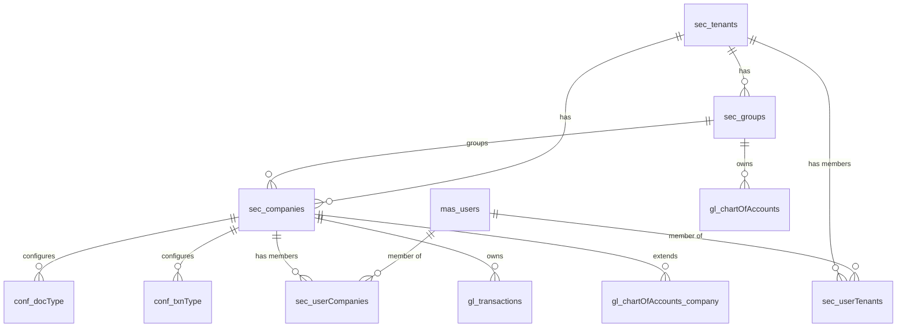

# Database Schema

Schema reference for the Service Plus backend. The **migration files** in `database/migrations/<stream>/` are the source of truth; this folder is a hand-maintained, human-readable derived view. When you change a migration, update the matching doc here.

Default dev DB is SQLite (`database/service_plus.db`). MySQL is also supported via `knexfile.js`.

## How migrations are organised

Migrations live in per-stream subfolders and are run independently (e.g. `npm run migrate:core`, `npm run migrate:gl`). Each stream has its own knex migration table.

| stream | doc | tables | purpose |
|---|---|---|---|
| core | [core.md](core.md) | 24 | Tenancy, security, users, roles, menus, config, doc/txn type masters, reference data, business partners, audit |
| gl | [gl.md](gl.md) | 5 | General ledger: chart of accounts and journal transactions |
| service | [service.md](service.md) | 3 | Service jobs and activities |
| songBook | [songbook.md](songbook.md) | 4 | Song book content |
| inventory (root) | [inventory.md](inventory.md) | 3 | Items, stores, stock |
| operations (root) | [operations.md](operations.md) | 7 | Vehicle confirmation, activity log, debtor (AR) transactions, images, jolly-snap |
| hrm | — | 0 | **Creates no tables.** Seeds only: `conf_docType`, `conf_txnType`, menu and role data into core tables. |
| bin | — | 0 | Scratch/parking folder. Its `conf_category` migration is commented out and unused. Ignore. |

## Conventions

### Multi-tenant scoping
Most tables carry `tenantId` and usually `companyId`.

- Core/gl tables (`sec_*`, `conf_*`, `mas_*`, `ref_*`, `gl_*`) plus the Inventory (`ims_*`), Operations (`imp_*`, `ar_*`, `gen_txn_images`), Service (`svc_*`), and Song Book (`sb_*`) tables type these as `uuid` with FKs to `sec_tenants.tenantId` and `sec_companies.companyId`.
- `js_*` (jolly-snap) still types them as `integer`.

`mas_users` itself carries no `tenantId`/`companyId` (membership via `sec_userTenants`/`sec_userCompanies`) and no `roleId` (roles via `mas_userRoles`).

**Ordering note:** the Inventory/Operations tables live in the root `migrations` directory (`development` env) and FK into core tables, so run `migrate:core` before `migrate` (the root set) on a fresh DB.

### Activity / deletion flags
Two patterns coexist:

- **Newer tables** use `isActive` (boolean) and have **no** `deleted` column. Rows are hard-deleted or deactivated.
- **Legacy tables** use a `deleted` (boolean, soft-delete) flag, and some also use `active`. Queries on these must filter `deleted = false`.

The split is deliberate; do not assume a table has both.

### Audit columns
Every table carries `updatedBy` (uuid, references `mas_users.userId` on core/gl tables; plain uuid on legacy tables) and `updatedAt` (datetime, default now). There is no `createdAt`; the legacy `userId`/`userDT` pair was replaced by `updatedBy`/`updatedAt`. The only exceptions are the append-only history tables (`sec_auditHistory`, `sb_txn_song_history`), which keep `changedBy`/`changedAt`.

### Audit history
Pre-change row snapshots are written to history via `snapshotBefore()` in [`src/repository/auditHistory.js`](../../src/repository/auditHistory.js). The central audit table is `sec_auditHistory` (core). The songBook stream keeps its own `sb_txn_song_history` table. History rows store the full prior row as JSON plus `changeType` (`I`/`E`/`D`, or full words in songBook).

### Serial number allocation
New header rows get their `id`/`docNo` from `getNextSerialNo(trx, docType, txnType)` in [`src/repository/getNextSerialNo.js`](../../src/repository/getNextSerialNo.js), backed by the `conf_txnType.serialNo` counter. Always called inside a transaction.

### Document / transaction type config
Document and transaction types are defined in two layers: the masters `sec_docType` (PK `docType`) and `sec_txnType` (PK `docType, txnType`, with `txnTypename`), and the per-company enablement tables `conf_docType` (PK `companyId, docType`, FK to `sec_docType`) and `conf_txnType` (PK `companyId, docType, txnType`, FK to both `conf_docType` and `sec_txnType`). `conf_txnType` no longer stores `txnTypename` — join `sec_txnType` for the display name. Transaction tables reference the `conf_*` tables by composite FK.

### Uniqueness
Application-level business-key uniqueness is enforced via `ensureUnique()` in [`src/repository/validators.js`](../../src/repository/validators.js), not always by DB constraints.

### Table prefix legend
| prefix | meaning |
|---|---|
| `sec_` | security / tenancy / config masters (tenants, companies, groups, user links, rates, doc/txn type masters, audit) |
| `mas_` | core master data (users, roles, user-roles, business partners) |
| `conf_` | per-company configuration (doc/txn type enablement, category config) |
| `gen_` | legacy general data (`gen_txn_images`) |
| `ref_` | reference / lookup data (categories, roles) |
| `gl_` | general ledger |
| `svc_` | service jobs |
| `sb_` | song book |
| `js_` | jolly-snap |
| `ims_` | inventory management (items, stores, stock) |
| `imp_` | import / operations (vehicle confirmation, activity log) |
| `ar_` | accounts receivable (debtor transactions) |

## Cross-stream relationships

The core hub tables anchor everything. `sec_tenants` is the top of the tenancy tree; `sec_groups` and `sec_companies` hang off it; the GL and config tables reference companies.

Legacy streams (`svc_*`, `sb_*`, `js_*`, `ims_*`, `imp_*`, `ar_*`) carry `integer` tenant/company columns that are not FK-linked to the UUID core, so they are shown only within their own stream docs.
