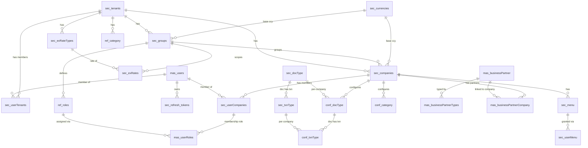

# Core Stream

Tenancy, security, users, roles, menus, configuration, reference data, business partners, and audit. All tables use `uuid` tenant/company keys with enforced FKs, camelCase columns, and `updatedBy`/`updatedAt` audit columns (no `createdAt`). Migration files live in `database/migrations/core/`.

## Diagram

## Tenancy & org

### sec_tenants
Top of the tenancy tree.

| column | type | null | key | notes |
|---|---|---|---|---|
| tenantId | uuid | no | PK | defaults to uuid() |
| tenantName | string | no | | |
| legalName | string | yes | | |
| status | string | yes | | defaults `active` |
| email, phone | string | yes | | |
| addressLine1, addressLine2, city, stateProvince, postalCode, country | string | yes | | camelCase |
| updatedBy | uuid | yes | FK | -> mas_users.userId |
| updatedAt | datetime | yes | | default now |

### sec_groups
Company groups under a tenant. Carries the group base currency.

| column | type | null | key | notes |
|---|---|---|---|---|
| groupId | uuid | no | PK | |
| tenantId | uuid | no | FK | -> sec_tenants.tenantId |
| groupName | string(150) | no | | |
| baseCurrencyCode | char(3) | yes | FK | -> sec_currencies.currencyCode |
| isActive | bool | no | | default true |
| updatedBy | uuid | yes | FK | -> mas_users.userId |
| updatedAt | datetime | yes | | default now |

### sec_companies
Operating company. Key columns below.

| column | type | null | key | notes |
|---|---|---|---|---|
| companyId | uuid | no | PK | |
| tenantId | uuid | no | FK | -> sec_tenants.tenantId |
| groupId | uuid | no | FK | -> sec_groups.groupId |
| companyCode, companyName, legalName, registrationNumber | string | mixed | | companyName not null |
| address/contact/tax fields | string | yes | | |
| country | integer | yes | | ref_category categoryType 2107 by app convention |
| parentCompanyId | uuid | yes | FK | -> sec_companies.companyId (self) |
| baseCurrencyCode | char(3) | yes | FK | -> sec_currencies.currencyCode |
| fiscalYear, period | integer | yes | | |
| isActive | bool | no | | default true |
| updatedBy | uuid | yes | FK | -> mas_users.userId |
| updatedAt | datetime | yes | | default now |

### sec_userTenants
Many-to-many membership of users in tenants (tenant scoping moved here off `mas_users`).

| column | type | null | key | notes |
|---|---|---|---|---|
| id | increments | no | PK | |
| userId | uuid | no | FK | -> mas_users.userId, ON DELETE CASCADE |
| tenantId | uuid | no | FK | -> sec_tenants.tenantId, ON DELETE CASCADE |
| isDefault | bool | no | | default false |
| isActive | bool | no | | default true |
| updatedBy | uuid | yes | FK | -> mas_users.userId |
| updatedAt | datetime | yes | | default now |
|  |  |  | UNIQUE | (userId, tenantId) |

### sec_userCompanies
Many-to-many membership of users in companies.

| column | type | null | key | notes |
|---|---|---|---|---|
| id | increments | no | PK | |
| userId | uuid | no | FK | -> mas_users.userId, ON DELETE CASCADE |
| companyId | uuid | no | FK | -> sec_companies.companyId, ON DELETE CASCADE |
| isDefault | bool | no | | default false |
| isActive | bool | no | | default true |
| updatedBy | uuid | yes | FK | -> mas_users.userId |
| updatedAt | datetime | yes | | default now |
|  |  |  | UNIQUE | (userId, companyId) |

## Users, roles & access

### mas_users
Global user master. No `tenantId` (membership via `sec_userTenants`) and no `roleId` (roles via `mas_userRoles`).

| column | type | null | key | notes |
|---|---|---|---|---|
| userId | uuid | no | PK | |
| userName | string | no | | uniqueness via ensureUnique |
| password | string | no | | argon2 hash |
| fullName, email, phone, phone2 | string | no | | |
| isActive | bool | no | | default true |
| updatedBy | uuid | yes | FK | -> mas_users.userId (self) |
| updatedAt | datetime | yes | | default now |

A user's effective role is resolved through `mas_userRoles` joined via `sec_userCompanies` (the default company's role).

### ref_roles
Role definitions.

| column | type | null | key | notes |
|---|---|---|---|---|
| index | increments | no | PK | |
| tenantId | uuid | no | FK | -> sec_tenants.tenantId |
| groupId | uuid | no | FK | -> sec_groups.groupId |
| id | integer | yes | | business role id (indexed) |
| roleName | string | no | | |
| isActive | bool | no | | |
| updatedBy | uuid | yes | FK | -> mas_users.userId |
| updatedAt | datetime | yes | | default now |

### mas_userRoles
Assigns a role to a user-company membership.

| column | type | null | key | notes |
|---|---|---|---|---|
| index | increments | no | PK | |
| tenantId | uuid | no | FK | -> sec_tenants.tenantId |
| companyId | uuid | no | FK | -> sec_companies.companyId |
| userCompanyId | integer | yes | FK | -> sec_userCompanies.id |
| roleID | integer | no | FK | -> ref_roles.id |
| updatedBy | uuid | yes | FK | -> mas_users.userId |
| updatedAt | datetime | yes | | default now |

### sec_refreshTokens
JWT refresh token store.

| column | type | null | key | notes |
|---|---|---|---|---|
| index | increments | no | PK | |
| userId | uuid | no | FK | -> mas_users.userId |
| tokenHash | string(255) | no | UNIQUE | indexed |
| expiresAt | datetime | no | | indexed |
| revoked | bool | no | | default false, indexed |
| revokedAt | datetime | yes | | |
| replacedByHash | string(255) | yes | | rotation chain |
| userAgent | text | yes | | |
| ip | string(64) | yes | | |
| updatedBy | uuid | yes | | |
| updatedAt | datetime | no | | default now (serves as issue time) |

### sec_menu
UI menu tree.

| column | type | null | key | notes |
|---|---|---|---|---|
| tenantId | uuid | no | FK | -> sec_tenants.tenantId |
| companyId | uuid | no | FK | -> sec_companies.companyId |
| id | integer | no | PK | |
| parentId | integer | yes | | self-reference |
| route, displayName, icon | string | no | | |
| order | integer | yes | | |
| isGroup | bool | yes | | |
| isActive | bool | no | | |
| updatedBy | uuid | yes | FK | -> mas_users.userId |
| updatedAt | datetime | yes | | default now |

### sec_userMenu
Role-to-menu grants. (Altered by `20260525000010` to add `isCategory`.)

| column | type | null | key | notes |
|---|---|---|---|---|
| tenantId | uuid | no | FK | -> sec_tenants.tenantId |
| companyId | uuid | no | FK | -> sec_companies.companyId |
| id | integer | yes | | menu id (relates to sec_menu.id) |
| roleId | integer | no | | |
| isCategory | bool | yes | | default false (added later) |
| updatedBy | uuid | yes | FK | -> mas_users.userId |
| updatedAt | datetime | yes | | default now |

## Currencies & rates

### sec_currencies
| column | type | null | key | notes |
|---|---|---|---|---|
| currencyCode | char(3)/string(3) | no | PK | |
| currencyName | string(50) | no | | |
| symbol | string(5) | yes | | |
| isActive | bool | yes | | default true |
| updatedBy | uuid | yes | | |
| updatedAt | datetime | yes | | default now |

### sec_exRateTypes
Exchange rate types (Buying / Selling / Official / Mid). Renamed from `sec_rate_types`.

| column | type | null | key | notes |
|---|---|---|---|---|
| rateTypeId | increments | no | PK | |
| tenantId | uuid | no | FK | -> sec_tenants.tenantId |
| typeName | string(50) | no | | |
| description | string(255) | yes | | |
| isActive | bool | no | | default true |
| updatedBy | uuid | yes | FK | -> mas_users.userId |
| updatedAt | datetime | yes | | default now |

### sec_exRates
Exchange rates. Renamed from `sec_exchange_rates`; columns camelCased.

| column | type | null | key | notes |
|---|---|---|---|---|
| rateId | uuid | no | PK | |
| tenantId | uuid | no | FK | -> sec_tenants.tenantId |
| groupId | uuid | no | FK | -> sec_groups.groupId |
| fromCurrencyCode | char(3) | no | FK | -> sec_currencies.currencyCode |
| toCurrencyCode | char(3) | no | FK | -> sec_currencies.currencyCode |
| rateTypeId | integer | no | FK | -> sec_exRateTypes.rateTypeId |
| rate | decimal(18,6) | no | | |
| effectiveDate | date | no | | |
| updatedBy | uuid | yes | FK | -> mas_users.userId |
| updatedAt | datetime | yes | | default now |

## Document / transaction types

### sec_docType
Master list of document types.

| column | type | null | key | notes |
|---|---|---|---|---|
| docType | string | no | PK | |
| docTypename | string | no | | display name |
| isActive | bool | no | | default true |
| updatedBy | uuid | yes | FK | -> mas_users.userId |
| updatedAt | datetime | yes | | default now |

### sec_txnType
Master list of transaction types per document type.

| column | type | null | key | notes |
|---|---|---|---|---|
| docType | string | no | PK | part of (docType, txnType) |
| txnType | string | no | PK | |
| txnTypename | string | no | | display name |
| isActive | bool | no | | default true |
| updatedBy | uuid | yes | FK | -> mas_users.userId |
| updatedAt | datetime | yes | | default now |
|  |  |  | FK | (docType) -> sec_docType |

### conf_docType
Per-company enablement of document types.

| column | type | null | key | notes |
|---|---|---|---|---|
| companyId | uuid | no | PK | part of (companyId, docType) |
| docType | string | no | PK | |
| tenantId | uuid | no | FK | -> sec_tenants.tenantId |
| isActive | bool | no | | |
| updatedBy | uuid | yes | FK | -> mas_users.userId |
| updatedAt | datetime | yes | | default now |
|  |  |  | FK | (companyId) -> sec_companies; (docType) -> sec_docType |

### conf_txnType
Per-company enablement of transaction types. `txnTypename` now lives on `sec_txnType`.

| column | type | null | key | notes |
|---|---|---|---|---|
| companyId | uuid | no | PK | part of (companyId, docType, txnType) |
| docType | string | no | PK | |
| txnType | string | no | PK | |
| tenantId | uuid | no | FK | -> sec_tenants.tenantId |
| serialNo | integer | no | | counter for getNextSerialNo |
| isActive | bool | no | | |
| isReport | bool | no | | |
| updatedBy | uuid | yes | FK | -> mas_users.userId |
| updatedAt | datetime | yes | | default now |
|  |  |  | FK | (companyId, docType) -> conf_docType; (docType, txnType) -> sec_txnType |

## Reference & category data

### conf_category
Category-type configuration (metadata for `ref_category` groups).

| column | type | null | key | notes |
|---|---|---|---|---|
| tenantId | uuid | no | FK | -> sec_tenants.tenantId |
| companyId | uuid | no | FK | -> sec_companies.companyId |
| categoryType, parentCategoryType | integer | no | | |
| categoryTypeName | string | no | | |
| serialNo | integer | no | | |
| metaValue, metaDesc | json | no | | |
| ref1..ref5 | json | yes | | |
| menuParentId | integer | yes | | default 0 |
| icon | string | yes | | |
| order | integer | yes | | |
| isActive | bool | no | | default true |
| updatedBy | uuid | yes | FK | -> mas_users.userId |
| updatedAt | datetime | yes | | default now |

Note: no primary key declared.

### ref_category
Reference lookup rows (countries, makes, models, etc).

| column | type | null | key | notes |
|---|---|---|---|---|
| tenantId | uuid | no | FK | -> sec_tenants.tenantId |
| companyId | uuid | no | FK | -> sec_companies.companyId |
| index | increments | no | PK | |
| id | integer | yes | | business id within categoryType |
| parentId | integer | no | | default 0; self-reference |
| categoryType | integer | no | | |
| value | string | no | | |
| description | string | yes | | |
| isActive | bool | no | | |
| updatedBy | uuid | yes | FK | -> mas_users.userId |
| updatedAt | datetime | yes | | default now |
| ref1..ref5 | string | yes | | |

## Business partners

### mas_businessPartner
Business partner master. UUID PK; no integer `id`, no `companyId` (company links live in `mas_businessPartnerCompany`).

| column | type | null | key | notes |
|---|---|---|---|---|
| businessPartnerId | uuid | no | PK | defaults to uuid() |
| tenantId | uuid | no | FK | -> sec_tenants.tenantId |
| partnerCode | string | no | | unique via ensureUnique |
| partnerName | string | no | | unique via ensureUnique |
| contactPerson, email, address, phone1, phone2 | string | no | | |
| isActive | bool | no | | |
| updatedBy | uuid | yes | FK | -> mas_users.userId |
| updatedAt | datetime | yes | | default now |

### mas_businessPartnerTypes
Partner type tags (C/S/D/H/E...).

| column | type | null | key | notes |
|---|---|---|---|---|
| tenantId | uuid | no | FK | -> sec_tenants.tenantId |
| businessPartnerId | uuid | no | PK+FK | -> mas_businessPartner.businessPartnerId, ON DELETE CASCADE |
| partnerType | string | no | PK | PK (businessPartnerId, partnerType) |
| updatedBy | uuid | yes | FK | -> mas_users.userId |
| updatedAt | datetime | yes | | default now |

### mas_businessPartnerCompany
Links a business partner to the companies it operates with.

| column | type | null | key | notes |
|---|---|---|---|---|
| id | increments | no | PK | |
| businessPartnerId | uuid | no | FK | -> mas_businessPartner.businessPartnerId, ON DELETE CASCADE |
| companyId | uuid | no | FK | -> sec_companies.companyId, ON DELETE CASCADE |
| isDefault | bool | no | | default false |
| isActive | bool | no | | default true |
| updatedBy | uuid | yes | FK | -> mas_users.userId |
| updatedAt | datetime | yes | | default now |
|  |  |  | UNIQUE | (businessPartnerId, companyId) |

## Audit

### sec_auditHistory
Central audit log (append-only; keeps its own `changedBy`/`changedAt`, exempt from the updatedBy/updatedAt rule).

| column | type | null | key | notes |
|---|---|---|---|---|
| historyId | uuid | no | PK | |
| tableName | string(100) | no | | indexed |
| recordId | string(36) | no | | indexed |
| changedBy | string(36) | yes | | |
| changedAt | datetime | no | | |
| changeType | string(1) | no | | `I` / `E` / `D` |
| snapshot | text | no | | JSON of prior row |
