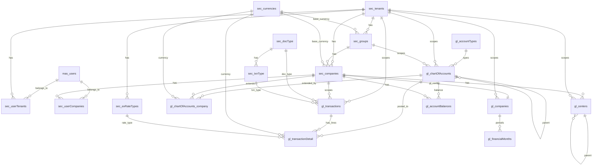

# GL Stream (General Ledger)

Chart of accounts and journal transactions. UUID tenant/company keys with FKs into core. Migration files live in `database/migrations/gl/`.

## Diagram

## Tables

### gl_companies

Per-company GL operational config (fiscal year calendar and current open period).

| column | type | null | key | notes |
|---|---|---|---|---|
| companyId | uuid | no | PK+FK | -> sec_companies.companyId |
| tenantId | uuid | no | FK | -> sec_tenants.tenantId |
| financialYearStartMonth | integer | no | | 1–12; default 1 (January) |
| currentFinYear | integer | no | | e.g. 2026 |
| currentFinMonth | integer | no | | 1–12; currently open posting period |
| isActive | bool | no | | default true |
| updatedBy | uuid | yes | FK | -> mas_users.userId |
| updatedAt | datetime | yes | | default now |

### gl_financialMonths

Per-company financial month status (open/closed for posting).

| column | type | null | key | notes |
|---|---|---|---|---|
| companyId | uuid | no | PK+FK | -> sec_companies.companyId |
| tenantId | uuid | no | FK | -> sec_tenants.tenantId |
| fnYear | integer | no | PK | |
| fnMonth | integer | no | PK | 1–12 |
| isClosed | bool | no | | default false; locked for posting when true |
| updatedBy | uuid | yes | FK | -> mas_users.userId |
| updatedAt | datetime | yes | | default now |

### gl_centers

Cost and profit centre master, scoped per company. PK is composite `(companyId, centerCode)`.

| column | type | null | key | notes |
| --- | --- | --- | --- | --- |
| tenantId | uuid | no | FK | -> sec_tenants.tenantId |
| companyId | uuid | no | PK+FK | -> sec_companies.companyId |
| centerCode | char(3) | no | PK | unique within company |
| centerName | string(150) | no | | |
| parentCenterCode | char(3) | yes | FK | -> gl_centers(companyId, centerCode) (self) |
| isProfitCenter | bool | no | | false=Cost, true=Profit |
| isActive | bool | no | | default true |
| updatedBy | uuid | yes | FK | -> mas_users.userId |
| updatedAt | datetime | yes | | default now |

### gl_accountBalances

Period summary written on month close. Each account gets two rows per period: `isCumulative=false` (this period only) and `isCumulative=true` (FY-to-date). `costCenter=''` is the account-level roll-up; centre-coded rows are the breakdown.

PK: `(companyId, accountId, fnYear, fnMonth, isCumulative, costCenter)`

| column | type | null | key | notes |
| --- | --- | --- | --- | --- |
| tenantId | uuid | no | FK | -> sec_tenants.tenantId |
| companyId | uuid | no | PK+FK | -> sec_companies.companyId |
| accountId | uuid | no | PK+FK | -> gl_chartOfAccounts.accountId |
| fnYear | integer | no | PK | |
| fnMonth | integer | no | PK | 1–12 |
| isCumulative | bool | no | PK | false=period only, true=FY-to-date |
| costCenter | char(3) | no | PK | '' = no centre filter |
| debitTotal | decimal(18,2) | no | | default 0 |
| creditTotal | decimal(18,2) | no | | default 0 |
| updatedBy | uuid | yes | FK | -> mas_users.userId |
| updatedAt | datetime | yes | | default now |

### gl_accountTypes
Lookup of account classes (seeded A/L/E/I/X).

| column | type | null | key | notes |
|---|---|---|---|---|
| accountType | char(1) | no | PK | A=Asset, L=Liability, E=Equity, I=Income, X=Expense |
| typeName | string(50) | no | | |
| sortOrder | integer | no | | |
| isActive | bool | no | | default true |
| updatedBy | uuid | yes | FK | -> mas_users.userId |
| updatedAt | datetime | yes | | default now |

### gl_chartOfAccounts
Hierarchical chart of accounts, scoped by tenant + group.

| column | type | null | key | notes |
|---|---|---|---|---|
| accountId | uuid | no | PK | defaults to uuid() |
| tenantId | uuid | no | FK | -> sec_tenants.tenantId |
| groupId | uuid | no | FK | -> sec_groups.groupId |
| accountType | char(1) | no | FK | -> gl_account_types.accountType |
| accountCode | string(20) | no | | |
| accountName | string(150) | no | | |
| parentAccountId | uuid | yes | FK | -> gl_chartOfAccounts.accountId (self) |
| level | integer | no | | default 1 |
| sortOrder | integer | no | | |
| isActive | bool | no | | default true |
| updatedBy | uuid | yes | FK | -> mas_users.userId |
| updatedAt | timestamp | yes | | default now |

### gl_chartOfAccounts_company
Per-company extension/override of a chart account (codes, posting control, opening balances).

| column | type | null | key | notes |
|---|---|---|---|---|
| companyAccountId | uuid | no | PK | |
| tenantId | uuid | no | FK | -> sec_tenants.tenantId |
| companyId | uuid | no | FK | -> sec_companies.companyId |
| accountId | uuid | no | FK | -> gl_chartOfAccounts.accountId |
| accountCode | string(20) | yes | | override; falls back to master when null |
| accountName | string(150) | yes | | override |
| allowPosting | bool | no | | default true |
| isActive | bool | no | | default true |
| openingBalance | decimal(18,2) | no | | default 0 |
| openingBalanceDate | date | yes | | |
| currencyCode | char(3) | yes | FK | -> sec_currencies.currencyCode |
| updatedBy | uuid | yes | FK | -> mas_users.userId |
| updatedAt | timestamp | yes | | default now |
|  |  |  | UNIQUE | (companyId, accountId) |

### gl_transactions
Journal header. Scoped by tenant + company.

| column | type | null | key | notes |
|---|---|---|---|---|
| transactionId | uuid | no | PK | |
| tenantId | uuid | no | FK | -> sec_tenants.tenantId |
| companyId | uuid | no | FK | -> sec_companies.companyId |
| fnYear | integer | no | | financial year (denormalised from txnDate via gl_companies config) |
| fnMonth | integer | no | | financial month (1–12) |
| docType | string | no | | |
| txnType | string | no | | |
| docNo | integer | no | | |
| txnDate | date | no | | |
| reference | string(100) | yes | | |
| description | string(500) | yes | | |
| status | enum | no | | Draft / Posted / Void, default Draft |
| updatedBy | uuid | yes | FK | -> mas_users.userId |
| updatedAt | timestamp | yes | | default now |
|  |  |  | FK | (companyId, docType) -> conf_docType |
|  |  |  | FK | (companyId, docType, txnType) -> conf_txnType |

### gl_transactionDetail
Journal lines. Denormalises several header fields. PK is composite (`transactionId`, `lineId`).

| column | type | null | key | notes |
|---|---|---|---|---|
| transactionId | uuid | no | PK+FK | -> gl_transactions.transactionId |
| lineId | integer | no | PK | line number within the transaction |
| tenantId | uuid | no | FK | -> sec_tenants.tenantId |
| companyId | uuid | no | FK | -> sec_companies.companyId |
| fnYear, fnMonth | integer | no | | financial year/month (denormalised) |
| docType, txnType | string | no | | denormalised |
| docNo | integer | no | | denormalised |
| txnDate | date | no | | denormalised |
| lineNo | integer | no | | |
| accountId | uuid | no | FK | -> gl_chartOfAccounts.accountId |
| debitAmount | decimal(18,2) | no | | default 0 |
| creditAmount | decimal(18,2) | no | | default 0 |
| currencyCode | char(3) | no | FK | -> sec_currencies.currencyCode |
| exchangeRate | decimal(18,6) | no | | default 1 |
| rateTypeId | integer | yes | FK | -> sec_exRateTypes.rateTypeId |
| debitBase | decimal(18,2) | no | | default 0 |
| creditBase | decimal(18,2) | no | | default 0 |
| costCenter | char(3) | yes | FK | -> gl_centers(companyId, centerCode) where isProfitCenter=false |
| profitCenter | char(3) | yes | FK | -> gl_centers(companyId, centerCode) where isProfitCenter=true |
| description | string(500) | yes | | |
| updatedBy | uuid | yes | FK | -> mas_users.userId |
| updatedAt | datetime | yes | | default now |
|  |  |  | FK | (companyId, docType) -> conf_docType |
|  |  |  | FK | (companyId, docType, txnType) -> conf_txnType |

Seed note: `conf_docType`/`conf_txnType` register a `JV` (Journal Voucher) doc/txn type for the demo company (`20260523000009/10`), while the transaction seed data uses `BP`/`USR` types.

---

## Core / Security Tables

### mas_users

| column | type | null | key | notes |
|---|---|---|---|---|
| userId | uuid | no | PK | defaults to uuid() |
| userName | string | no | UNIQUE | |
| password | string | no | | bcrypt hash |
| fullName | string | no | | |
| email | string | no | | |
| phone | string | no | | |
| phone2 | string | no | | |
| isActive | bool | no | | default true |
| updatedBy | uuid | yes | FK | -> mas_users.userId (self) |
| updatedAt | datetime | yes | | default now |

### sec_tenants

| column | type | null | key | notes |
|---|---|---|---|---|
| tenantId | uuid | no | PK | defaults to uuid() |
| tenantName | string | no | | |
| legalName | string | yes | | |
| status | string | no | | default 'active' |
| email | string | yes | | |
| phone | string | yes | | |
| addressLine1 | string | yes | | |
| addressLine2 | string | yes | | |
| city | string | yes | | |
| stateProvince | string | yes | | |
| postalCode | string | yes | | |
| country | string | yes | | |
| updatedBy | uuid | yes | FK | -> mas_users.userId |
| updatedAt | datetime | yes | | default now |

### sec_groups

One group per tenant; holds the group-level base currency.

| column | type | null | key | notes |
|---|---|---|---|---|
| groupId | uuid | no | PK | defaults to uuid() |
| tenantId | uuid | no | FK | -> sec_tenants.tenantId |
| groupName | string(150) | no | | |
| baseCurrencyCode | char(3) | yes | FK | -> sec_currencies.currencyCode |
| isActive | bool | no | | default true |
| updatedBy | uuid | yes | FK | -> mas_users.userId |
| updatedAt | datetime | yes | | default now |

### sec_companies

| column | type | null | key | notes |
|---|---|---|---|---|
| companyId | uuid | no | PK | defaults to uuid() |
| tenantId | uuid | no | FK | -> sec_tenants.tenantId |
| groupId | uuid | no | FK | -> sec_groups.groupId |
| companyCode | string | yes | | |
| companyName | string | no | | |
| legalName | string | yes | | |
| registrationNumber | string | yes | | |
| addressLine1 | string | yes | | |
| addressLine2 | string | yes | | |
| city | string | yes | | |
| stateProvince | string | yes | | |
| postalCode | string | yes | | |
| country | integer | yes | | |
| phoneNumber | string | yes | | |
| email | string | yes | | |
| websiteUrl | string | yes | | |
| primaryContactName | string | yes | | |
| primaryContactEmail | string | yes | | |
| primaryContactPhone | string | yes | | |
| secondaryContactName | string | yes | | |
| dateOfIncorporation | date | yes | | |
| numberOfEmployees | integer | yes | | |
| parentCompanyId | uuid | yes | FK | -> sec_companies.companyId (self) |
| taxId | string | yes | | |
| vatNumber | string | yes | | |
| gstNumber | string | yes | | |
| panNumber | string | yes | | |
| bankAccountDetails | string | yes | | |
| remarks | text | yes | | |
| baseCurrencyCode | char(3) | yes | FK | -> sec_currencies.currencyCode |
| fiscalYear | integer | yes | | |
| period | integer | yes | | |
| isActive | bool | no | | default true |
| updatedBy | uuid | yes | FK | -> mas_users.userId |
| updatedAt | datetime | yes | | default now |

### sec_currencies

| column | type | null | key | notes |
|---|---|---|---|---|
| currencyCode | char(3) | no | PK | ISO 4217 |
| currencyName | string(50) | no | | |
| symbol | string(5) | yes | | |
| isActive | bool | no | | default true |
| updatedBy | uuid | yes | FK | -> mas_users.userId |
| updatedAt | datetime | yes | | default now |

### sec_exRateTypes

| column | type | null | key | notes |
|---|---|---|---|---|
| rateTypeId | integer | no | PK | auto-increment |
| tenantId | uuid | no | FK | -> sec_tenants.tenantId |
| typeName | string(50) | no | | |
| description | string(255) | yes | | |
| isActive | bool | no | | default true |
| updatedBy | uuid | yes | FK | -> mas_users.userId |
| updatedAt | datetime | yes | | default now |

### sec_docType

| column | type | null | key | notes |
|---|---|---|---|---|
| docType | string | no | PK | e.g. JV, BP |
| docTypename | string | no | | |
| isActive | bool | no | | default true |
| updatedBy | uuid | yes | FK | -> mas_users.userId |
| updatedAt | datetime | yes | | default now |

### sec_txnType

| column | type | null | key | notes |
|---|---|---|---|---|
| docType | string | no | PK+FK | -> sec_docType.docType |
| txnType | string | no | PK | |
| txnTypename | string | no | | |
| isActive | bool | no | | default true |
| updatedBy | uuid | yes | FK | -> mas_users.userId |
| updatedAt | datetime | yes | | default now |

### sec_userTenants

Junction: which tenants a user can access.

| column | type | null | key | notes |
| --- | --- | --- | --- | --- |
| id | integer | no | PK | auto-increment |
| userId | uuid | no | FK | -> mas_users.userId |
| tenantId | uuid | no | FK | -> sec_tenants.tenantId |
| isDefault | bool | no | | default false |
| isActive | bool | no | | default true |
| updatedBy | uuid | yes | FK | -> mas_users.userId |
| updatedAt | datetime | yes | | default now |
|  |  |  | UNIQUE | (userId, tenantId) |

### sec_userCompanies

Junction: which companies a user can access.

| column | type | null | key | notes |
| --- | --- | --- | --- | --- |
| id | integer | no | PK | auto-increment |
| userId | uuid | no | FK | -> mas_users.userId |
| companyId | uuid | no | FK | -> sec_companies.companyId |
| isDefault | bool | no | | default false |
| isActive | bool | no | | default true |
| updatedBy | uuid | yes | FK | -> mas_users.userId |
| updatedAt | datetime | yes | | default now |
|  |  |  | UNIQUE | (userId, companyId) |
