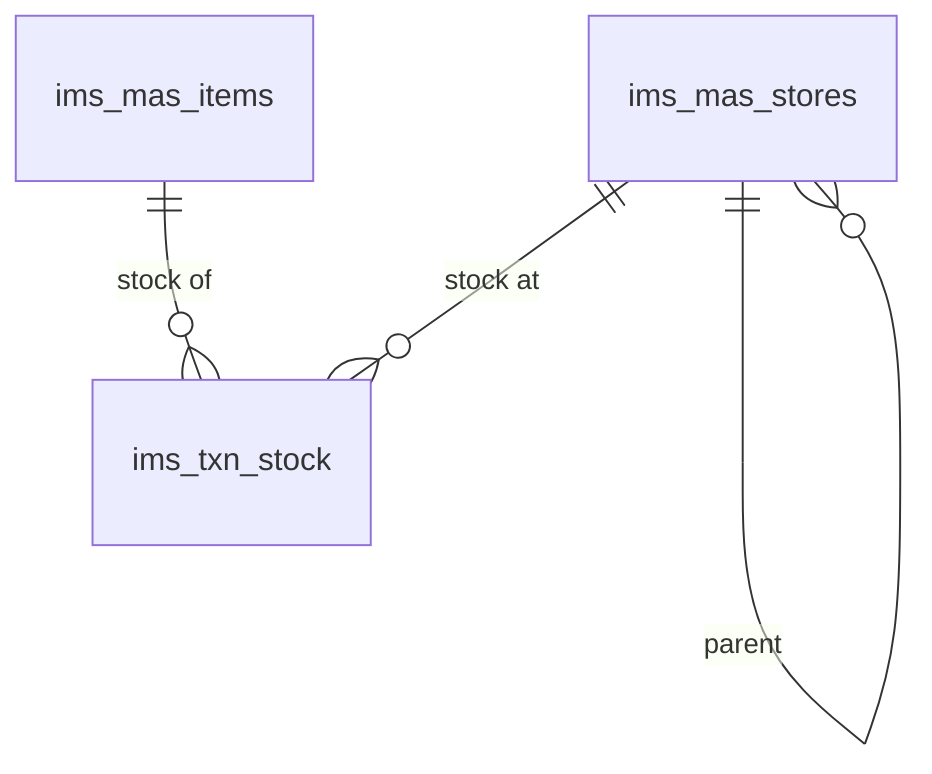

# Inventory (root migrations)

Items, stores, and stock. Defined directly in `database/migrations/` (root, not a subfolder). `tenantId`/`companyId` are `uuid` with FKs to `sec_tenants`/`sec_companies` (run `migrate:core` first); masters use `active` + `deleted` and `updatedBy`/`updatedAt`.

## Diagram

Links are by business id (`storeId`, `itemId`), not DB-enforced FKs.

## Tables

### ims_mas_items
Item master.

| column | type | null | key | notes |
|---|---|---|---|---|
| tenantId | uuid | yes | FK | -> sec_tenants.tenantId |
| companyId | uuid | yes | FK | -> sec_companies.companyId |
| index | increments | no | PK | |
| id | integer | yes | | business id |
| itemCode | integer | no | | |
| itemName | string | no | | |
| description | text | yes | | |
| uom | string | no | | unit of measure (ref_category categoryType 80) |
| brand | string | no | | |
| reorderLevel | integer | yes | | |
| costPrice | integer | yes | | |
| sellingPrice | integer | yes | | |
| active | bool | no | | |
| deleted | bool | no | | default false |
| updatedBy | uuid | yes | | audit |
| updatedAt | datetime | yes | | default now |

### ims_mas_stores
Store master (hierarchical).

| column | type | null | key | notes |
|---|---|---|---|---|
| tenantId | uuid | yes | FK | -> sec_tenants.tenantId |
| companyId | uuid | yes | FK | -> sec_companies.companyId |
| index | increments | no | PK | |
| id | integer | yes | | business id |
| parentId | integer | yes | | self-reference |
| storeCode | integer | no | | |
| storeName | string | no | | |
| description | text | yes | | |
| active | bool | no | | |
| deleted | bool | no | | default false |
| updatedBy | uuid | yes | | |
| updatedAt | datetime | yes | | default now |

### ims_txn_stock
Stock on hand per store/item.

| column | type | null | key | notes |
|---|---|---|---|---|
| tenantId | uuid | yes | FK | -> sec_tenants.tenantId |
| companyId | uuid | yes | FK | -> sec_companies.companyId |
| index | increments | no | PK | |
| storeId | integer | yes | | -> ims_mas_stores.id (app-level) |
| itemId | integer | yes | | -> ims_mas_items.id (app-level) |
| quantity | decimal(10,2) | no | | |
| reservedQty | decimal(10,2) | no | | |
| updatedBy | uuid | yes | | |
| updatedAt | datetime | yes | | default now |
