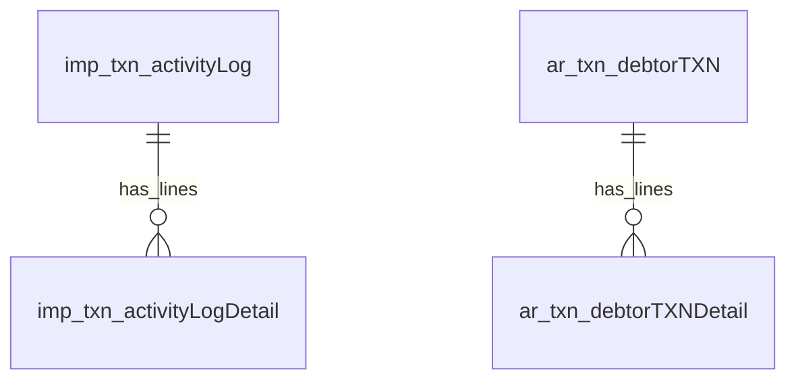

# Operations (root migrations)

Vehicle confirmation, activity log, debtor (AR) transactions, and generic images. Defined directly in `database/migrations/` (root). Their `tenantId`/`companyId` are `uuid` with FKs to `sec_tenants`/`sec_companies` (run `migrate:core` first); rows use the `deleted` soft-delete flag and `updatedBy`/`updatedAt`. The `jolly-snap` header (`js_txn_job_hedder`) is a separate stream and keeps `integer` tenant/company.

## Diagram

`imp_txn_vehicleConfirmation`, `gen_txn_images`, and `js_txn_job_hedder` stand alone. Partner/category references (`partner`, `supplier`, `customer`, `make`, `model`, etc) resolve against `gen_mas_businessPartner` / `ref_category` in application code, not via DB FKs.

## Vehicle confirmation

### imp_txn_vehicleConfirmation
Imported-vehicle costing record (~45 columns). Key columns below; the bulk are LC / duty / clearing cost and date fields, all `decimal(18,2)` / `date`.

| column | type | null | key | notes |
|---|---|---|---|---|
| tenantId | uuid | yes | FK | -> sec_tenants.tenantId |
| companyId | uuid | yes | FK | -> sec_companies.companyId |
| index | increments | no | PK | |
| id | integer | yes | | business id |
| make, model, grade, colour | integer | yes | | ref_category ids (10/20/30/60) |
| year, engineCapacity, fuelType, transmission, millage | integer | yes | | ref_category ids for fuel/transmission |
| chassisNo | string(100) | yes | | |
| supplier | uuid | yes | | -> mas_businessPartner.businessPartnerId |
| customer | uuid | yes | | -> mas_businessPartner.businessPartnerId |
| purchaseDate, paymentDate, lcOpenDetailsDate, lcMarginDate, lcSettlementDate, dutyDate, clearingDate | date | yes | | cost-event dates |
| cifYen, auctionPrice, tax, freight, paymentAmount, paymentAmountYen, JPY, lcMarginAmount, lcSettlementAmount, lcSettlementCharges, dutyAmount, clearingCharges, salesTax, transportCost, totalCost | decimal(18,2) | yes | | costing amounts |
| paymentRate | decimal(18,4) | yes | | |
| paymentDetails, description | text | yes | | |
| lcOpenDetailsBank | string(100) | yes | | |
| deleted | bool | no | | default false |
| updatedBy | uuid | yes | | audit |
| updatedAt | datetime | yes | | default now |

## Activity log

### imp_txn_activityLog
Machine/vehicle activity header.

| column | type | null | key | notes |
|---|---|---|---|---|
| tenantId | uuid | yes | FK | -> sec_tenants.tenantId |
| companyId | uuid | yes | FK | -> sec_companies.companyId |
| txnIndex | increments | no | PK | |
| id | integer | no | | business id |
| docType, txnType | string | yes | | |
| txnDate | date | yes | | |
| partner | uuid | no | | -> mas_businessPartner.businessPartnerId |
| vehicle | integer | no | | ref_category |
| typeOfMachine | integer | no | | |
| operator | uuid | no | | -> mas_businessPartner.businessPartnerId |
| helper | uuid | yes | | -> mas_businessPartner.businessPartnerId |
| remarks | text | yes | | |
| km | decimal(10,2) | yes | | |
| time, diesel, certifiedHours | string(50) | yes | | |
| deleted | bool | no | | default false |
| updatedBy | uuid | yes | | audit |
| updatedAt | datetime | yes | | default now |

### imp_txn_activityLogDetail
Activity line items.

| column | type | null | key | notes |
|---|---|---|---|---|
| tenantId | uuid | yes | FK | -> sec_tenants.tenantId |
| companyId | uuid | yes | FK | -> sec_companies.companyId |
| txnIndex | increments | no | PK | part of (txnIndex, txnLineNo) |
| id | integer | no | | header business id |
| txnLineNo | integer | no | PK | |
| docType, txnType | string | no | | |
| txnDate | date | no | | |
| description | string | yes | | |
| amount | decimal(15,2) | no | | |
| hours | string(50) | yes | | |
| deleted | bool | no | | default false |
| updatedBy | uuid | yes | | |
| updatedAt | datetime | yes | | default now |

## Debtor (AR) transactions

### ar_txn_debtorTXN
Debtor transaction header (invoices, advances, payments).

| column | type | null | key | notes |
|---|---|---|---|---|
| tenantId | uuid | yes | FK | -> sec_tenants.tenantId |
| companyId | uuid | yes | FK | -> sec_companies.companyId |
| txnIndex | increments | no | PK | |
| id | integer | no | | business id |
| docType, txnType | string | yes | | e.g. INV/NT/TAX/ADV/PAY |
| txnDate | date | yes | | |
| partner | uuid | yes | | -> mas_businessPartner.businessPartnerId |
| remarks | string | yes | | |
| ref1, ref2, ref3 | string | yes | | ref_category ids (70/80) |
| amount, taxAmount, taxRate, advance, totalAmount | decimal(15,2) | yes | | |
| deleted | bool | no | | default false |
| updatedBy | uuid | yes | | audit |
| updatedAt | datetime | yes | | default now |

### ar_txn_debtorTXNDetail
Debtor transaction line items.

| column | type | null | key | notes |
|---|---|---|---|---|
| tenantId | uuid | yes | FK | -> sec_tenants.tenantId |
| companyId | uuid | yes | FK | -> sec_companies.companyId |
| txnIndex | integer | yes | PK | part of (txnIndex, txnLineNo) |
| id | integer | no | | header business id |
| txnLineNo | integer | yes | PK | |
| docType, txnType | string | no | | |
| txnDate | date | no | | |
| description | string | yes | | |
| amount | decimal(15,2) | no | | |
| deleted | bool | no | | default false |
| updatedBy | uuid | yes | | |
| updatedAt | datetime | yes | | default now |

## Images

### gen_txn_images
Generic image attachments keyed by doc/txn.

| column | type | null | key | notes |
|---|---|---|---|---|
| tenantId | uuid | yes | FK | -> sec_tenants.tenantId |
| companyId | uuid | yes | FK | -> sec_companies.companyId |
| index | increments | no | PK | |
| id | integer | yes | | owning record id |
| docType | string | no | | |
| txnType | string | no | | |
| image | string | yes | | path/filename |
| deleted | bool | no | | default false |
| updatedBy | uuid | yes | | audit |
| updatedAt | datetime | yes | | default now |

## Jolly-snap

Single table; the only object in the `jolly-snap` stream (`database/migrations/jolly-snap/`).

### js_txn_job_hedder
Public-facing job/lead capture header. `tenantId`/`companyId` are `integer` (not null).

| column | type | null | key | notes |
|---|---|---|---|---|
| tenantId | integer | no | | legacy |
| companyId | integer | no | | legacy |
| index | increments | no | PK | |
| id | integer | yes | | business id |
| name | string | yes | | |
| email | string | yes | | |
| whatsAppNo | string | yes | | |
| package | integer | yes | | |
| amount | decimal(10,2) | yes | | |
| isPaid | bool | yes | | default false |
| deleted | bool | yes | | default false |
| updatedBy | uuid | yes | | |
| updatedAt | datetime | yes | | default now |
