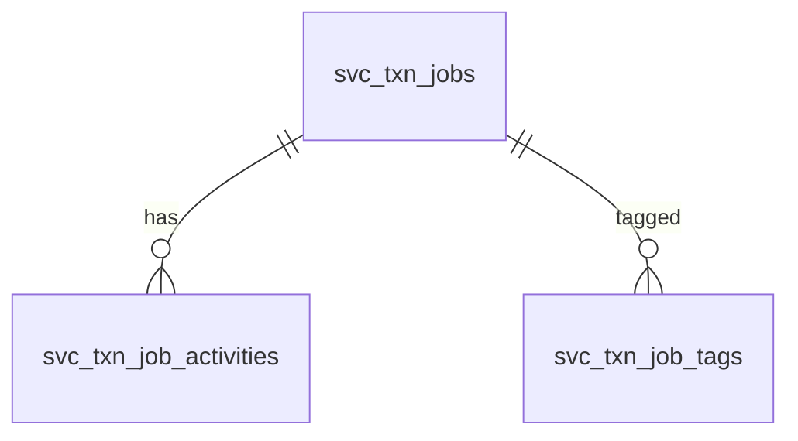

# Service Stream

Service jobs, their activities, and tags. `tenantId`/`companyId` are `uuid` with FKs to `sec_tenants`/`sec_companies`; rows still use the `deleted` soft-delete flag and the `userId`/`userDT` audit pair was replaced by `updatedBy`/`updatedAt`. Migration files live in `database/migrations/service/`.

## Diagram

Relationships are by `id`/`JobId` business keys, not DB-enforced FKs. `svc_txn_jobs.partner` (now `uuid`) resolves against `mas_businessPartner.businessPartnerId`; `svc_txn_job_tags.tag_id` resolves against `ref_category` in application code.

## Tables

### svc_txn_jobs
Service job header.

| column | type | null | key | notes |
|---|---|---|---|---|
| tenantId | uuid | yes | FK | -> sec_tenants.tenantId |
| companyId | uuid | yes | FK | -> sec_companies.companyId |
| txnIndex | increments | no | PK | |
| id | integer | no | | business id |
| docType | string | yes | | |
| txnType | string | yes | | |
| txnDate | date | yes | | |
| partner | uuid | yes | | -> mas_businessPartner.businessPartnerId (app-level) |
| status | integer | no | | ref_category status id |
| ref1, ref2, ref3 | string | yes | | |
| description | text | yes | | |
| remarks | text | yes | | |
| deleted | bool | no | | default false |
| updatedBy | uuid | yes | | audit |
| updatedAt | datetime | yes | | default now |

### svc_txn_job_activities
Activity lines for a job.

| column | type | null | key | notes |
|---|---|---|---|---|
| tenantId | uuid | yes | FK | -> sec_tenants.tenantId |
| companyId | uuid | yes | FK | -> sec_companies.companyId |
| activity_id | increments | no | PK | |
| index | integer | yes | | |
| JobId | integer | yes | | -> svc_txn_jobs.id (app-level) |
| docType, txnType | string | yes | | |
| activityDate | date | yes | | |
| description | text | yes | | |
| remarks | text | yes | | |
| deleted | bool | no | | default false |
| updatedBy | uuid | yes | | |
| updatedAt | datetime | yes | | default now |

### svc_txn_job_tags
Tag links for a job.

| column | type | null | key | notes |
|---|---|---|---|---|
| tenantId | uuid | yes | FK | -> sec_tenants.tenantId |
| companyId | uuid | yes | FK | -> sec_companies.companyId |
| index | increments | no | PK | |
| id | integer | yes | | -> svc_txn_jobs.id (app-level) |
| tag_id | integer | yes | | -> ref_category.id, categoryType 3 (app-level) |
| deleted | bool | no | | default false |
| updatedBy | uuid | yes | | |
| updatedAt | datetime | yes | | default now |
