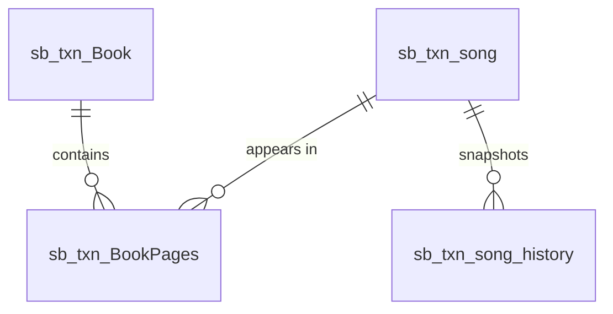

# Song Book Stream

Songs, books, page ordering, and a song history table. `tenantId`/`companyId` are `uuid` with FKs to `sec_tenants`/`sec_companies`; rows still use `deleted` (and `active`) and `updatedBy`/`updatedAt`. Migration files live in `database/migrations/songBook/`.

## Diagram

Page links are by business id (`Book_id`, `Song_id`), not DB-enforced FKs.

## Tables

### sb_txn_song
Song with lyrics.

| column | type | null | key | notes |
|---|---|---|---|---|
| tenantId | uuid | yes | FK | -> sec_tenants.tenantId |
| companyId | uuid | yes | FK | -> sec_companies.companyId |
| index | increments | no | PK | |
| id | integer | no | | business id |
| title | string | no | | |
| lyrics | text | no | | |
| language | string | no | | intended to link to a master |
| active | bool | no | | |
| deleted | bool | no | | default false |
| updatedBy | uuid | yes | | audit |
| updatedAt | datetime | yes | | default now |

### sb_txn_Book
Song book header.

| column | type | null | key | notes |
|---|---|---|---|---|
| tenantId | uuid | yes | FK | -> sec_tenants.tenantId |
| companyId | uuid | yes | FK | -> sec_companies.companyId |
| index | increments | no | PK | |
| id | integer | no | | business id |
| title | string | no | | |
| language | string | no | | |
| active | bool | no | | |
| deleted | bool | no | | default false |
| updatedBy | uuid | yes | | |
| updatedAt | datetime | yes | | default now |

### sb_txn_BookPages
Ordered song entries within a book.

| column | type | null | key | notes |
|---|---|---|---|---|
| tenantId | uuid | yes | FK | -> sec_tenants.tenantId |
| companyId | uuid | yes | FK | -> sec_companies.companyId |
| index | increments | no | PK | |
| Book_id | integer | no | | -> sb_txn_Book.id (app-level) |
| Song_id | integer | no | | -> sb_txn_song.id (app-level) |
| Song_No | integer | no | | page/order number |
| deleted | bool | no | | default false |
| updatedBy | uuid | yes | | |
| updatedAt | datetime | yes | | default now |

### sb_txn_song_history
Per-song audit snapshots (stream-local history table).

| column | type | null | key | notes |
|---|---|---|---|---|
| historyId | increments | no | PK | |
| id | integer | no | | business id of changed song (indexed) |
| changedBy | integer | yes | | userId |
| changedAt | datetime | no | | |
| changeType | string(10) | no | | INSERT / UPDATE / DELETE |
| snapshot | text | no | | JSON of full row before change |
